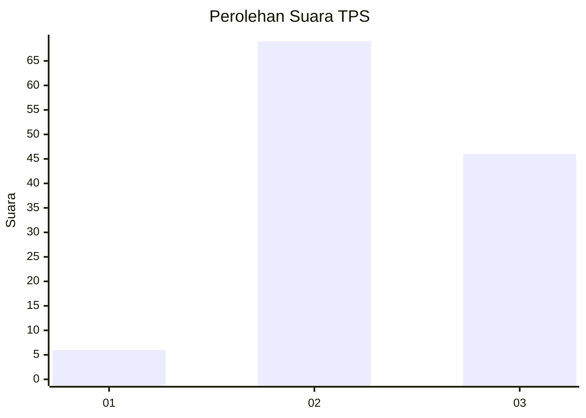
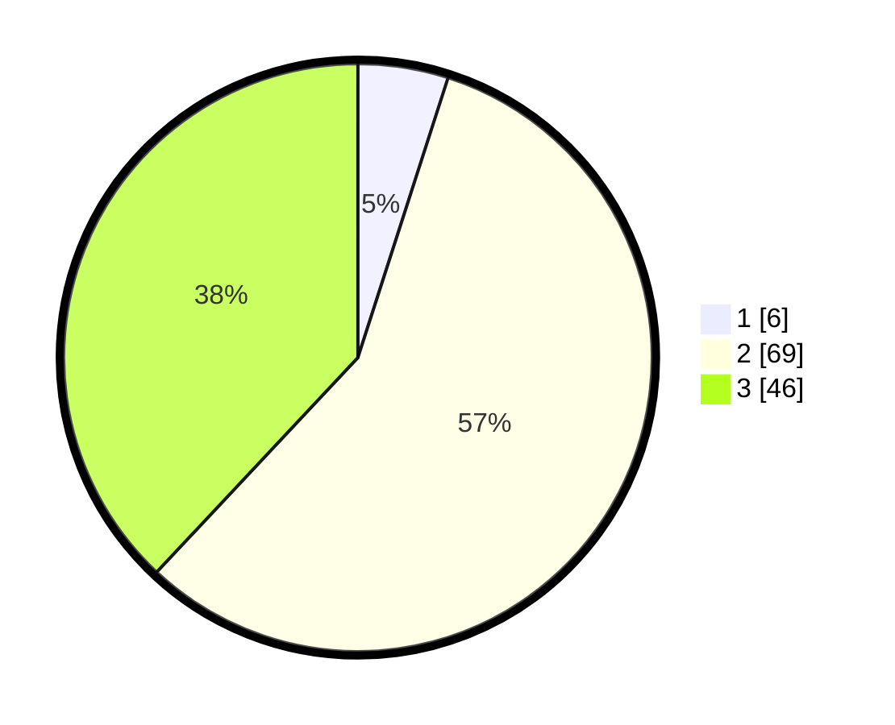

# Hasil

## Grafik

## Tabel

| No. | Nama Paslon    | Suara | Suara (raw) | Persentase |
|:--- |:-------------- | -----:| -----------:| ----------:|
| 1   | ANIES MUHAIMIN | 6     | [6][p-1]    | 4,96       |
| 2   | PRABOWO GIBRAN | 69    | [69][p-2]   | 57,02      |
| 3   | GANJAR MAHFUD  | 46    | [46][p-3]   | 38,02      |

[p-1]: https://github.com/gigit-pemilu/pemilu-2024-91-papua/blob/main/pilpres/hitung-suara/sub/91-papua/sub/03-jayapura/sub/10-demta/sub/2004-muris-kecil/sub/001-tps/sub/paslon-1.txt
[p-2]: https://github.com/gigit-pemilu/pemilu-2024-91-papua/blob/main/pilpres/hitung-suara/sub/91-papua/sub/03-jayapura/sub/10-demta/sub/2004-muris-kecil/sub/001-tps/sub/paslon-2.txt
[p-3]: https://github.com/gigit-pemilu/pemilu-2024-91-papua/blob/main/pilpres/hitung-suara/sub/91-papua/sub/03-jayapura/sub/10-demta/sub/2004-muris-kecil/sub/001-tps/sub/paslon-3.txt

## Foto C Plano

https://sirekap-obj-formc.kpu.go.id/eaaf/pemilu/ppwp/91/03/10/20/04/9103102004001-20240220-115121--1f85927d-2355-4806-8015-4842e1dd379f.jpg

https://sirekap-obj-formc.kpu.go.id/eaaf/pemilu/ppwp/91/03/10/20/04/9103102004001-20240220-115123--ec9e4617-a6fe-4b52-b4a7-1455829a865a.jpg

https://sirekap-obj-formc.kpu.go.id/eaaf/pemilu/ppwp/91/03/10/20/04/9103102004001-20240220-115122--1d47ab75-e227-488a-9f4e-88e2ec4b700a.jpg

## Metadata

| Key        | Value               |
| ---------- | ------------------- |
| Time Stamp | 2024-02-24 22:31:28 |

## DATA PEMILIH TETAP

Jumlah pemilih dalam DPT: **180**.
 * L: **108**.
 * P: **72**.

## DATA PENGGUNA HAK PILIH

Jumlah pengguna hak pilih dalam DPT: **180**.
 * L: **108**.
 * P: **72**.

Jumlah pengguna hak pilih dalam DPTb: **5**.
 * L: **5**.
 * P: **0**.

Jumlah pengguna hak pilih dalam DPK: **18**.
 * L: **13**.
 * P: **5**.

Jumlah pengguna hak pilih: **203**.
 * L: **126**.
 * P: **77**.

## JUMLAH SUARA SAH DAN TIDAK SAH

JUMLAH SELURUH SUARA SAH: **121**.

JUMLAH SUARA TIDAK SAH: **2**.

JUMLAH SELURUH SUARA SAH DAN SUARA TIDAK SAH: **123**.

