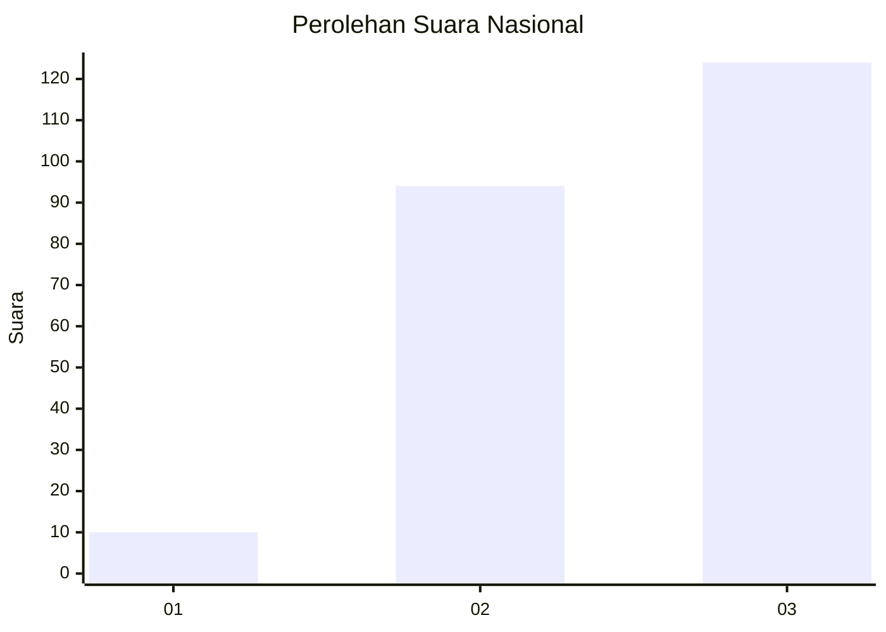
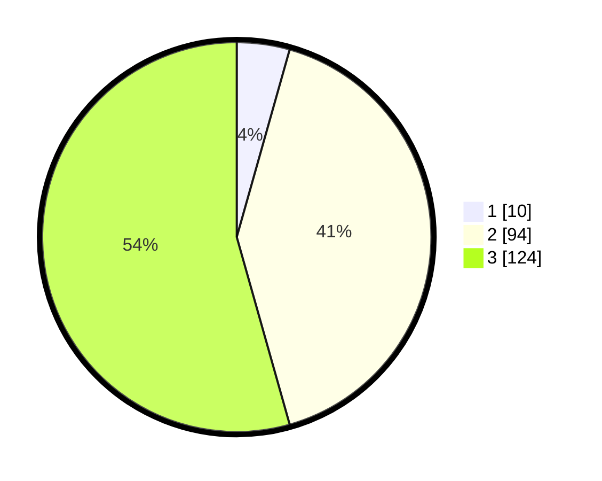

# Hasil

## Grafik

## Tabel

| No. | Nama Paslon    | Suara | Suara (raw) | Persentase |
|:--- |:-------------- | -----:| -----------:| ----------:|
| 1   | ANIES MUHAIMIN | 10    | [10][p-1]   | 4,39       |
| 2   | PRABOWO GIBRAN | 94    | [94][p-2]   | 41,23      |
| 3   | GANJAR MAHFUD  | 124   | [124][p-3]  | 54,39      |

[p-1]: https://github.com/gigit-pemilu/pemilu-2024/blob/main/pilpres/hitung-suara/sub/91-papua/sub/03-jayapura/sub/12-ebungfao/sub/2001-ebungfa/sub/002-tps/sub/paslon-1.txt
[p-2]: https://github.com/gigit-pemilu/pemilu-2024/blob/main/pilpres/hitung-suara/sub/91-papua/sub/03-jayapura/sub/12-ebungfao/sub/2001-ebungfa/sub/002-tps/sub/paslon-2.txt
[p-3]: https://github.com/gigit-pemilu/pemilu-2024/blob/main/pilpres/hitung-suara/sub/91-papua/sub/03-jayapura/sub/12-ebungfao/sub/2001-ebungfa/sub/002-tps/sub/paslon-3.txt

## Foto C Plano

https://sirekap-obj-formc.kpu.go.id/a63f/pemilu/ppwp/91/03/12/20/01/9103122001002-20240215-140732--0e5164d9-5c17-4c2b-b27c-792e7d6f2e37.jpg

https://sirekap-obj-formc.kpu.go.id/a63f/pemilu/ppwp/91/03/12/20/01/9103122001002-20240215-141021--2440a765-74f2-4954-8f2b-7fed71bb19b3.jpg

https://sirekap-obj-formc.kpu.go.id/a63f/pemilu/ppwp/91/03/12/20/01/9103122001002-20240215-141238--5f2497af-d30b-45b8-948c-0afb1fbcd4ec.jpg

## Metadata

| Key        | Value               |
| ---------- | ------------------- |
| Time Stamp | 2024-02-25 13:00:00 |

