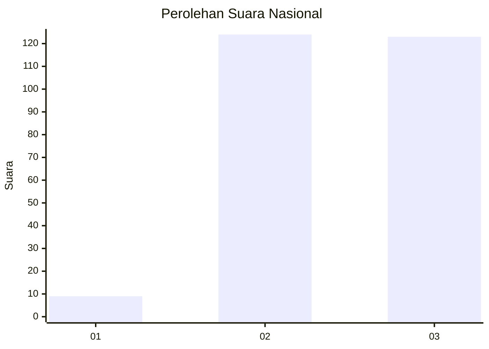
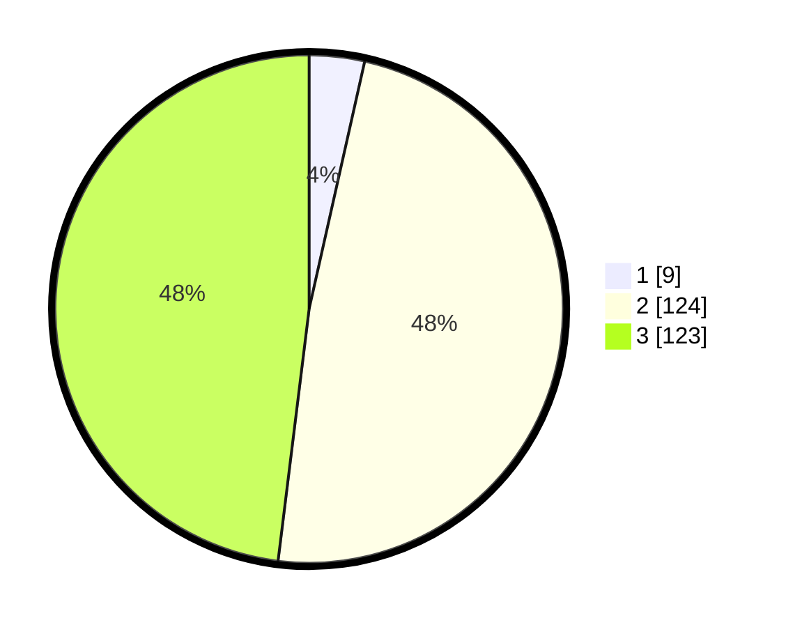

# Hasil

## Grafik

## Tabel

| No. | Nama Paslon    | Suara | Suara (raw) | Persentase |
|:--- |:-------------- | -----:| -----------:| ----------:|
| 1   | ANIES MUHAIMIN | 9     | [9][p-1]    | 3,52       |
| 2   | PRABOWO GIBRAN | 124   | [124][p-2]  | 48,44      |
| 3   | GANJAR MAHFUD  | 123   | [123][p-3]  | 48,05      |

[p-1]: https://github.com/gigit-pemilu/pemilu-2024/blob/main/pilpres/hitung-suara/sub/91-papua/sub/03-jayapura/sub/12-ebungfao/sub/3003-desa-adat-bobrongko/sub/001-tps/sub/paslon-1.txt
[p-2]: https://github.com/gigit-pemilu/pemilu-2024/blob/main/pilpres/hitung-suara/sub/91-papua/sub/03-jayapura/sub/12-ebungfao/sub/3003-desa-adat-bobrongko/sub/001-tps/sub/paslon-2.txt
[p-3]: https://github.com/gigit-pemilu/pemilu-2024/blob/main/pilpres/hitung-suara/sub/91-papua/sub/03-jayapura/sub/12-ebungfao/sub/3003-desa-adat-bobrongko/sub/001-tps/sub/paslon-3.txt

## Foto C Plano

https://sirekap-obj-formc.kpu.go.id/e783/pemilu/ppwp/91/03/12/30/03/9103123003001-20240214-205158--ee9c63ff-24a5-4685-a5ba-6d4a7ed14ad0.jpg

https://sirekap-obj-formc.kpu.go.id/e783/pemilu/ppwp/91/03/12/30/03/9103123003001-20240214-205314--46600204-185f-4cf0-91dc-6b6e42622799.jpg

https://sirekap-obj-formc.kpu.go.id/e783/pemilu/ppwp/91/03/12/30/03/9103123003001-20240214-205429--20b2a750-66fe-458c-b508-c7a3103e852b.jpg

## Metadata

| Key        | Value               |
| ---------- | ------------------- |
| Time Stamp | 2024-02-25 13:00:00 |

