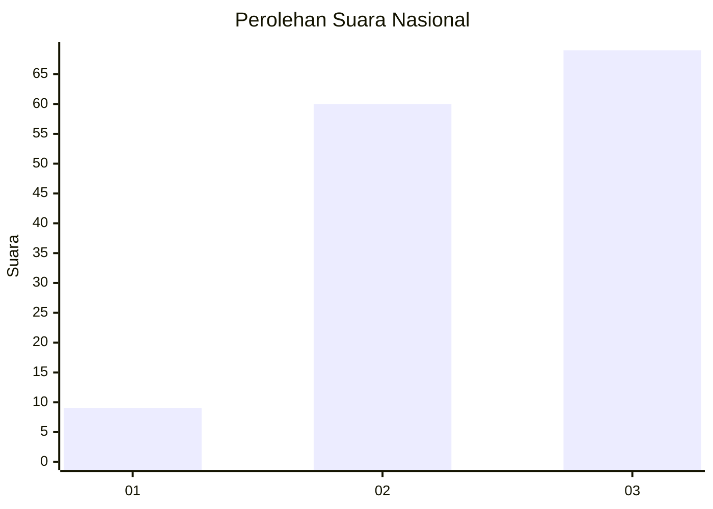
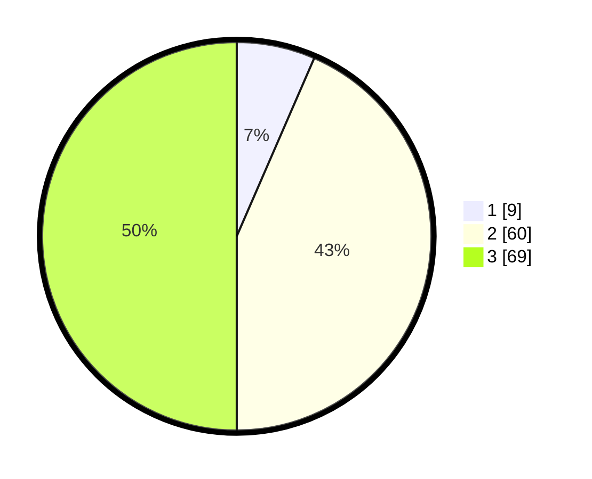

# Hasil

## Grafik

## Tabel

| No. | Nama Paslon    | Suara | Suara (raw) | Persentase |
|:--- |:-------------- | -----:| -----------:| ----------:|
| 1   | ANIES MUHAIMIN | 9     | [9][p-1]    | 6,52       |
| 2   | PRABOWO GIBRAN | 60    | [60][p-2]   | 43,48      |
| 3   | GANJAR MAHFUD  | 69    | [69][p-3]   | 50,00      |

[p-1]: https://github.com/gigit-pemilu/pemilu-2024/blob/main/pilpres/hitung-suara/sub/91-papua/sub/03-jayapura/sub/12-ebungfao/sub/3005-desa-adat-homfolo/sub/002-tps/sub/paslon-1.txt
[p-2]: https://github.com/gigit-pemilu/pemilu-2024/blob/main/pilpres/hitung-suara/sub/91-papua/sub/03-jayapura/sub/12-ebungfao/sub/3005-desa-adat-homfolo/sub/002-tps/sub/paslon-2.txt
[p-3]: https://github.com/gigit-pemilu/pemilu-2024/blob/main/pilpres/hitung-suara/sub/91-papua/sub/03-jayapura/sub/12-ebungfao/sub/3005-desa-adat-homfolo/sub/002-tps/sub/paslon-3.txt

## Foto C Plano

https://sirekap-obj-formc.kpu.go.id/778e/pemilu/ppwp/91/03/12/30/05/9103123005002-20240216-091203--0c7748a5-5ba4-478d-b38b-1c1ef15808ec.jpg

https://sirekap-obj-formc.kpu.go.id/778e/pemilu/ppwp/91/03/12/30/05/9103123005002-20240216-092755--472b55ca-73ea-4371-99b3-19a394043650.jpg

## Metadata

| Key        | Value               |
| ---------- | ------------------- |
| Time Stamp | 2024-02-25 19:00:00 |

