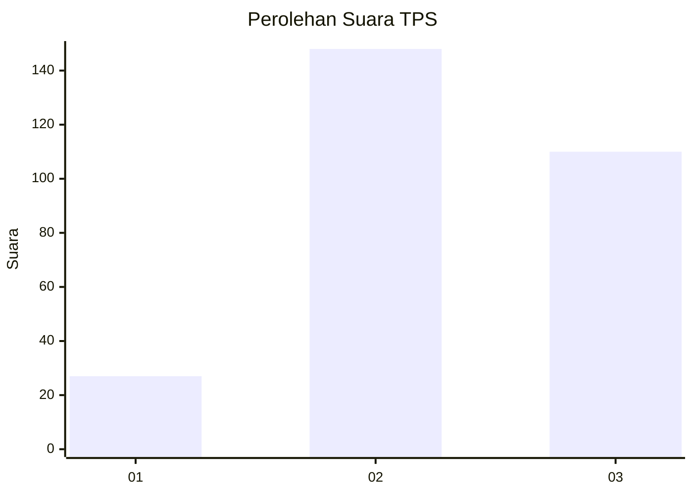
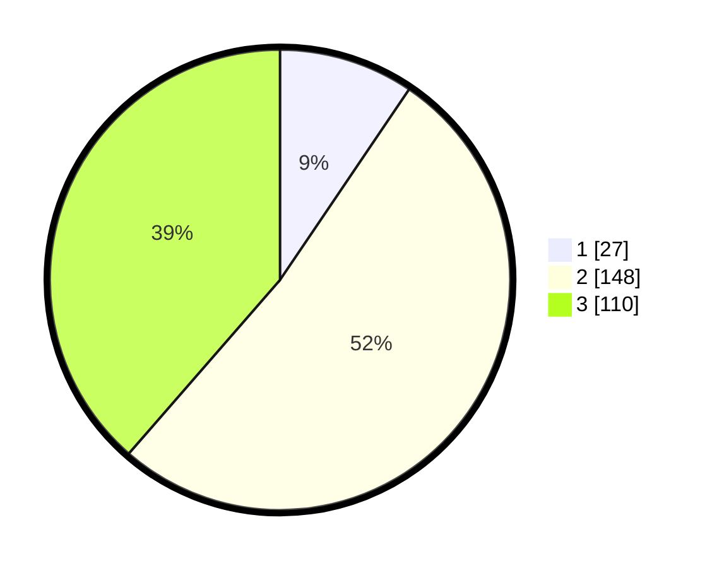

# Hasil

## Grafik

## Tabel

| No. | Nama Paslon    | Suara | Suara (raw) | Persentase |
|:--- |:-------------- | -----:| -----------:| ----------:|
| 1   | ANIES MUHAIMIN | 27    | [27][p-1]   | 9,47       |
| 2   | PRABOWO GIBRAN | 148   | [148][p-2]  | 51,93      |
| 3   | GANJAR MAHFUD  | 110   | [110][p-3]  | 38,60      |

[p-1]: https://github.com/gigit-pemilu/pemilu-2024-91-papua/blob/main/pilpres/hitung-suara/sub/91-papua/sub/03-jayapura/sub/13-waibu/sub/2002-doyo-lama/sub/001-tps/sub/paslon-1.txt
[p-2]: https://github.com/gigit-pemilu/pemilu-2024-91-papua/blob/main/pilpres/hitung-suara/sub/91-papua/sub/03-jayapura/sub/13-waibu/sub/2002-doyo-lama/sub/001-tps/sub/paslon-2.txt
[p-3]: https://github.com/gigit-pemilu/pemilu-2024-91-papua/blob/main/pilpres/hitung-suara/sub/91-papua/sub/03-jayapura/sub/13-waibu/sub/2002-doyo-lama/sub/001-tps/sub/paslon-3.txt

## Foto C Plano

https://sirekap-obj-formc.kpu.go.id/fad8/pemilu/ppwp/91/03/13/20/02/9103132002001-20240224-160707--94b12c1e-20b4-4dbf-9c85-3b63ca8024da.jpg

https://sirekap-obj-formc.kpu.go.id/fad8/pemilu/ppwp/91/03/13/20/02/9103132002001-20240223-190811--b59b5867-dbb1-4830-a001-24c896b103c5.jpg

https://sirekap-obj-formc.kpu.go.id/fad8/pemilu/ppwp/91/03/13/20/02/9103132002001-20240223-190855--12617808-916a-41b0-a2b3-a5a6376135d6.jpg

## Metadata

| Key        | Value               |
| ---------- | ------------------- |
| Time Stamp | 2024-02-25 13:00:00 |

