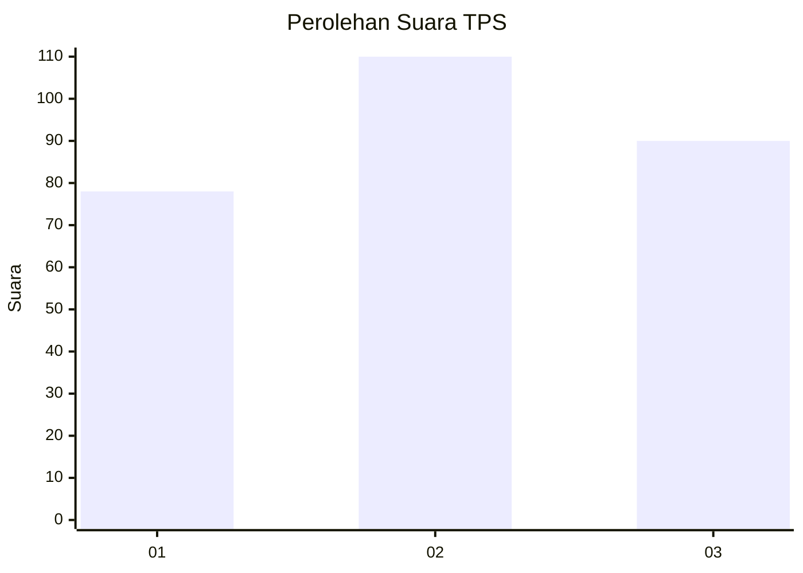
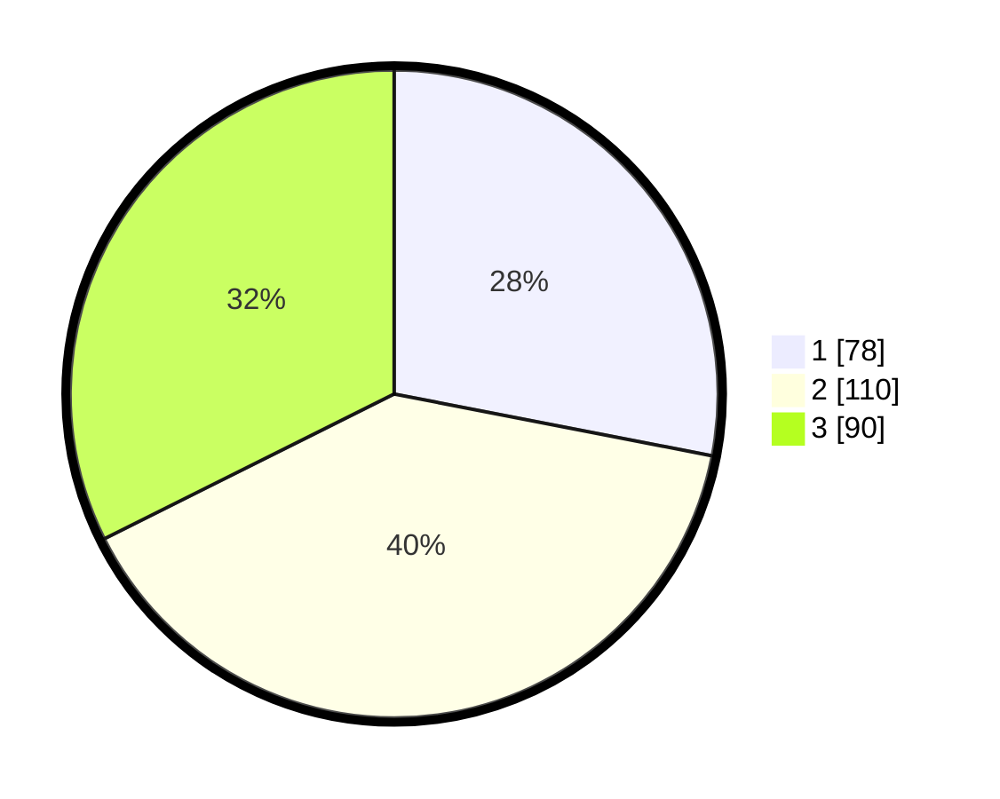

# Hasil

## Grafik

## Tabel

| No. | Nama Paslon    | Suara | Suara (raw) | Persentase |
|:--- |:-------------- | -----:| -----------:| ----------:|
| 1   | ANIES MUHAIMIN | 78    | [78][p-1]   | 28,06      |
| 2   | PRABOWO GIBRAN | 110   | [110][p-2]  | 39,57      |
| 3   | GANJAR MAHFUD  | 90    | [90][p-3]   | 32,37      |

[p-1]: https://github.com/gigit-pemilu/pemilu-2024-91-papua/blob/main/pilpres/hitung-suara/sub/91-papua/sub/03-jayapura/sub/13-waibu/sub/2002-doyo-lama/sub/002-tps/sub/paslon-1.txt
[p-2]: https://github.com/gigit-pemilu/pemilu-2024-91-papua/blob/main/pilpres/hitung-suara/sub/91-papua/sub/03-jayapura/sub/13-waibu/sub/2002-doyo-lama/sub/002-tps/sub/paslon-2.txt
[p-3]: https://github.com/gigit-pemilu/pemilu-2024-91-papua/blob/main/pilpres/hitung-suara/sub/91-papua/sub/03-jayapura/sub/13-waibu/sub/2002-doyo-lama/sub/002-tps/sub/paslon-3.txt

## Foto C Plano

https://sirekap-obj-formc.kpu.go.id/6367/pemilu/ppwp/91/03/13/20/02/9103132002002-20240223-205538--8388e104-7c44-4874-bbf2-1e7a7b62429d.jpg

https://sirekap-obj-formc.kpu.go.id/6367/pemilu/ppwp/91/03/13/20/02/9103132002002-20240223-205610--c47d8b4f-3d61-400c-b7f2-d6d05b1cfeba.jpg

https://sirekap-obj-formc.kpu.go.id/6367/pemilu/ppwp/91/03/13/20/02/9103132002002-20240223-205701--f4570759-b71f-44d1-8440-49c58a0eb2a7.jpg

## Metadata

| Key        | Value               |
| ---------- | ------------------- |
| Time Stamp | 2024-02-25 13:00:00 |

