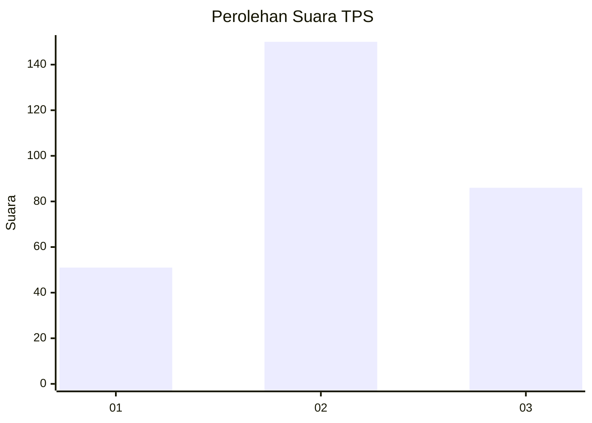
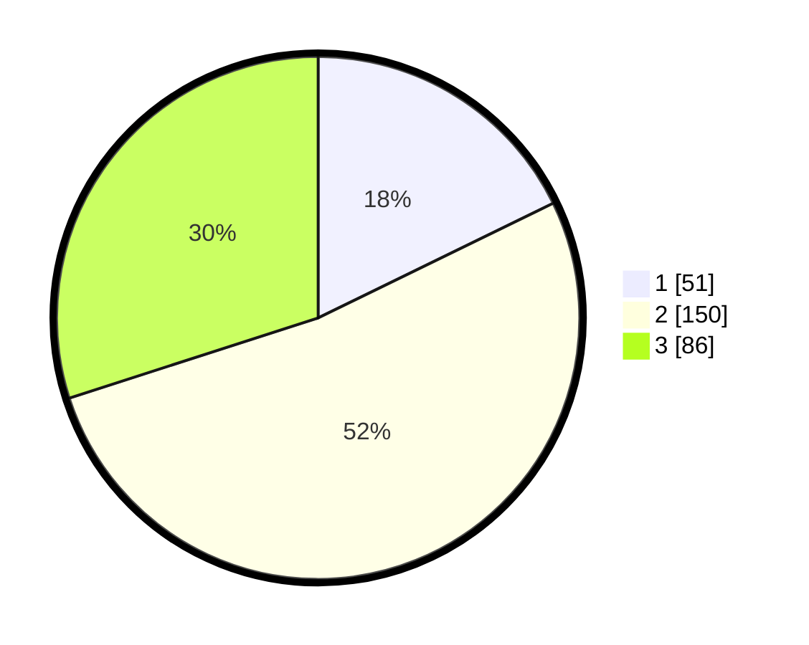

# Hasil

## Grafik

## Tabel

| No. | Nama Paslon    | Suara | Suara (raw) | Persentase |
|:--- |:-------------- | -----:| -----------:| ----------:|
| 1   | ANIES MUHAIMIN | 51    | [51][p-1]   | 17,77      |
| 2   | PRABOWO GIBRAN | 150   | [150][p-2]  | 52,26      |
| 3   | GANJAR MAHFUD  | 86    | [86][p-3]   | 29,97      |

[p-1]: https://github.com/gigit-pemilu/pemilu-2024-91-papua/blob/main/pilpres/hitung-suara/sub/91-papua/sub/03-jayapura/sub/13-waibu/sub/2002-doyo-lama/sub/003-tps/sub/paslon-1.txt
[p-2]: https://github.com/gigit-pemilu/pemilu-2024-91-papua/blob/main/pilpres/hitung-suara/sub/91-papua/sub/03-jayapura/sub/13-waibu/sub/2002-doyo-lama/sub/003-tps/sub/paslon-2.txt
[p-3]: https://github.com/gigit-pemilu/pemilu-2024-91-papua/blob/main/pilpres/hitung-suara/sub/91-papua/sub/03-jayapura/sub/13-waibu/sub/2002-doyo-lama/sub/003-tps/sub/paslon-3.txt

## Foto C Plano

https://sirekap-obj-formc.kpu.go.id/720a/pemilu/ppwp/91/03/13/20/02/9103132002003-20240224-112808--4ab41c26-df89-4664-85b7-5b18bf45e5d0.jpg

https://sirekap-obj-formc.kpu.go.id/720a/pemilu/ppwp/91/03/13/20/02/9103132002003-20240224-112620--b4117c96-0b14-4cd6-bec4-1316fc57ce42.jpg

## Metadata

| Key        | Value               |
| ---------- | ------------------- |
| Time Stamp | 2024-02-25 13:00:00 |

