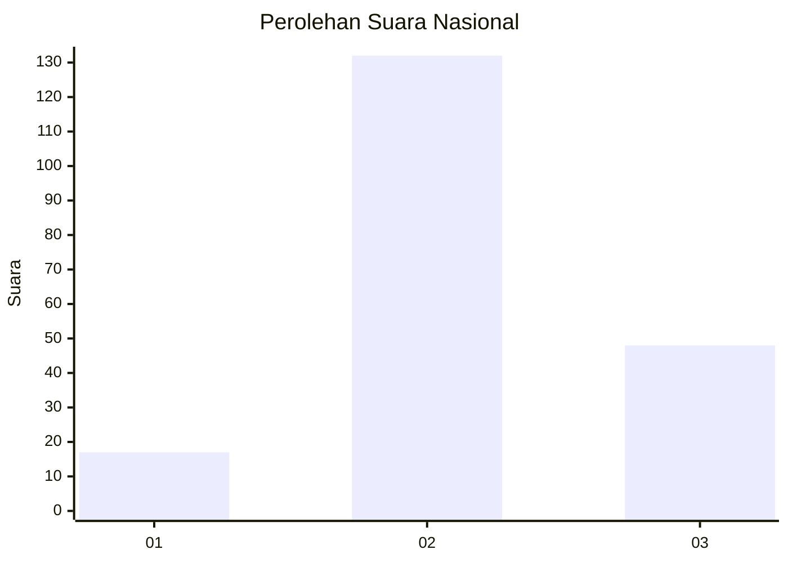
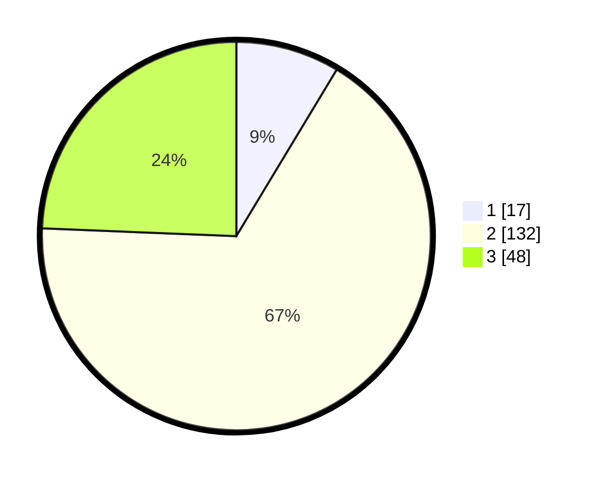

# Hasil

## Grafik

## Tabel

| No. | Nama Paslon    | Suara | Suara (raw) | Persentase |
|:--- |:-------------- | -----:| -----------:| ----------:|
| 1   | ANIES MUHAIMIN | 17    | [17][p-1]   | 8,63       |
| 2   | PRABOWO GIBRAN | 132   | [132][p-2]  | 67,01      |
| 3   | GANJAR MAHFUD  | 48    | [48][p-3]   | 24,37      |

[p-1]: https://github.com/gigit-pemilu/pemilu-2024/blob/main/pilpres/hitung-suara/sub/91-papua/sub/03-jayapura/sub/13-waibu/sub/2002-doyo-lama/sub/004-tps/sub/paslon-1.txt
[p-2]: https://github.com/gigit-pemilu/pemilu-2024/blob/main/pilpres/hitung-suara/sub/91-papua/sub/03-jayapura/sub/13-waibu/sub/2002-doyo-lama/sub/004-tps/sub/paslon-2.txt
[p-3]: https://github.com/gigit-pemilu/pemilu-2024/blob/main/pilpres/hitung-suara/sub/91-papua/sub/03-jayapura/sub/13-waibu/sub/2002-doyo-lama/sub/004-tps/sub/paslon-3.txt

## Foto C Plano

https://sirekap-obj-formc.kpu.go.id/bf08/pemilu/ppwp/91/03/13/20/02/9103132002004-20240224-123353--881152a8-03e0-4f86-b54e-93bf6ef19479.jpg

https://sirekap-obj-formc.kpu.go.id/bf08/pemilu/ppwp/91/03/13/20/02/9103132002004-20240224-123318--a3683876-494c-46b6-9da6-e78cec2203b4.jpg

https://sirekap-obj-formc.kpu.go.id/bf08/pemilu/ppwp/91/03/13/20/02/9103132002004-20240224-124327--b405b67e-c7ce-4a4f-a309-8d3a1ea83b69.jpg

## Metadata

| Key        | Value               |
| ---------- | ------------------- |
| Time Stamp | 2024-02-25 13:00:00 |

