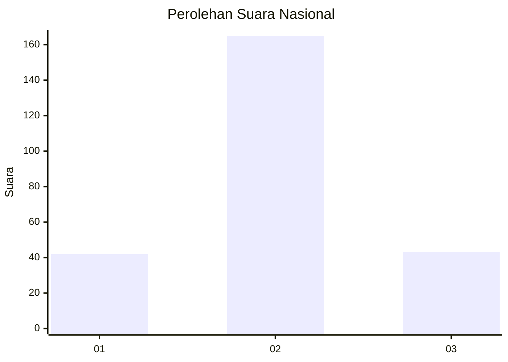
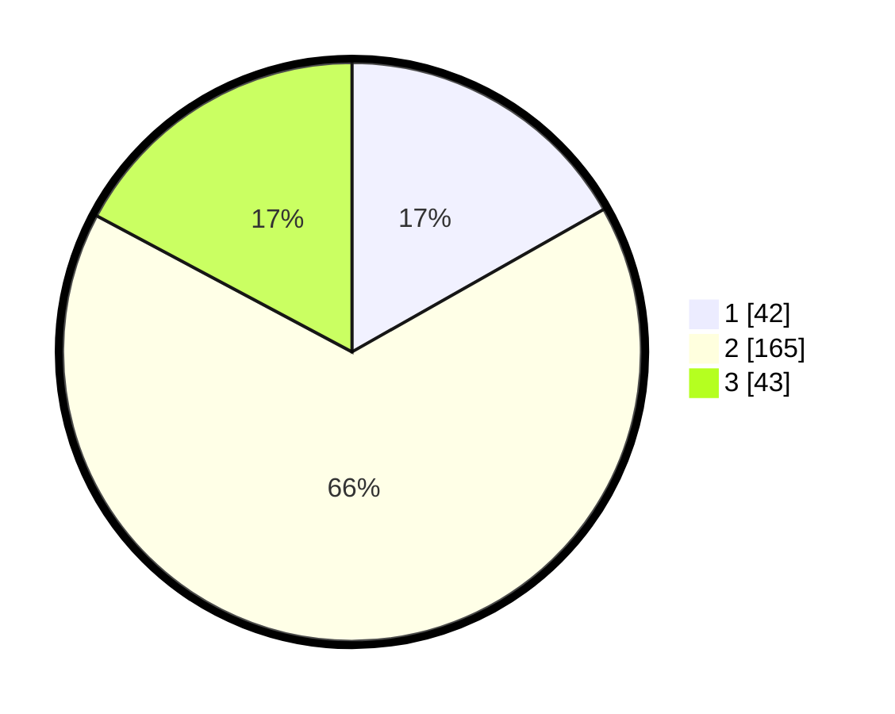

# Hasil

## Grafik

## Tabel

| No. | Nama Paslon    | Suara | Suara (raw) | Persentase |
|:--- |:-------------- | -----:| -----------:| ----------:|
| 1   | ANIES MUHAIMIN | 42    | [42][p-1]   | 16,80      |
| 2   | PRABOWO GIBRAN | 165   | [165][p-2]  | 66,00      |
| 3   | GANJAR MAHFUD  | 43    | [43][p-3]   | 17,20      |

[p-1]: https://github.com/gigit-pemilu/pemilu-2024/blob/main/pilpres/hitung-suara/sub/91-papua/sub/03-jayapura/sub/13-waibu/sub/2002-doyo-lama/sub/005-tps/sub/paslon-1.txt
[p-2]: https://github.com/gigit-pemilu/pemilu-2024/blob/main/pilpres/hitung-suara/sub/91-papua/sub/03-jayapura/sub/13-waibu/sub/2002-doyo-lama/sub/005-tps/sub/paslon-2.txt
[p-3]: https://github.com/gigit-pemilu/pemilu-2024/blob/main/pilpres/hitung-suara/sub/91-papua/sub/03-jayapura/sub/13-waibu/sub/2002-doyo-lama/sub/005-tps/sub/paslon-3.txt

## Foto C Plano

https://sirekap-obj-formc.kpu.go.id/97f5/pemilu/ppwp/91/03/13/20/02/9103132002005-20240224-150627--dfa248e6-d439-4132-aa40-5ea39f723186.jpg

https://sirekap-obj-formc.kpu.go.id/97f5/pemilu/ppwp/91/03/13/20/02/9103132002005-20240224-150704--dfca1d5e-57e7-4204-aa03-e15781286764.jpg

https://sirekap-obj-formc.kpu.go.id/97f5/pemilu/ppwp/91/03/13/20/02/9103132002005-20240224-150732--873e12e1-98ee-48c6-9cbd-b0e52217ef00.jpg

## Metadata

| Key        | Value               |
| ---------- | ------------------- |
| Time Stamp | 2024-02-25 13:00:00 |

