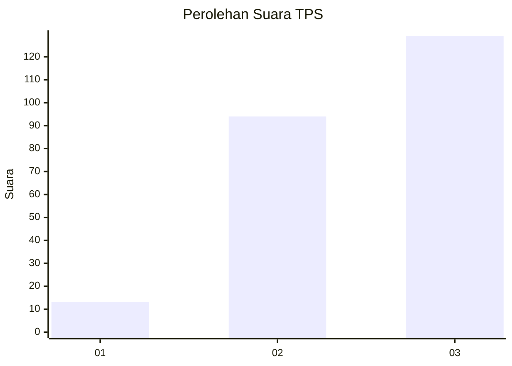
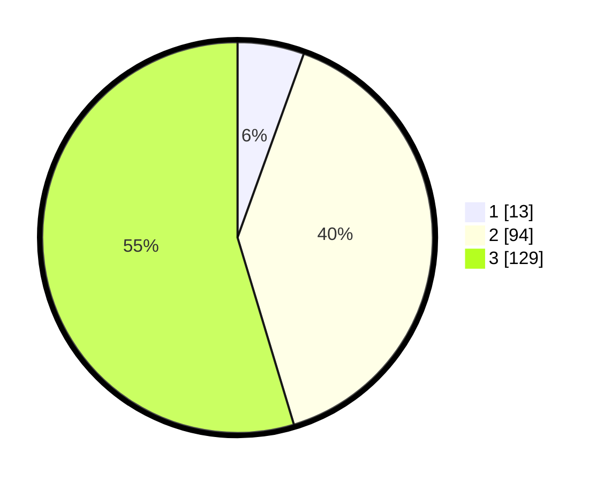

# Hasil

## Grafik

## Tabel

| No. | Nama Paslon    | Suara | Suara (raw) | Persentase |
|:--- |:-------------- | -----:| -----------:| ----------:|
| 1   | ANIES MUHAIMIN | 13    | [13][p-1]   | 5,51       |
| 2   | PRABOWO GIBRAN | 94    | [94][p-2]   | 39,83      |
| 3   | GANJAR MAHFUD  | 129   | [129][p-3]  | 54,66      |

[p-1]: https://github.com/gigit-pemilu/pemilu-2024-91-papua/blob/main/pilpres/hitung-suara/sub/91-papua/sub/03-jayapura/sub/13-waibu/sub/2003-kwadeware/sub/002-tps/sub/paslon-1.txt
[p-2]: https://github.com/gigit-pemilu/pemilu-2024-91-papua/blob/main/pilpres/hitung-suara/sub/91-papua/sub/03-jayapura/sub/13-waibu/sub/2003-kwadeware/sub/002-tps/sub/paslon-2.txt
[p-3]: https://github.com/gigit-pemilu/pemilu-2024-91-papua/blob/main/pilpres/hitung-suara/sub/91-papua/sub/03-jayapura/sub/13-waibu/sub/2003-kwadeware/sub/002-tps/sub/paslon-3.txt

## Foto C Plano

https://sirekap-obj-formc.kpu.go.id/be9a/pemilu/ppwp/91/03/13/20/03/9103132003002-20240221-134118--79aba2c1-1395-4853-99e8-385c59bffce9.jpg

https://sirekap-obj-formc.kpu.go.id/be9a/pemilu/ppwp/91/03/13/20/03/9103132003002-20240221-134204--a5d1ea73-af27-4558-8b3c-4bf5f5cf8166.jpg

https://sirekap-obj-formc.kpu.go.id/be9a/pemilu/ppwp/91/03/13/20/03/9103132003002-20240221-134248--e8b1dbfc-d3a9-4052-bda4-898e598f8bc0.jpg

## Metadata

| Key        | Value               |
| ---------- | ------------------- |
| Time Stamp | 2024-02-25 13:00:00 |

