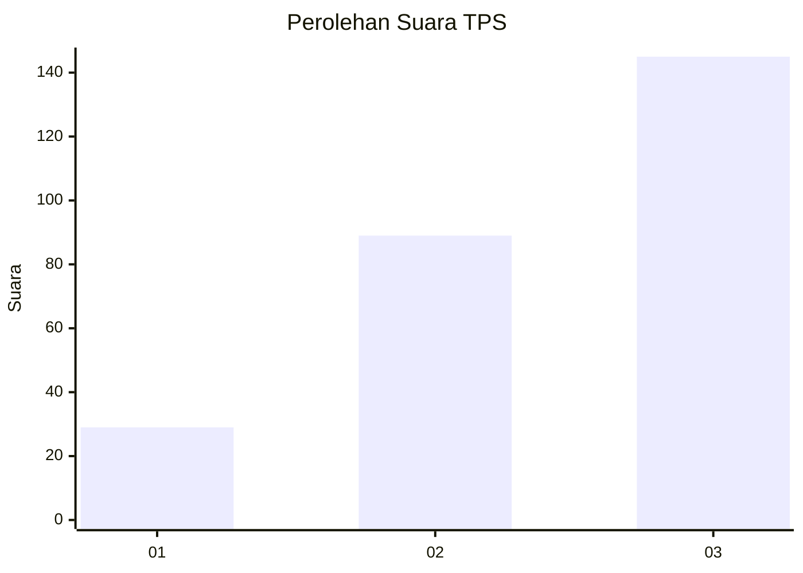
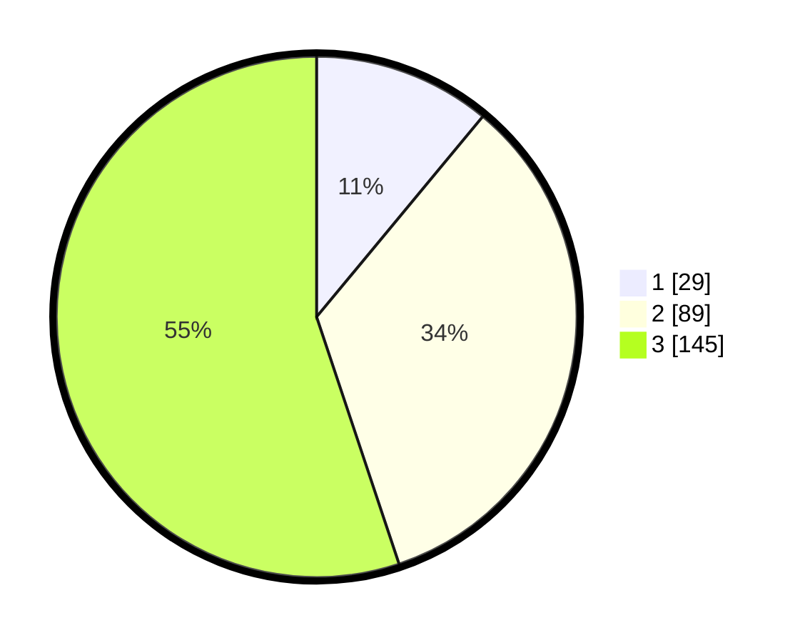

# Hasil

## Grafik

## Tabel

| No. | Nama Paslon    | Suara | Suara (raw) | Persentase |
|:--- |:-------------- | -----:| -----------:| ----------:|
| 1   | ANIES MUHAIMIN | 29    | [29][p-1]   | 11,03      |
| 2   | PRABOWO GIBRAN | 89    | [89][p-2]   | 33,84      |
| 3   | GANJAR MAHFUD  | 145   | [145][p-3]  | 55,13      |

[p-1]: https://github.com/gigit-pemilu/pemilu-2024-91-papua/blob/main/pilpres/hitung-suara/sub/91-papua/sub/03-jayapura/sub/13-waibu/sub/2004-yakonde/sub/001-tps/sub/paslon-1.txt
[p-2]: https://github.com/gigit-pemilu/pemilu-2024-91-papua/blob/main/pilpres/hitung-suara/sub/91-papua/sub/03-jayapura/sub/13-waibu/sub/2004-yakonde/sub/001-tps/sub/paslon-2.txt
[p-3]: https://github.com/gigit-pemilu/pemilu-2024-91-papua/blob/main/pilpres/hitung-suara/sub/91-papua/sub/03-jayapura/sub/13-waibu/sub/2004-yakonde/sub/001-tps/sub/paslon-3.txt

## Foto C Plano

https://sirekap-obj-formc.kpu.go.id/c502/pemilu/ppwp/91/03/13/20/04/9103132004001-20240221-153223--c11b8d0d-056c-4214-b24e-37d8827bb2ce.jpg

https://sirekap-obj-formc.kpu.go.id/c502/pemilu/ppwp/91/03/13/20/04/9103132004001-20240221-153441--5de585f2-fc44-4d18-bc83-3af74de9eb34.jpg

https://sirekap-obj-formc.kpu.go.id/c502/pemilu/ppwp/91/03/13/20/04/9103132004001-20240221-153347--619eacd1-819f-48ee-b0d9-44e3110d2f7c.jpg

## Metadata

| Key        | Value               |
| ---------- | ------------------- |
| Time Stamp | 2024-02-25 13:00:00 |

