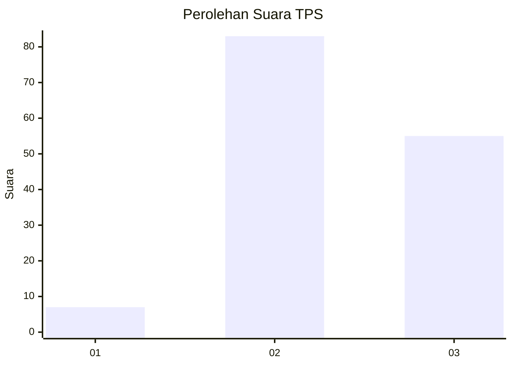
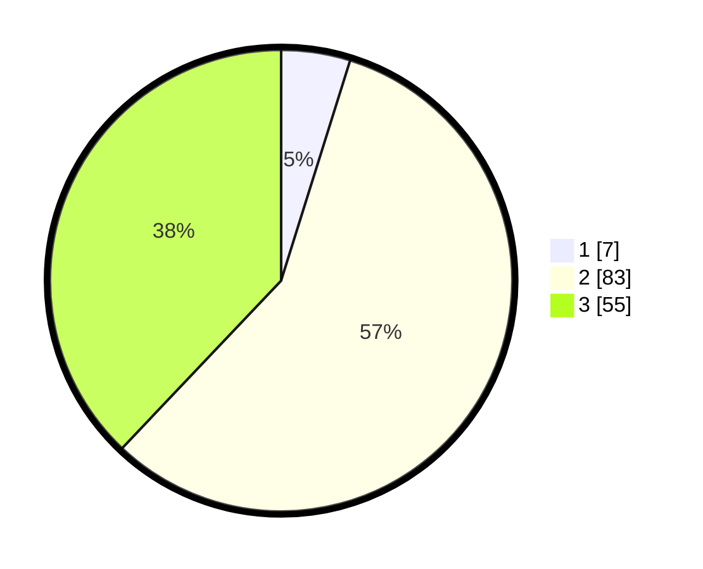

# Hasil

## Grafik

## Tabel

| No. | Nama Paslon    | Suara | Suara (raw) | Persentase |
|:--- |:-------------- | -----:| -----------:| ----------:|
| 1   | ANIES MUHAIMIN | 7     | [7][p-1]    | 4,83       |
| 2   | PRABOWO GIBRAN | 83    | [83][p-2]   | 57,24      |
| 3   | GANJAR MAHFUD  | 55    | [55][p-3]   | 37,93      |

[p-1]: https://github.com/gigit-pemilu/pemilu-2024-91-papua/blob/main/pilpres/hitung-suara/sub/91-papua/sub/03-jayapura/sub/13-waibu/sub/2004-yakonde/sub/002-tps/sub/paslon-1.txt
[p-2]: https://github.com/gigit-pemilu/pemilu-2024-91-papua/blob/main/pilpres/hitung-suara/sub/91-papua/sub/03-jayapura/sub/13-waibu/sub/2004-yakonde/sub/002-tps/sub/paslon-2.txt
[p-3]: https://github.com/gigit-pemilu/pemilu-2024-91-papua/blob/main/pilpres/hitung-suara/sub/91-papua/sub/03-jayapura/sub/13-waibu/sub/2004-yakonde/sub/002-tps/sub/paslon-3.txt

## Foto C Plano

https://sirekap-obj-formc.kpu.go.id/df56/pemilu/ppwp/91/03/13/20/04/9103132004002-20240221-172407--c0fad316-c62e-4e1e-9035-14bf703bf3da.jpg

https://sirekap-obj-formc.kpu.go.id/df56/pemilu/ppwp/91/03/13/20/04/9103132004002-20240221-172446--c2ef5759-2d2f-4915-aaab-ecc2e75e691b.jpg

https://sirekap-obj-formc.kpu.go.id/df56/pemilu/ppwp/91/03/13/20/04/9103132004002-20240221-172531--76274998-b4de-4188-9248-cb63e882670f.jpg

## Metadata

| Key        | Value               |
| ---------- | ------------------- |
| Time Stamp | 2024-02-24 22:31:28 |

