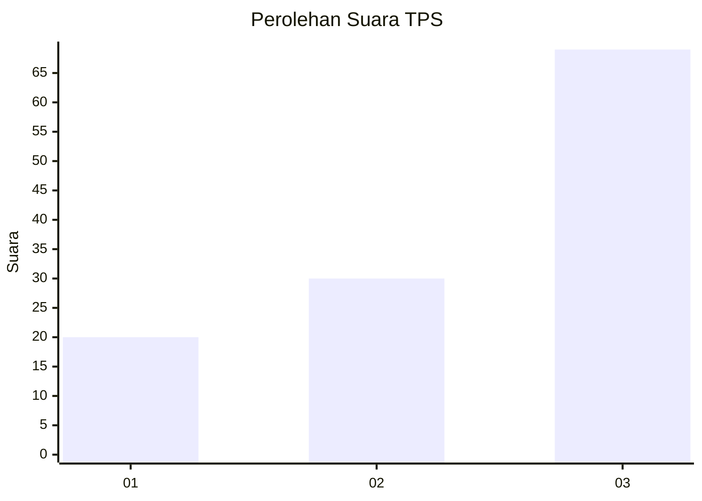
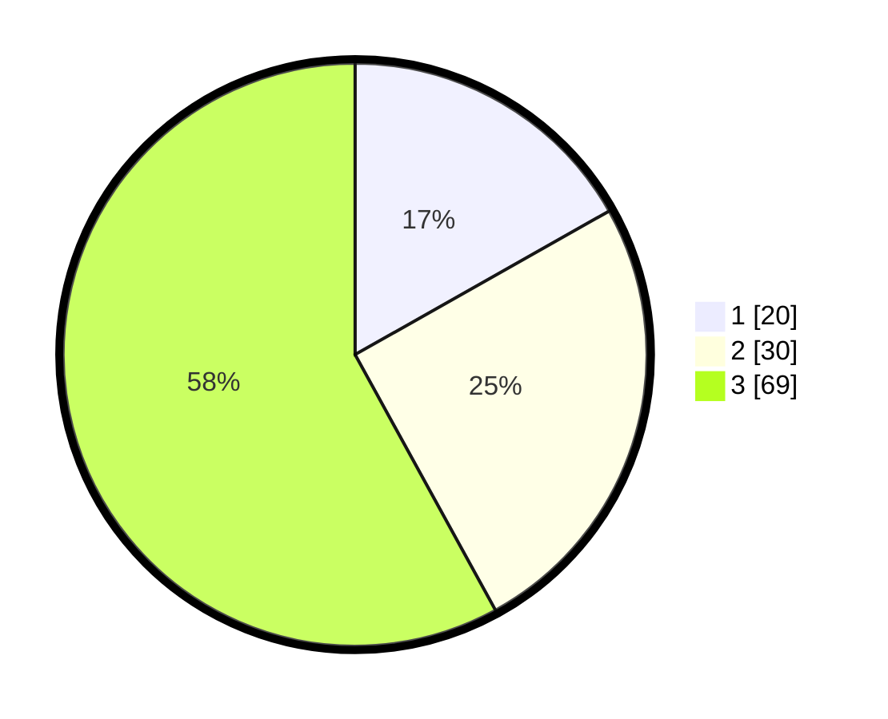

# Hasil

## Grafik

## Tabel

| No. | Nama Paslon    | Suara | Suara (raw) | Persentase |
|:--- |:-------------- | -----:| -----------:| ----------:|
| 1   | ANIES MUHAIMIN | 20    | [20][p-1]   | 16,81      |
| 2   | PRABOWO GIBRAN | 30    | [30][p-2]   | 25,21      |
| 3   | GANJAR MAHFUD  | 69    | [69][p-3]   | 57,98      |

[p-1]: https://github.com/gigit-pemilu/pemilu-2024-91-papua/blob/main/pilpres/hitung-suara/sub/91-papua/sub/03-jayapura/sub/13-waibu/sub/2005-sosiri/sub/001-tps/sub/paslon-1.txt
[p-2]: https://github.com/gigit-pemilu/pemilu-2024-91-papua/blob/main/pilpres/hitung-suara/sub/91-papua/sub/03-jayapura/sub/13-waibu/sub/2005-sosiri/sub/001-tps/sub/paslon-2.txt
[p-3]: https://github.com/gigit-pemilu/pemilu-2024-91-papua/blob/main/pilpres/hitung-suara/sub/91-papua/sub/03-jayapura/sub/13-waibu/sub/2005-sosiri/sub/001-tps/sub/paslon-3.txt

## Foto C Plano

https://sirekap-obj-formc.kpu.go.id/1db4/pemilu/ppwp/91/03/13/20/05/9103132005001-20240226-100016--403e37d0-e9b3-41e4-a9a8-1b21fac66795.jpg

https://sirekap-obj-formc.kpu.go.id/1db4/pemilu/ppwp/91/03/13/20/05/9103132005001-20240226-100213--a4e7456f-9745-4ff9-8170-546f141e2825.jpg

https://sirekap-obj-formc.kpu.go.id/1db4/pemilu/ppwp/91/03/13/20/05/9103132005001-20240226-100137--99350881-721d-4d47-b6b1-c0a124a93a0c.jpg

## Metadata

| Key        | Value               |
| ---------- | ------------------- |
| Time Stamp | 2024-02-28 11:00:00 |

