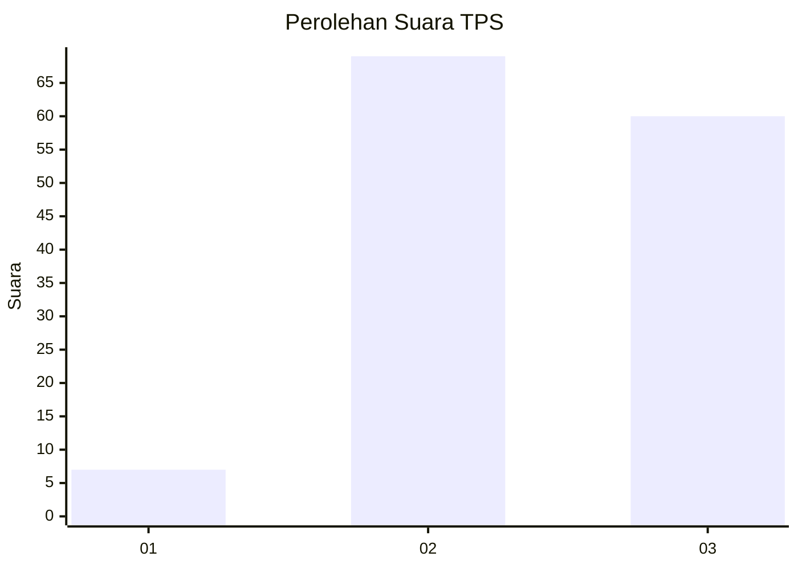
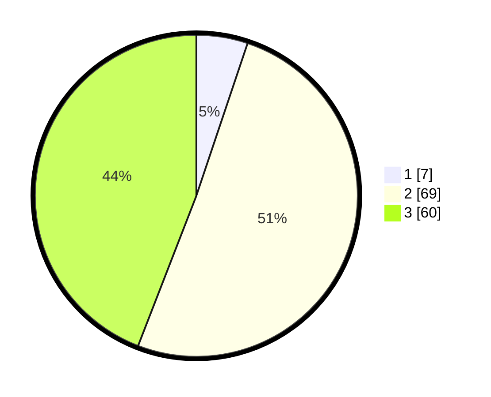

# Hasil

## Grafik

## Tabel

| No. | Nama Paslon    | Suara | Suara (raw) | Persentase |
|:--- |:-------------- | -----:| -----------:| ----------:|
| 1   | ANIES MUHAIMIN | 7     | [7][p-1]    | 5,15       |
| 2   | PRABOWO GIBRAN | 69    | [69][p-2]   | 50,74      |
| 3   | GANJAR MAHFUD  | 60    | [60][p-3]   | 44,12      |

[p-1]: https://github.com/gigit-pemilu/pemilu-2024-91-papua/blob/main/pilpres/hitung-suara/sub/91-papua/sub/03-jayapura/sub/13-waibu/sub/2005-sosiri/sub/002-tps/sub/paslon-1.txt
[p-2]: https://github.com/gigit-pemilu/pemilu-2024-91-papua/blob/main/pilpres/hitung-suara/sub/91-papua/sub/03-jayapura/sub/13-waibu/sub/2005-sosiri/sub/002-tps/sub/paslon-2.txt
[p-3]: https://github.com/gigit-pemilu/pemilu-2024-91-papua/blob/main/pilpres/hitung-suara/sub/91-papua/sub/03-jayapura/sub/13-waibu/sub/2005-sosiri/sub/002-tps/sub/paslon-3.txt

## Foto C Plano

https://sirekap-obj-formc.kpu.go.id/bd81/pemilu/ppwp/91/03/13/20/05/9103132005002-20240226-110549--6e9b7fcb-1379-40cf-b296-a4351234bc4d.jpg

https://sirekap-obj-formc.kpu.go.id/bd81/pemilu/ppwp/91/03/13/20/05/9103132005002-20240226-110652--c3b33460-0cc9-4a45-bffc-455596b9daea.jpg

https://sirekap-obj-formc.kpu.go.id/bd81/pemilu/ppwp/91/03/13/20/05/9103132005002-20240226-110746--d8028559-5472-4f4b-b746-375a6683fceb.jpg

## Metadata

| Key        | Value               |
| ---------- | ------------------- |
| Time Stamp | 2024-02-28 11:00:00 |

