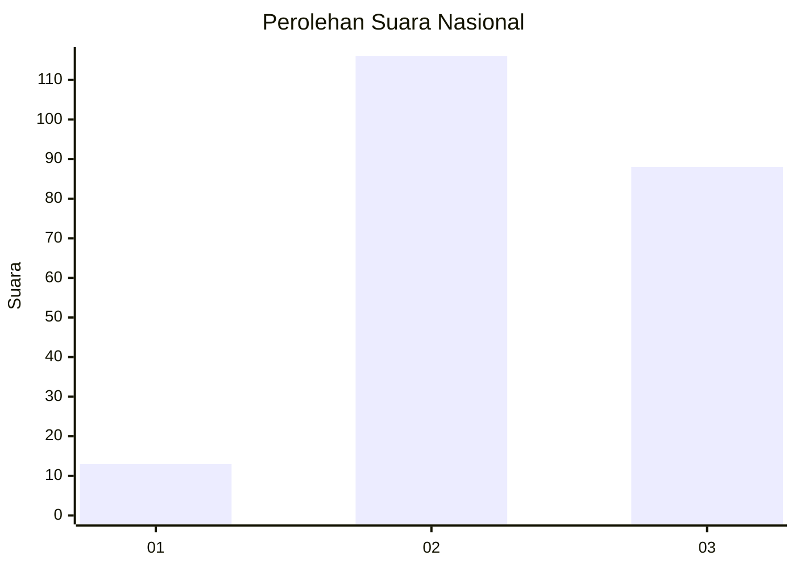
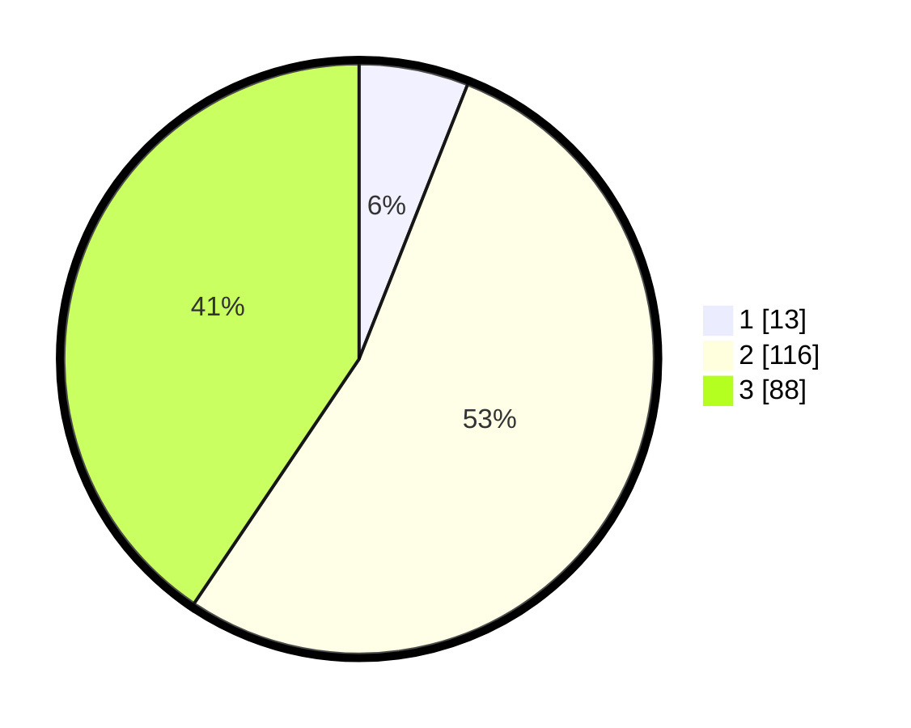

# Hasil

## Grafik

## Tabel

| No. | Nama Paslon    | Suara | Suara (raw) | Persentase |
|:--- |:-------------- | -----:| -----------:| ----------:|
| 1   | ANIES MUHAIMIN | 13    | [13][p-1]   | 5,99       |
| 2   | PRABOWO GIBRAN | 116   | [116][p-2]  | 53,46      |
| 3   | GANJAR MAHFUD  | 88    | [88][p-3]   | 40,55      |

[p-1]: https://github.com/gigit-pemilu/pemilu-2024/blob/main/pilpres/hitung-suara/sub/91-papua/sub/03-jayapura/sub/13-waibu/sub/2005-sosiri/sub/003-tps/sub/paslon-1.txt
[p-2]: https://github.com/gigit-pemilu/pemilu-2024/blob/main/pilpres/hitung-suara/sub/91-papua/sub/03-jayapura/sub/13-waibu/sub/2005-sosiri/sub/003-tps/sub/paslon-2.txt
[p-3]: https://github.com/gigit-pemilu/pemilu-2024/blob/main/pilpres/hitung-suara/sub/91-papua/sub/03-jayapura/sub/13-waibu/sub/2005-sosiri/sub/003-tps/sub/paslon-3.txt

## Foto C Plano

https://sirekap-obj-formc.kpu.go.id/1fe8/pemilu/ppwp/91/03/13/20/05/9103132005003-20240226-125824--24381da1-3cc7-454f-918a-c66b19b2e3a0.jpg

https://sirekap-obj-formc.kpu.go.id/1fe8/pemilu/ppwp/91/03/13/20/05/9103132005003-20240226-125930--a9e0a8dc-6601-4611-93fd-453df7a05c9e.jpg

https://sirekap-obj-formc.kpu.go.id/1fe8/pemilu/ppwp/91/03/13/20/05/9103132005003-20240226-130004--56573e9b-9ade-4864-8f44-cc9993488ca0.jpg

## Metadata

| Key        | Value               |
| ---------- | ------------------- |
| Time Stamp | 2024-02-28 11:00:00 |

