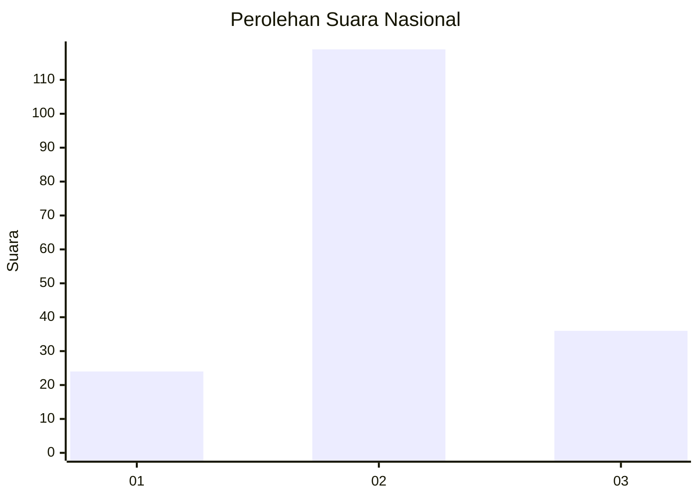
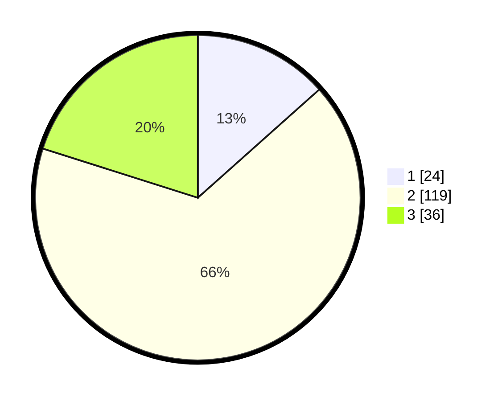

# Hasil

## Grafik

## Tabel

| No. | Nama Paslon    | Suara | Suara (raw) | Persentase |
|:--- |:-------------- | -----:| -----------:| ----------:|
| 1   | ANIES MUHAIMIN | 24    | [24][p-1]   | 13,41      |
| 2   | PRABOWO GIBRAN | 119   | [119][p-2]  | 66,48      |
| 3   | GANJAR MAHFUD  | 36    | [36][p-3]   | 20,11      |

[p-1]: https://github.com/gigit-pemilu/pemilu-2024/blob/main/pilpres/hitung-suara/sub/91-papua/sub/03-jayapura/sub/13-waibu/sub/2006-doyo-baru/sub/001-tps/sub/paslon-1.txt
[p-2]: https://github.com/gigit-pemilu/pemilu-2024/blob/main/pilpres/hitung-suara/sub/91-papua/sub/03-jayapura/sub/13-waibu/sub/2006-doyo-baru/sub/001-tps/sub/paslon-2.txt
[p-3]: https://github.com/gigit-pemilu/pemilu-2024/blob/main/pilpres/hitung-suara/sub/91-papua/sub/03-jayapura/sub/13-waibu/sub/2006-doyo-baru/sub/001-tps/sub/paslon-3.txt

## Foto C Plano

https://sirekap-obj-formc.kpu.go.id/8713/pemilu/ppwp/91/03/13/20/06/9103132006001-20240227-170010--9811793a-9ee0-4da3-a186-3fc79b1121a4.jpg

https://sirekap-obj-formc.kpu.go.id/8713/pemilu/ppwp/91/03/13/20/06/9103132006001-20240227-165930--796a4dbb-cb9f-45b7-b06e-a3839f12b0c2.jpg

https://sirekap-obj-formc.kpu.go.id/8713/pemilu/ppwp/91/03/13/20/06/9103132006001-20240227-165818--dd6a052d-fa0b-42da-8520-6662b5ac390a.jpg

## Metadata

| Key        | Value               |
| ---------- | ------------------- |
| Time Stamp | 2024-02-28 11:00:00 |

