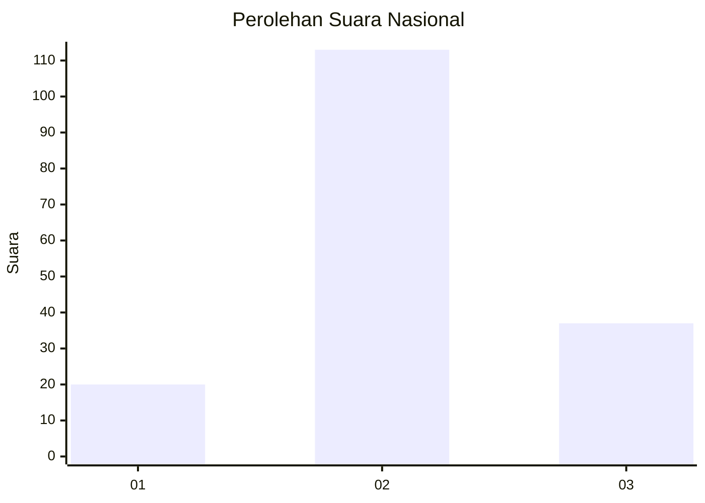
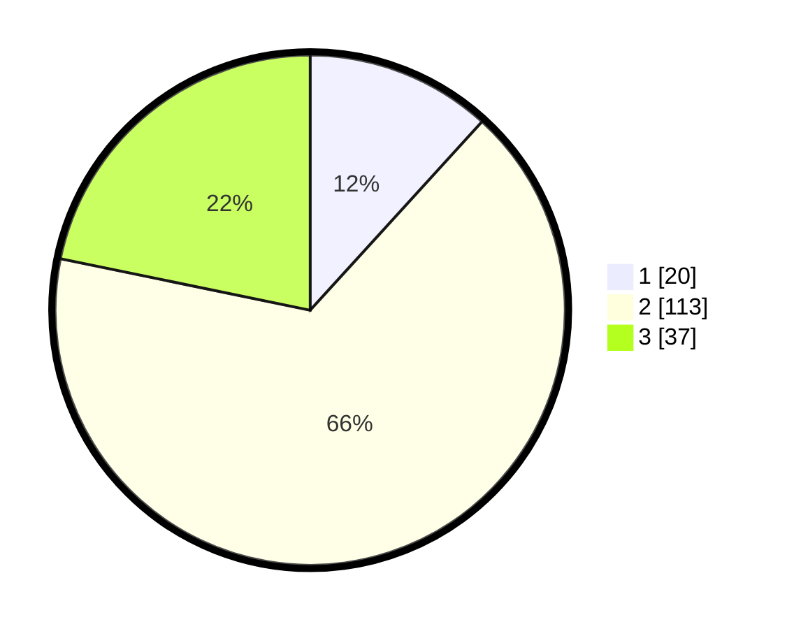

# Hasil

## Grafik

## Tabel

| No. | Nama Paslon    | Suara | Suara (raw) | Persentase |
|:--- |:-------------- | -----:| -----------:| ----------:|
| 1   | ANIES MUHAIMIN | 20    | [20][p-1]   | 11,76      |
| 2   | PRABOWO GIBRAN | 113   | [113][p-2]  | 66,47      |
| 3   | GANJAR MAHFUD  | 37    | [37][p-3]   | 21,76      |

[p-1]: https://github.com/gigit-pemilu/pemilu-2024/blob/main/pilpres/hitung-suara/sub/91-papua/sub/03-jayapura/sub/13-waibu/sub/2006-doyo-baru/sub/027-tps/sub/paslon-1.txt
[p-2]: https://github.com/gigit-pemilu/pemilu-2024/blob/main/pilpres/hitung-suara/sub/91-papua/sub/03-jayapura/sub/13-waibu/sub/2006-doyo-baru/sub/027-tps/sub/paslon-2.txt
[p-3]: https://github.com/gigit-pemilu/pemilu-2024/blob/main/pilpres/hitung-suara/sub/91-papua/sub/03-jayapura/sub/13-waibu/sub/2006-doyo-baru/sub/027-tps/sub/paslon-3.txt

## Foto C Plano

https://sirekap-obj-formc.kpu.go.id/8706/pemilu/ppwp/91/03/13/20/06/9103132006027-20240215-153020--cc622e02-5962-4caf-9fdd-a214ec55586c.jpg

https://sirekap-obj-formc.kpu.go.id/8706/pemilu/ppwp/91/03/13/20/06/9103132006027-20240215-153151--44dc14d8-c510-4e3a-b6f9-fa2955e921fa.jpg

https://sirekap-obj-formc.kpu.go.id/8706/pemilu/ppwp/91/03/13/20/06/9103132006027-20240215-145819--076363ff-6ca1-4b3c-9ccf-24e4773c2674.jpg

## Metadata

| Key        | Value               |
| ---------- | ------------------- |
| Time Stamp | 2024-02-28 11:00:00 |

