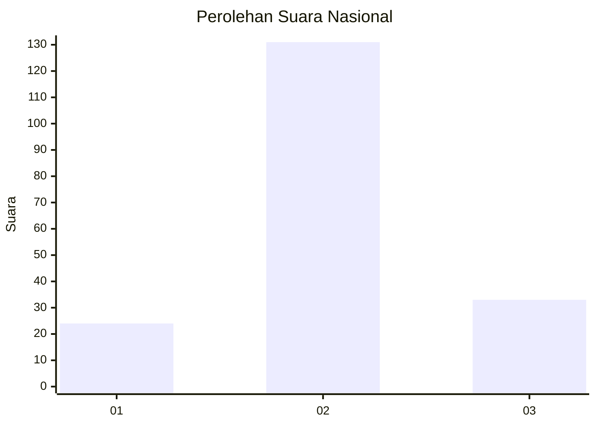
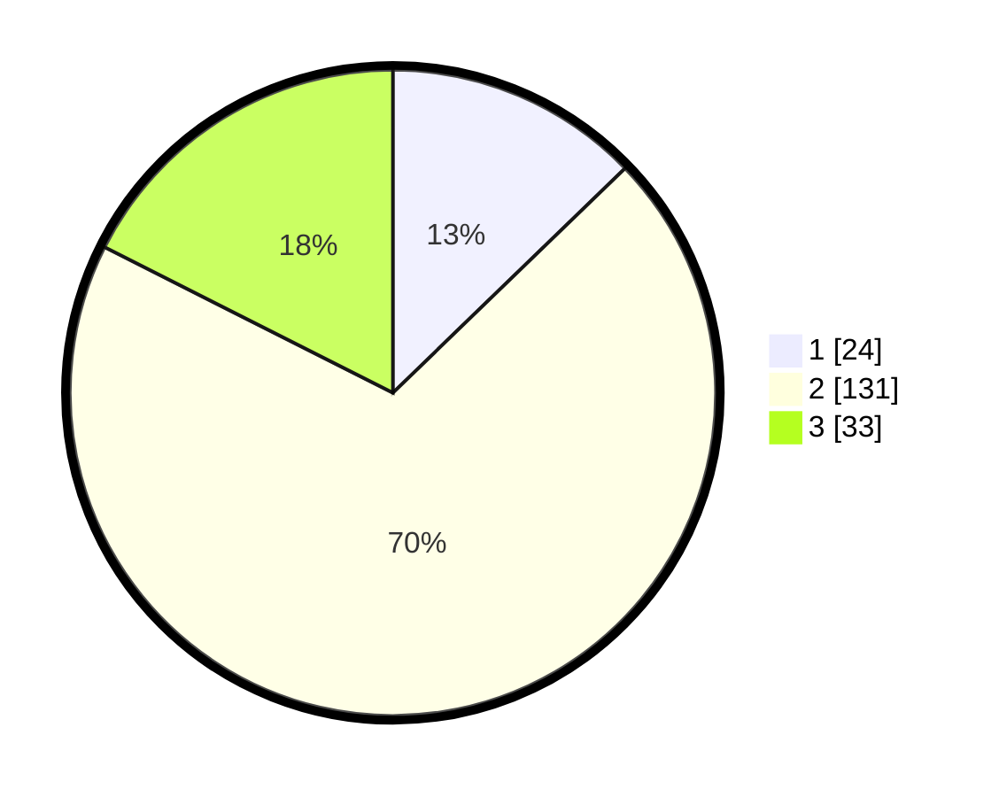

# Hasil

## Grafik

## Tabel

| No. | Nama Paslon    | Suara | Suara (raw) | Persentase |
|:--- |:-------------- | -----:| -----------:| ----------:|
| 1   | ANIES MUHAIMIN | 24    | [24][p-1]   | 12,77      |
| 2   | PRABOWO GIBRAN | 131   | [131][p-2]  | 69,68      |
| 3   | GANJAR MAHFUD  | 33    | [33][p-3]   | 17,55      |

[p-1]: https://github.com/gigit-pemilu/pemilu-2024/blob/main/pilpres/hitung-suara/sub/91-papua/sub/03-jayapura/sub/13-waibu/sub/2006-doyo-baru/sub/028-tps/sub/paslon-1.txt
[p-2]: https://github.com/gigit-pemilu/pemilu-2024/blob/main/pilpres/hitung-suara/sub/91-papua/sub/03-jayapura/sub/13-waibu/sub/2006-doyo-baru/sub/028-tps/sub/paslon-2.txt
[p-3]: https://github.com/gigit-pemilu/pemilu-2024/blob/main/pilpres/hitung-suara/sub/91-papua/sub/03-jayapura/sub/13-waibu/sub/2006-doyo-baru/sub/028-tps/sub/paslon-3.txt

## Foto C Plano

https://sirekap-obj-formc.kpu.go.id/ab60/pemilu/ppwp/91/03/13/20/06/9103132006028-20240227-151629--b1d80fcb-4d55-40d9-adcc-a1cde5a2e3eb.jpg

https://sirekap-obj-formc.kpu.go.id/ab60/pemilu/ppwp/91/03/13/20/06/9103132006028-20240227-151559--6764118a-1387-43bf-8dfc-4b60a052ba1f.jpg

https://sirekap-obj-formc.kpu.go.id/ab60/pemilu/ppwp/91/03/13/20/06/9103132006028-20240227-151703--53d830a3-9fef-45aa-93e8-87ea2cd0d829.jpg

## Metadata

| Key        | Value               |
| ---------- | ------------------- |
| Time Stamp | 2024-02-28 11:00:00 |

