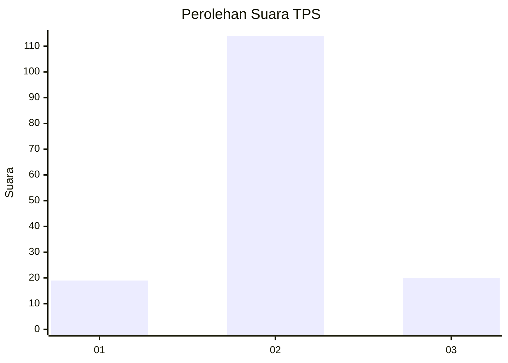
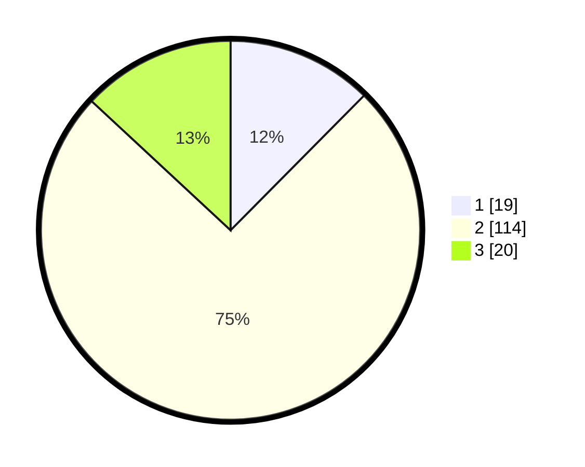

# Hasil

## Grafik

## Tabel

| No. | Nama Paslon    | Suara | Suara (raw) | Persentase |
|:--- |:-------------- | -----:| -----------:| ----------:|
| 1   | ANIES MUHAIMIN | 19    | [19][p-1]   | 12,42      |
| 2   | PRABOWO GIBRAN | 114   | [114][p-2]  | 74,51      |
| 3   | GANJAR MAHFUD  | 20    | [20][p-3]   | 13,07      |

[p-1]: https://github.com/gigit-pemilu/pemilu-2024-91-papua/blob/main/pilpres/hitung-suara/sub/91-papua/sub/03-jayapura/sub/13-waibu/sub/2006-doyo-baru/sub/031-tps/sub/paslon-1.txt
[p-2]: https://github.com/gigit-pemilu/pemilu-2024-91-papua/blob/main/pilpres/hitung-suara/sub/91-papua/sub/03-jayapura/sub/13-waibu/sub/2006-doyo-baru/sub/031-tps/sub/paslon-2.txt
[p-3]: https://github.com/gigit-pemilu/pemilu-2024-91-papua/blob/main/pilpres/hitung-suara/sub/91-papua/sub/03-jayapura/sub/13-waibu/sub/2006-doyo-baru/sub/031-tps/sub/paslon-3.txt

## Foto C Plano

https://sirekap-obj-formc.kpu.go.id/3e56/pemilu/ppwp/91/03/13/20/06/9103132006031-20240216-031206--0d9724fc-7148-4ed8-8f29-7322e90bfbe3.jpg

https://sirekap-obj-formc.kpu.go.id/3e56/pemilu/ppwp/91/03/13/20/06/9103132006031-20240215-142016--0f672bdc-3b4c-40fc-96ae-1e57de271ff8.jpg

https://sirekap-obj-formc.kpu.go.id/3e56/pemilu/ppwp/91/03/13/20/06/9103132006031-20240215-150700--cafdfe76-0df8-40fe-8e97-ed17070c94a6.jpg

## Metadata

| Key        | Value               |
| ---------- | ------------------- |
| Time Stamp | 2024-02-25 13:00:00 |

