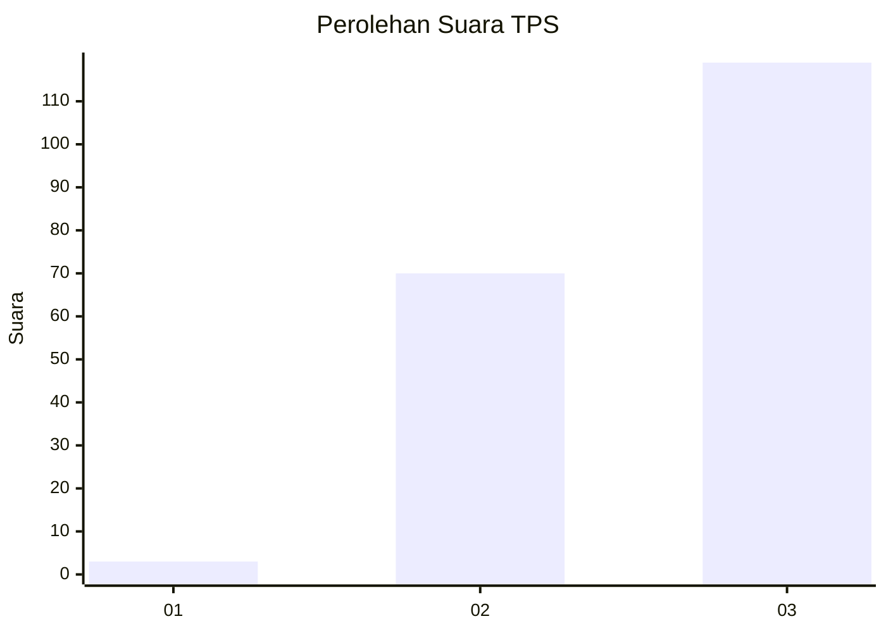
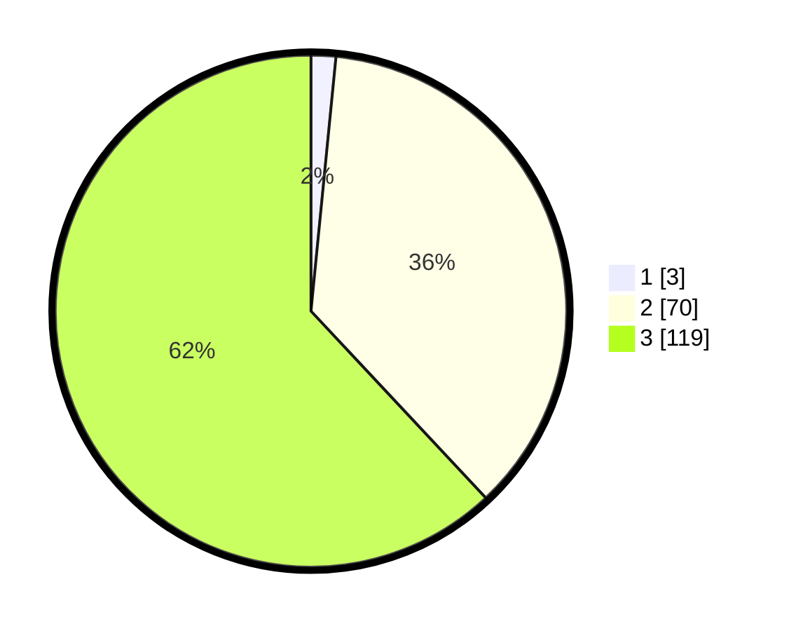

# Hasil

## Grafik

## Tabel

| No. | Nama Paslon    | Suara | Suara (raw) | Persentase |
|:--- |:-------------- | -----:| -----------:| ----------:|
| 1   | ANIES MUHAIMIN | 3     | [3][p-1]    | 1,56       |
| 2   | PRABOWO GIBRAN | 70    | [70][p-2]   | 36,46      |
| 3   | GANJAR MAHFUD  | 119   | [119][p-3]  | 61,98      |

[p-1]: https://github.com/gigit-pemilu/pemilu-2024-91-papua/blob/main/pilpres/hitung-suara/sub/91-papua/sub/03-jayapura/sub/13-waibu/sub/3001-desa-adat-dondai/sub/001-tps/sub/paslon-1.txt
[p-2]: https://github.com/gigit-pemilu/pemilu-2024-91-papua/blob/main/pilpres/hitung-suara/sub/91-papua/sub/03-jayapura/sub/13-waibu/sub/3001-desa-adat-dondai/sub/001-tps/sub/paslon-2.txt
[p-3]: https://github.com/gigit-pemilu/pemilu-2024-91-papua/blob/main/pilpres/hitung-suara/sub/91-papua/sub/03-jayapura/sub/13-waibu/sub/3001-desa-adat-dondai/sub/001-tps/sub/paslon-3.txt

## Foto C Plano

https://sirekap-obj-formc.kpu.go.id/1228/pemilu/ppwp/91/03/13/30/01/9103133001001-20240221-145556--11495128-25fb-4340-b735-45b1629a5083.jpg

https://sirekap-obj-formc.kpu.go.id/1228/pemilu/ppwp/91/03/13/30/01/9103133001001-20240221-145658--b6626c32-7376-4c1a-91be-9a5426c0fb2d.jpg

https://sirekap-obj-formc.kpu.go.id/1228/pemilu/ppwp/91/03/13/30/01/9103133001001-20240221-145745--7b0964ae-3da0-4315-9b7b-1ebaed820f6a.jpg

## Metadata

| Key        | Value               |
| ---------- | ------------------- |
| Time Stamp | 2024-02-28 11:00:00 |

