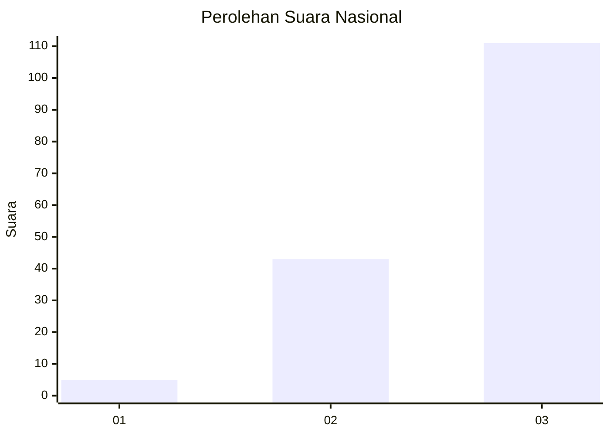
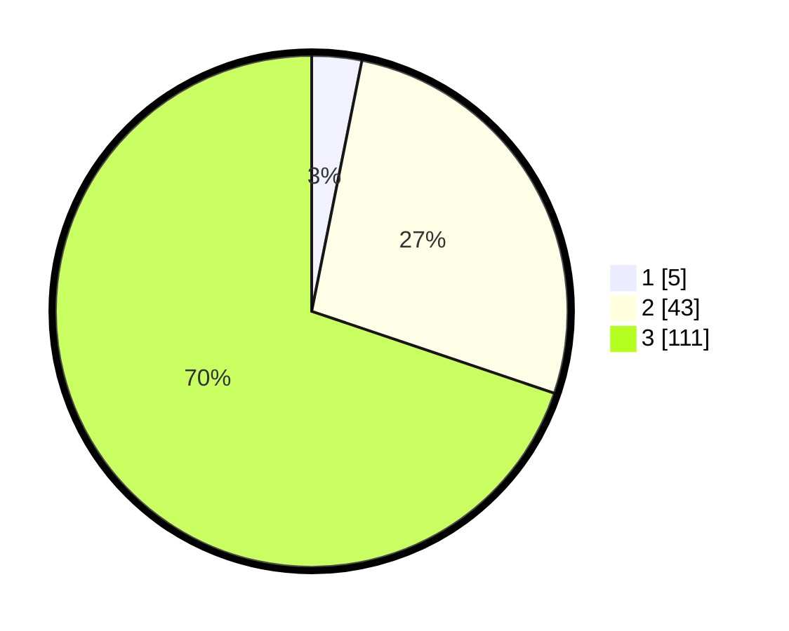

# Hasil

## Grafik

## Tabel

| No. | Nama Paslon    | Suara | Suara (raw) | Persentase |
|:--- |:-------------- | -----:| -----------:| ----------:|
| 1   | ANIES MUHAIMIN | 5     | [5][p-1]    | 3,14       |
| 2   | PRABOWO GIBRAN | 43    | [43][p-2]   | 27,04      |
| 3   | GANJAR MAHFUD  | 111   | [111][p-3]  | 69,81      |

[p-1]: https://github.com/gigit-pemilu/pemilu-2024/blob/main/pilpres/hitung-suara/sub/91-papua/sub/03-jayapura/sub/13-waibu/sub/3001-desa-adat-dondai/sub/002-tps/sub/paslon-1.txt
[p-2]: https://github.com/gigit-pemilu/pemilu-2024/blob/main/pilpres/hitung-suara/sub/91-papua/sub/03-jayapura/sub/13-waibu/sub/3001-desa-adat-dondai/sub/002-tps/sub/paslon-2.txt
[p-3]: https://github.com/gigit-pemilu/pemilu-2024/blob/main/pilpres/hitung-suara/sub/91-papua/sub/03-jayapura/sub/13-waibu/sub/3001-desa-adat-dondai/sub/002-tps/sub/paslon-3.txt

## Foto C Plano

https://sirekap-obj-formc.kpu.go.id/0861/pemilu/ppwp/91/03/13/30/01/9103133001002-20240223-164118--16463053-65cc-4511-9459-82e40a7d2e33.jpg

https://sirekap-obj-formc.kpu.go.id/0861/pemilu/ppwp/91/03/13/30/01/9103133001002-20240223-164215--d6d1b27d-68d3-4c6a-be83-ca662f418ccf.jpg

https://sirekap-obj-formc.kpu.go.id/0861/pemilu/ppwp/91/03/13/30/01/9103133001002-20240223-171126--c84b3ba5-933e-4fb8-9789-5ae22139ba7e.jpg

## Metadata

| Key        | Value               |
| ---------- | ------------------- |
| Time Stamp | 2024-02-25 12:00:00 |

