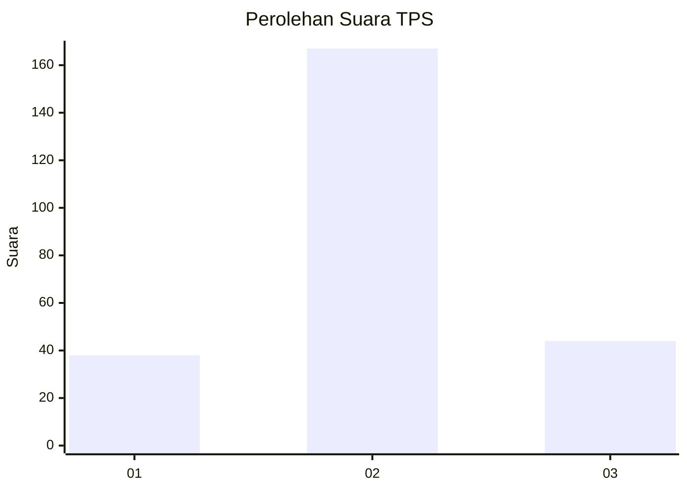
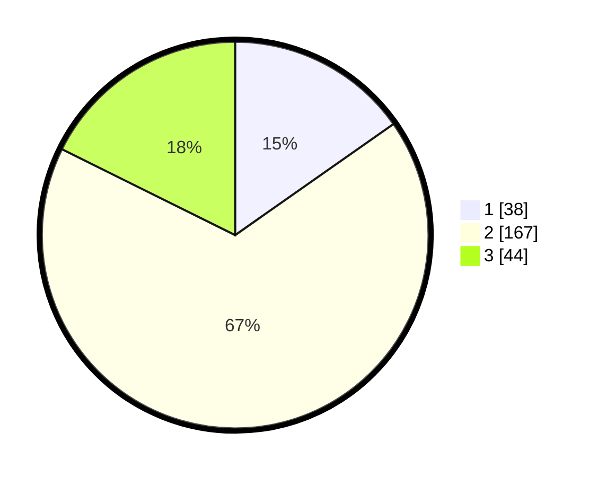

# Hasil

## Grafik

## Tabel

| No. | Nama Paslon    | Suara | Suara (raw) | Persentase |
|:--- |:-------------- | -----:| -----------:| ----------:|
| 1   | ANIES MUHAIMIN | 38    | [38][p-1]   | 15,26      |
| 2   | PRABOWO GIBRAN | 167   | [167][p-2]  | 67,07      |
| 3   | GANJAR MAHFUD  | 44    | [44][p-3]   | 17,67      |

[p-1]: https://github.com/gigit-pemilu/pemilu-2024-91-papua/blob/main/pilpres/hitung-suara/sub/91-papua/sub/03-jayapura/sub/13-waibu/sub/3007-desa-adat-bambar/sub/001-tps/sub/paslon-1.txt
[p-2]: https://github.com/gigit-pemilu/pemilu-2024-91-papua/blob/main/pilpres/hitung-suara/sub/91-papua/sub/03-jayapura/sub/13-waibu/sub/3007-desa-adat-bambar/sub/001-tps/sub/paslon-2.txt
[p-3]: https://github.com/gigit-pemilu/pemilu-2024-91-papua/blob/main/pilpres/hitung-suara/sub/91-papua/sub/03-jayapura/sub/13-waibu/sub/3007-desa-adat-bambar/sub/001-tps/sub/paslon-3.txt

## Foto C Plano

https://sirekap-obj-formc.kpu.go.id/5e96/pemilu/ppwp/91/03/13/30/07/9103133007001-20240226-151613--1f7e239d-e9f5-47be-87d6-90e7e82ea8c9.jpg

https://sirekap-obj-formc.kpu.go.id/5e96/pemilu/ppwp/91/03/13/30/07/9103133007001-20240226-151659--53d38eea-16d5-4ff4-a810-aa550e130c3d.jpg

https://sirekap-obj-formc.kpu.go.id/5e96/pemilu/ppwp/91/03/13/30/07/9103133007001-20240226-151739--d0b69590-9c54-4841-8fa4-ed15cb064b5d.jpg

## Metadata

| Key        | Value               |
| ---------- | ------------------- |
| Time Stamp | 2024-02-28 11:00:00 |

