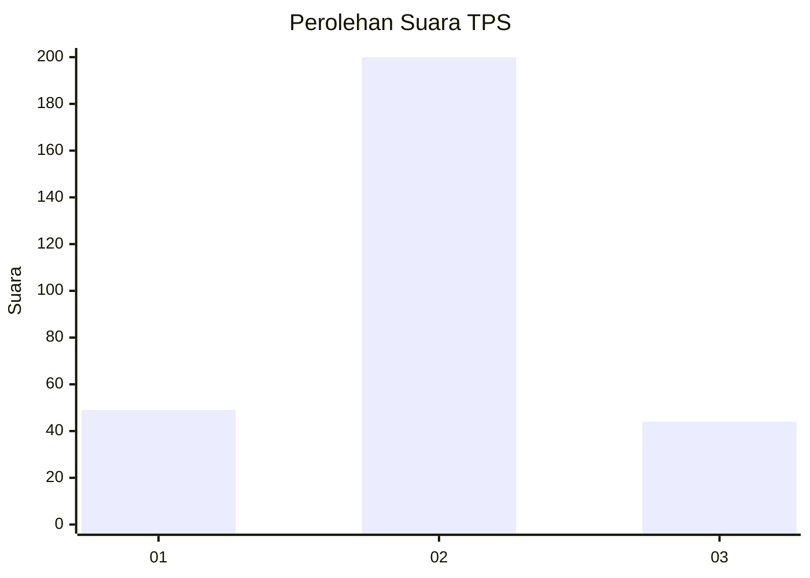
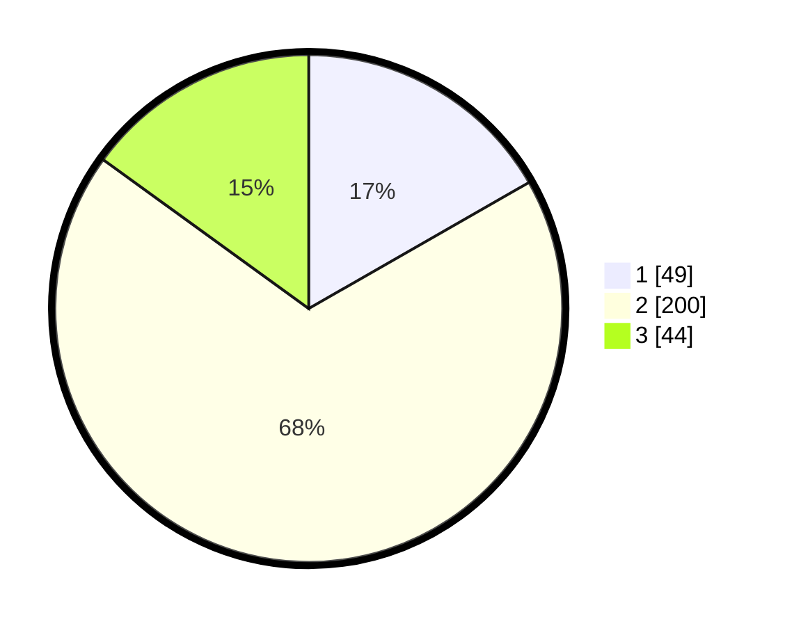

# Hasil

## Grafik

## Tabel

| No. | Nama Paslon    | Suara | Suara (raw) | Persentase |
|:--- |:-------------- | -----:| -----------:| ----------:|
| 1   | ANIES MUHAIMIN | 49    | [49][p-1]   | 16,72      |
| 2   | PRABOWO GIBRAN | 200   | [200][p-2]  | 68,26      |
| 3   | GANJAR MAHFUD  | 44    | [44][p-3]   | 15,02      |

[p-1]: https://github.com/gigit-pemilu/pemilu-2024-91-papua/blob/main/pilpres/hitung-suara/sub/91-papua/sub/03-jayapura/sub/13-waibu/sub/3007-desa-adat-bambar/sub/002-tps/sub/paslon-1.txt
[p-2]: https://github.com/gigit-pemilu/pemilu-2024-91-papua/blob/main/pilpres/hitung-suara/sub/91-papua/sub/03-jayapura/sub/13-waibu/sub/3007-desa-adat-bambar/sub/002-tps/sub/paslon-2.txt
[p-3]: https://github.com/gigit-pemilu/pemilu-2024-91-papua/blob/main/pilpres/hitung-suara/sub/91-papua/sub/03-jayapura/sub/13-waibu/sub/3007-desa-adat-bambar/sub/002-tps/sub/paslon-3.txt

## Foto C Plano

https://sirekap-obj-formc.kpu.go.id/3246/pemilu/ppwp/91/03/13/30/07/9103133007002-20240226-164501--51703798-612f-46a8-be1d-2dd43c70af53.jpg

https://sirekap-obj-formc.kpu.go.id/3246/pemilu/ppwp/91/03/13/30/07/9103133007002-20240226-164541--65716f52-9128-456c-b02f-31307a99f351.jpg

https://sirekap-obj-formc.kpu.go.id/3246/pemilu/ppwp/91/03/13/30/07/9103133007002-20240226-164614--42ec6561-0fec-476d-b5ce-e132c3c9c91e.jpg

## Metadata

| Key        | Value               |
| ---------- | ------------------- |
| Time Stamp | 2024-02-28 11:00:00 |

