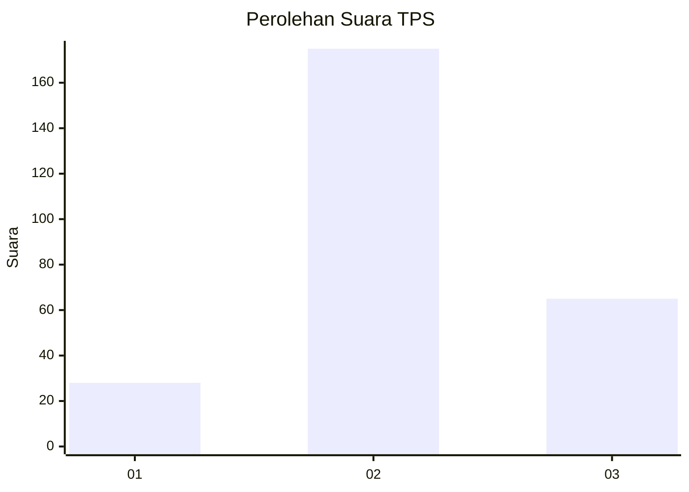
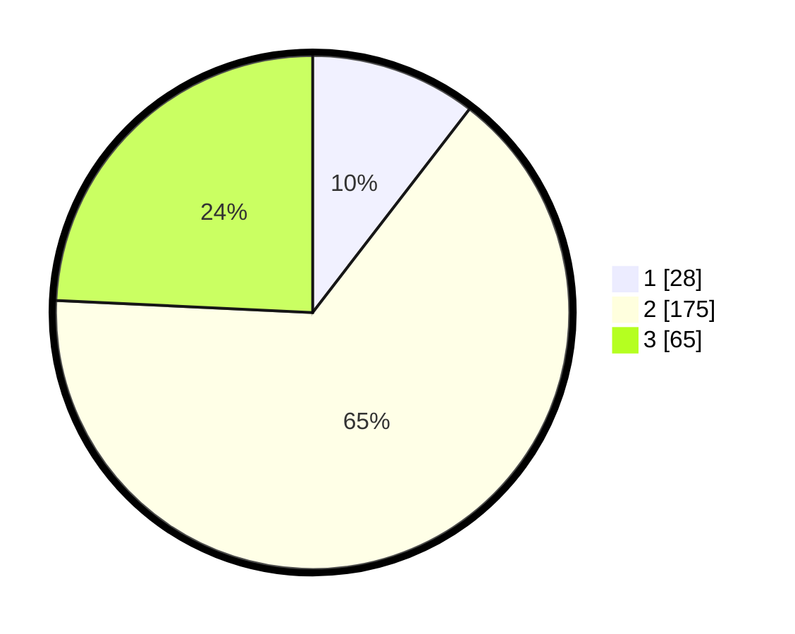

# Hasil

## Grafik

## Tabel

| No. | Nama Paslon    | Suara | Suara (raw) | Persentase |
|:--- |:-------------- | -----:| -----------:| ----------:|
| 1   | ANIES MUHAIMIN | 28    | [28][p-1]   | 10,45      |
| 2   | PRABOWO GIBRAN | 175   | [175][p-2]  | 65,30      |
| 3   | GANJAR MAHFUD  | 65    | [65][p-3]   | 24,25      |

[p-1]: https://github.com/gigit-pemilu/pemilu-2024-91-papua/blob/main/pilpres/hitung-suara/sub/91-papua/sub/03-jayapura/sub/13-waibu/sub/3007-desa-adat-bambar/sub/003-tps/sub/paslon-1.txt
[p-2]: https://github.com/gigit-pemilu/pemilu-2024-91-papua/blob/main/pilpres/hitung-suara/sub/91-papua/sub/03-jayapura/sub/13-waibu/sub/3007-desa-adat-bambar/sub/003-tps/sub/paslon-2.txt
[p-3]: https://github.com/gigit-pemilu/pemilu-2024-91-papua/blob/main/pilpres/hitung-suara/sub/91-papua/sub/03-jayapura/sub/13-waibu/sub/3007-desa-adat-bambar/sub/003-tps/sub/paslon-3.txt

## Foto C Plano

https://sirekap-obj-formc.kpu.go.id/940d/pemilu/ppwp/91/03/13/30/07/9103133007003-20240226-175728--bf014b21-675a-440c-a29c-88fd29b42c1e.jpg

https://sirekap-obj-formc.kpu.go.id/940d/pemilu/ppwp/91/03/13/30/07/9103133007003-20240226-175653--3ddb28ab-31e0-41f4-8aa7-f908e16fb916.jpg

https://sirekap-obj-formc.kpu.go.id/940d/pemilu/ppwp/91/03/13/30/07/9103133007003-20240226-175805--762454e7-5871-49d6-a698-b8345fe12edc.jpg

## Metadata

| Key        | Value               |
| ---------- | ------------------- |
| Time Stamp | 2024-02-28 11:00:00 |

