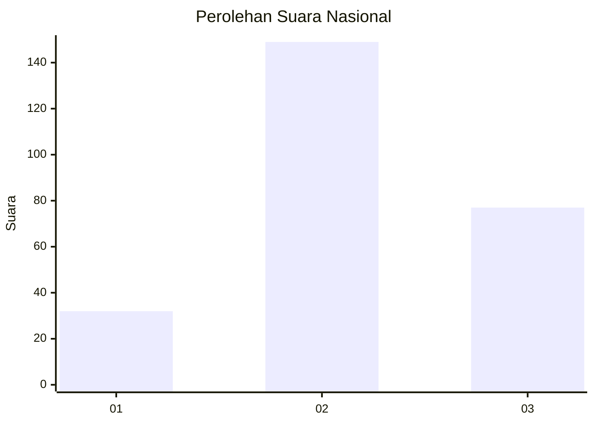
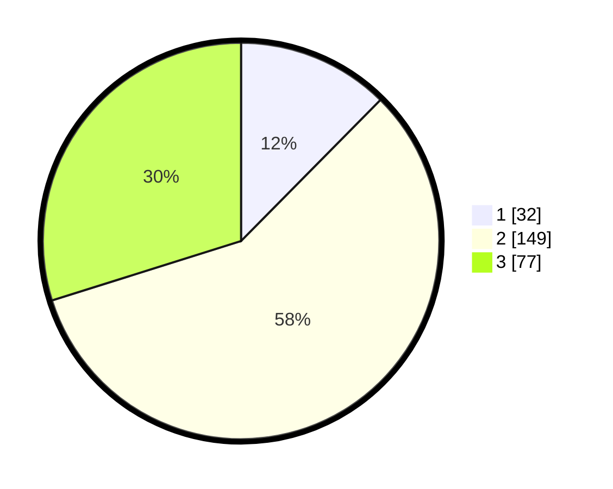

# Hasil

## Grafik

## Tabel

| No. | Nama Paslon    | Suara | Suara (raw) | Persentase |
|:--- |:-------------- | -----:| -----------:| ----------:|
| 1   | ANIES MUHAIMIN | 32    | [32][p-1]   | 12,40      |
| 2   | PRABOWO GIBRAN | 149   | [149][p-2]  | 57,75      |
| 3   | GANJAR MAHFUD  | 77    | [77][p-3]   | 29,84      |

[p-1]: https://github.com/gigit-pemilu/pemilu-2024/blob/main/pilpres/hitung-suara/sub/91-papua/sub/03-jayapura/sub/13-waibu/sub/3007-desa-adat-bambar/sub/004-tps/sub/paslon-1.txt
[p-2]: https://github.com/gigit-pemilu/pemilu-2024/blob/main/pilpres/hitung-suara/sub/91-papua/sub/03-jayapura/sub/13-waibu/sub/3007-desa-adat-bambar/sub/004-tps/sub/paslon-2.txt
[p-3]: https://github.com/gigit-pemilu/pemilu-2024/blob/main/pilpres/hitung-suara/sub/91-papua/sub/03-jayapura/sub/13-waibu/sub/3007-desa-adat-bambar/sub/004-tps/sub/paslon-3.txt

## Foto C Plano

https://sirekap-obj-formc.kpu.go.id/cb6c/pemilu/ppwp/91/03/13/30/07/9103133007004-20240226-190154--57e112d0-2aa5-44ea-ba81-c741cb645d9f.jpg

https://sirekap-obj-formc.kpu.go.id/cb6c/pemilu/ppwp/91/03/13/30/07/9103133007004-20240226-190237--1cd16c2b-b7b0-481f-9436-57267c1f694f.jpg

https://sirekap-obj-formc.kpu.go.id/cb6c/pemilu/ppwp/91/03/13/30/07/9103133007004-20240226-191351--88b01f9b-56d1-4410-a234-baaf4547fb66.jpg

## Metadata

| Key        | Value               |
| ---------- | ------------------- |
| Time Stamp | 2024-02-28 11:00:00 |

