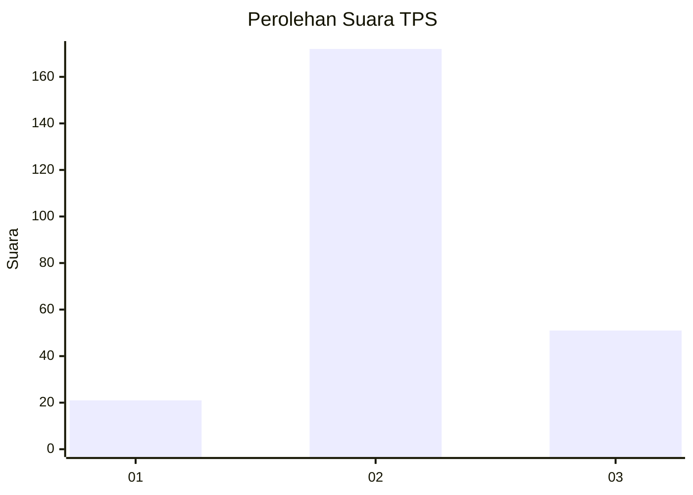
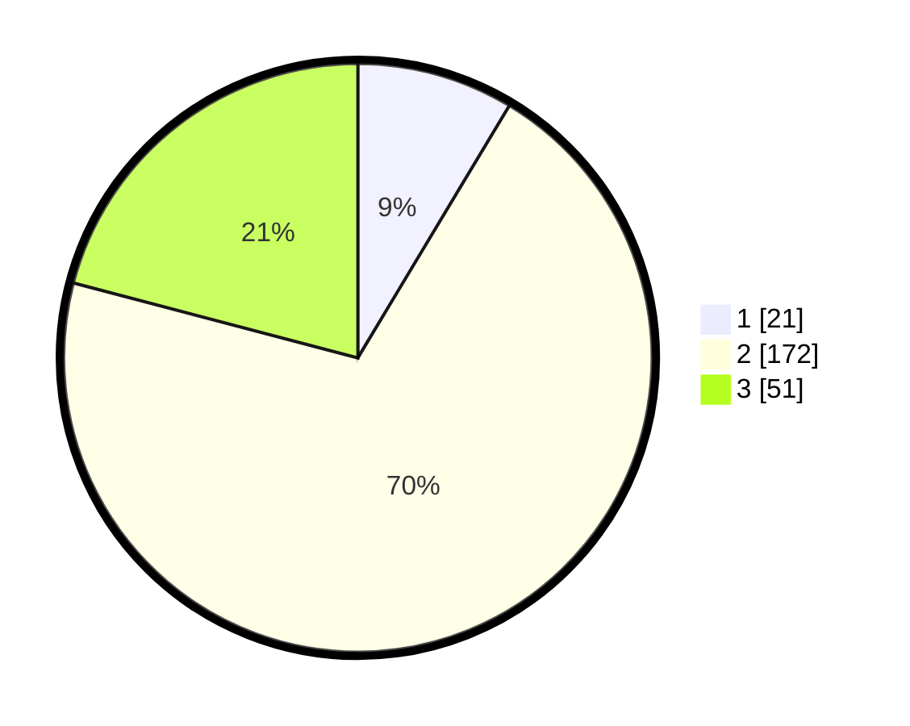

# Hasil

## Grafik

## Tabel

| No. | Nama Paslon    | Suara | Suara (raw) | Persentase |
|:--- |:-------------- | -----:| -----------:| ----------:|
| 1   | ANIES MUHAIMIN | 21    | [21][p-1]   | 8,61       |
| 2   | PRABOWO GIBRAN | 172   | [172][p-2]  | 70,49      |
| 3   | GANJAR MAHFUD  | 51    | [51][p-3]   | 20,90      |

[p-1]: https://github.com/gigit-pemilu/pemilu-2024-91-papua/blob/main/pilpres/hitung-suara/sub/91-papua/sub/03-jayapura/sub/13-waibu/sub/3007-desa-adat-bambar/sub/005-tps/sub/paslon-1.txt
[p-2]: https://github.com/gigit-pemilu/pemilu-2024-91-papua/blob/main/pilpres/hitung-suara/sub/91-papua/sub/03-jayapura/sub/13-waibu/sub/3007-desa-adat-bambar/sub/005-tps/sub/paslon-2.txt
[p-3]: https://github.com/gigit-pemilu/pemilu-2024-91-papua/blob/main/pilpres/hitung-suara/sub/91-papua/sub/03-jayapura/sub/13-waibu/sub/3007-desa-adat-bambar/sub/005-tps/sub/paslon-3.txt

## Foto C Plano

https://sirekap-obj-formc.kpu.go.id/b0bb/pemilu/ppwp/91/03/13/30/07/9103133007005-20240227-085727--edbc0116-c22e-4736-b111-97dfccbc095b.jpg

https://sirekap-obj-formc.kpu.go.id/b0bb/pemilu/ppwp/91/03/13/30/07/9103133007005-20240227-090338--f82acbf0-23de-4904-8d47-547018bb9331.jpg

https://sirekap-obj-formc.kpu.go.id/b0bb/pemilu/ppwp/91/03/13/30/07/9103133007005-20240227-090434--6f695b16-641f-4b78-9c0a-21ba67862f91.jpg

## Metadata

| Key        | Value               |
| ---------- | ------------------- |
| Time Stamp | 2024-02-28 11:00:00 |

