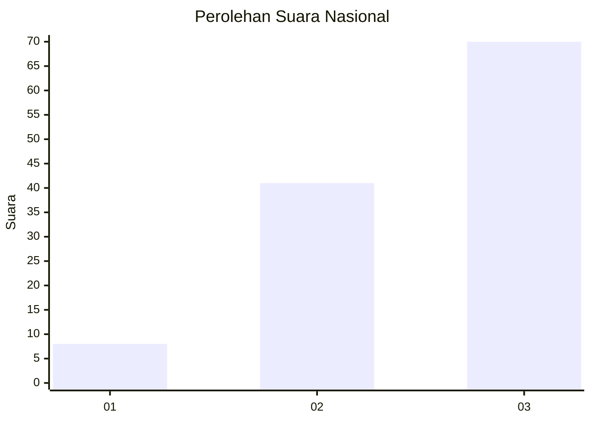
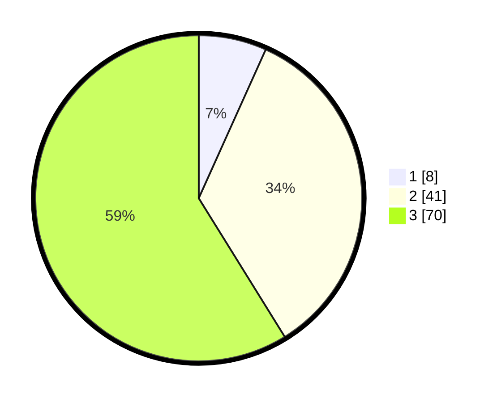

# Hasil

## Grafik

## Tabel

| No. | Nama Paslon    | Suara | Suara (raw) | Persentase |
|:--- |:-------------- | -----:| -----------:| ----------:|
| 1   | ANIES MUHAIMIN | 8     | [8][p-1]    | 6,72       |
| 2   | PRABOWO GIBRAN | 41    | [41][p-2]   | 34,45      |
| 3   | GANJAR MAHFUD  | 70    | [70][p-3]   | 58,82      |

[p-1]: https://github.com/gigit-pemilu/pemilu-2024/blob/main/pilpres/hitung-suara/sub/91-papua/sub/03-jayapura/sub/14-nambluong/sub/2007-imestum/sub/001-tps/sub/paslon-1.txt
[p-2]: https://github.com/gigit-pemilu/pemilu-2024/blob/main/pilpres/hitung-suara/sub/91-papua/sub/03-jayapura/sub/14-nambluong/sub/2007-imestum/sub/001-tps/sub/paslon-2.txt
[p-3]: https://github.com/gigit-pemilu/pemilu-2024/blob/main/pilpres/hitung-suara/sub/91-papua/sub/03-jayapura/sub/14-nambluong/sub/2007-imestum/sub/001-tps/sub/paslon-3.txt

## Foto C Plano

https://sirekap-obj-formc.kpu.go.id/8caa/pemilu/ppwp/91/03/14/20/07/9103142007001-20240216-233051--62f8238e-7c2e-46f7-9804-a268c6920901.jpg

https://sirekap-obj-formc.kpu.go.id/8caa/pemilu/ppwp/91/03/14/20/07/9103142007001-20240216-233358--18764f72-ef5b-465e-a12f-40f7f68eceaa.jpg

https://sirekap-obj-formc.kpu.go.id/8caa/pemilu/ppwp/91/03/14/20/07/9103142007001-20240216-233947--6919edf7-5f84-405e-aaa4-22f208621426.jpg

## Metadata

| Key        | Value               |
| ---------- | ------------------- |
| Time Stamp | 2024-02-16 23:45:47 |

## DATA PEMILIH TETAP

Jumlah pemilih dalam DPT: **164**.
 * L: **77**.
 * P: **87**.

## DATA PENGGUNA HAK PILIH

Jumlah pengguna hak pilih dalam DPT: **124**.
 * L: **59**.
 * P: **65**.

Jumlah pengguna hak pilih dalam DPTb: **0**.
 * L: **0**.
 * P: **0**.

Jumlah pengguna hak pilih dalam DPK: **0**.
 * L: **0**.
 * P: **0**.

Jumlah pengguna hak pilih: **124**.
 * L: **59**.
 * P: **65**.

## JUMLAH SUARA SAH DAN TIDAK SAH

JUMLAH SELURUH SUARA SAH: **119**.

JUMLAH SUARA TIDAK SAH: **5**.

JUMLAH SELURUH SUARA SAH DAN SUARA TIDAK SAH: **124**.

