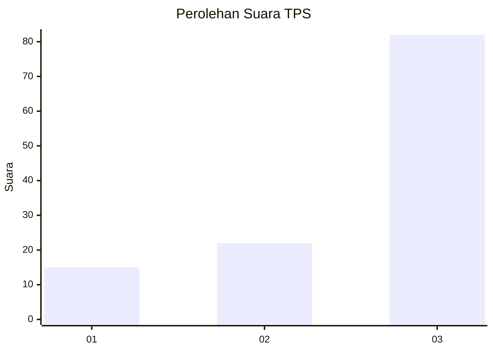
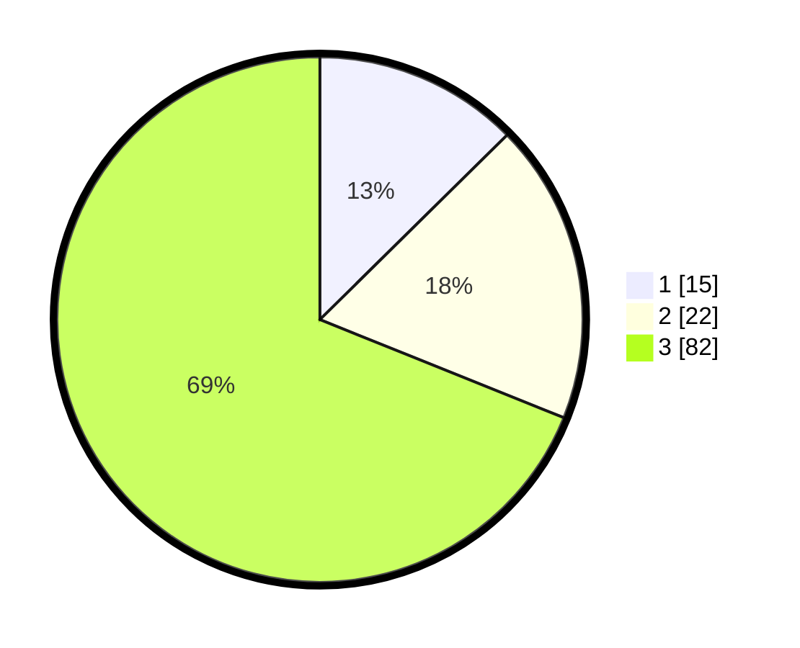

# Hasil

## Grafik

## Tabel

| No. | Nama Paslon    | Suara | Suara (raw) | Persentase |
|:--- |:-------------- | -----:| -----------:| ----------:|
| 1   | ANIES MUHAIMIN | 15    | [15][p-1]   | 12,61      |
| 2   | PRABOWO GIBRAN | 22    | [22][p-2]   | 18,49      |
| 3   | GANJAR MAHFUD  | 82    | [82][p-3]   | 68,91      |

[p-1]: https://github.com/gigit-pemilu/pemilu-2024-91-papua/blob/main/pilpres/hitung-suara/sub/91-papua/sub/03-jayapura/sub/15-yapsi/sub/2002-kwarja/sub/001-tps/sub/paslon-1.txt
[p-2]: https://github.com/gigit-pemilu/pemilu-2024-91-papua/blob/main/pilpres/hitung-suara/sub/91-papua/sub/03-jayapura/sub/15-yapsi/sub/2002-kwarja/sub/001-tps/sub/paslon-2.txt
[p-3]: https://github.com/gigit-pemilu/pemilu-2024-91-papua/blob/main/pilpres/hitung-suara/sub/91-papua/sub/03-jayapura/sub/15-yapsi/sub/2002-kwarja/sub/001-tps/sub/paslon-3.txt

## Foto C Plano

https://sirekap-obj-formc.kpu.go.id/301b/pemilu/ppwp/91/03/15/20/02/9103152002001-20240229-175519--976cce5d-2f0a-448e-b5f3-d6c6b4f73b36.jpg

https://sirekap-obj-formc.kpu.go.id/301b/pemilu/ppwp/91/03/15/20/02/9103152002001-20240229-175649--96e591e5-3270-4e78-af2a-484cf94d748c.jpg

https://sirekap-obj-formc.kpu.go.id/301b/pemilu/ppwp/91/03/15/20/02/9103152002001-20240229-175751--880824f9-9700-45f7-91f9-eb4a10303827.jpg

## Metadata

| Key        | Value               |
| ---------- | ------------------- |
| Time Stamp | 2024-02-29 18:00:00 |

## DATA PEMILIH TETAP

Jumlah pemilih dalam DPT: **117**.
 * L: **57**.
 * P: **60**.

## DATA PENGGUNA HAK PILIH

Jumlah pengguna hak pilih dalam DPT: **117**.
 * L: **57**.
 * P: **60**.

Jumlah pengguna hak pilih dalam DPTb: **0**.
 * L: **0**.
 * P: **0**.

Jumlah pengguna hak pilih dalam DPK: **2**.
 * L: **2**.
 * P: **0**.

Jumlah pengguna hak pilih: **119**.
 * L: **59**.
 * P: **60**.

## JUMLAH SUARA SAH DAN TIDAK SAH

JUMLAH SELURUH SUARA SAH: **119**.

JUMLAH SUARA TIDAK SAH: **0**.

JUMLAH SELURUH SUARA SAH DAN SUARA TIDAK SAH: **119**.

