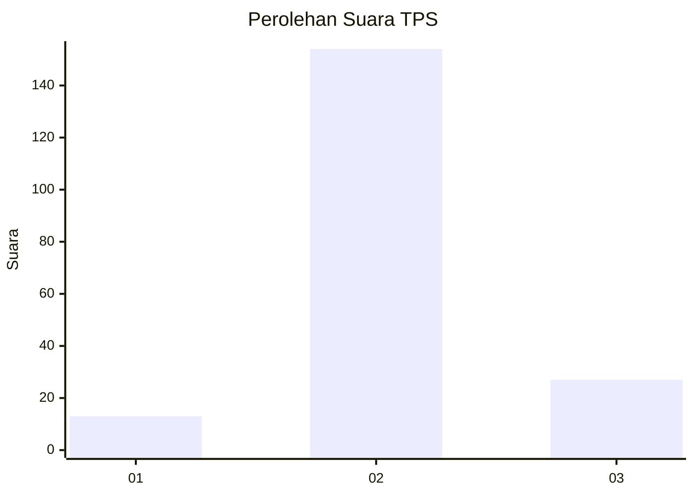
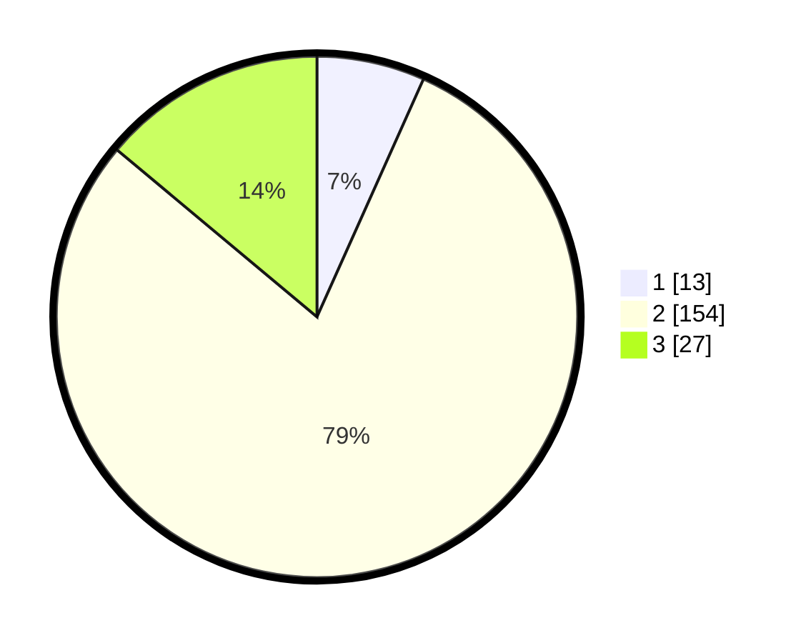

# Hasil

## Grafik

## Tabel

| No. | Nama Paslon    | Suara | Suara (raw) | Persentase |
|:--- |:-------------- | -----:| -----------:| ----------:|
| 1   | ANIES MUHAIMIN | 13    | [13][p-1]   | 6,70       |
| 2   | PRABOWO GIBRAN | 154   | [154][p-2]  | 79,38      |
| 3   | GANJAR MAHFUD  | 27    | [27][p-3]   | 13,92      |

[p-1]: https://github.com/gigit-pemilu/pemilu-2024-91-papua/blob/main/pilpres/hitung-suara/sub/91-papua/sub/03-jayapura/sub/15-yapsi/sub/2003-ongan-jaya/sub/001-tps/sub/paslon-1.txt
[p-2]: https://github.com/gigit-pemilu/pemilu-2024-91-papua/blob/main/pilpres/hitung-suara/sub/91-papua/sub/03-jayapura/sub/15-yapsi/sub/2003-ongan-jaya/sub/001-tps/sub/paslon-2.txt
[p-3]: https://github.com/gigit-pemilu/pemilu-2024-91-papua/blob/main/pilpres/hitung-suara/sub/91-papua/sub/03-jayapura/sub/15-yapsi/sub/2003-ongan-jaya/sub/001-tps/sub/paslon-3.txt

## Foto C Plano

https://sirekap-obj-formc.kpu.go.id/74fc/pemilu/ppwp/91/03/15/20/03/9103152003001-20240302-182157--2c2fec3b-7d82-494d-9afa-cb1ee8946b12.jpg

https://sirekap-obj-formc.kpu.go.id/74fc/pemilu/ppwp/91/03/15/20/03/9103152003001-20240302-182038--7ec62659-8055-4893-9156-5aba1e7966bd.jpg

https://sirekap-obj-formc.kpu.go.id/74fc/pemilu/ppwp/91/03/15/20/03/9103152003001-20240302-181809--c1cca434-ddb5-44ab-9332-6393642f654c.jpg

## Metadata

| Key        | Value               |
| ---------- | ------------------- |
| Time Stamp | 2024-03-02 19:00:00 |

## DATA PEMILIH TETAP

Jumlah pemilih dalam DPT: **340**.
 * L: **10**.
 * P: **9**.

## DATA PENGGUNA HAK PILIH

Jumlah pengguna hak pilih dalam DPT: **21**.
 * L: **120**.
 * P: **0**.

Jumlah pengguna hak pilih dalam DPTb: **14**.
 * L: **0**.
 * P: **0**.

Jumlah pengguna hak pilih dalam DPK: **10**.
 * L: **0**.
 * P: **0**.

Jumlah pengguna hak pilih: **50**.
 * L: **0**.
 * P: **0**.

## JUMLAH SUARA SAH DAN TIDAK SAH

JUMLAH SELURUH SUARA SAH: **209**.

JUMLAH SUARA TIDAK SAH: **2**.

JUMLAH SELURUH SUARA SAH DAN SUARA TIDAK SAH: **211**.

