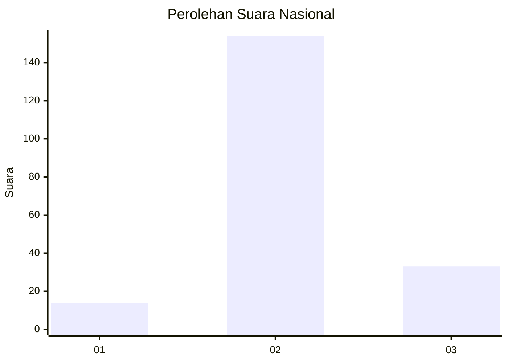
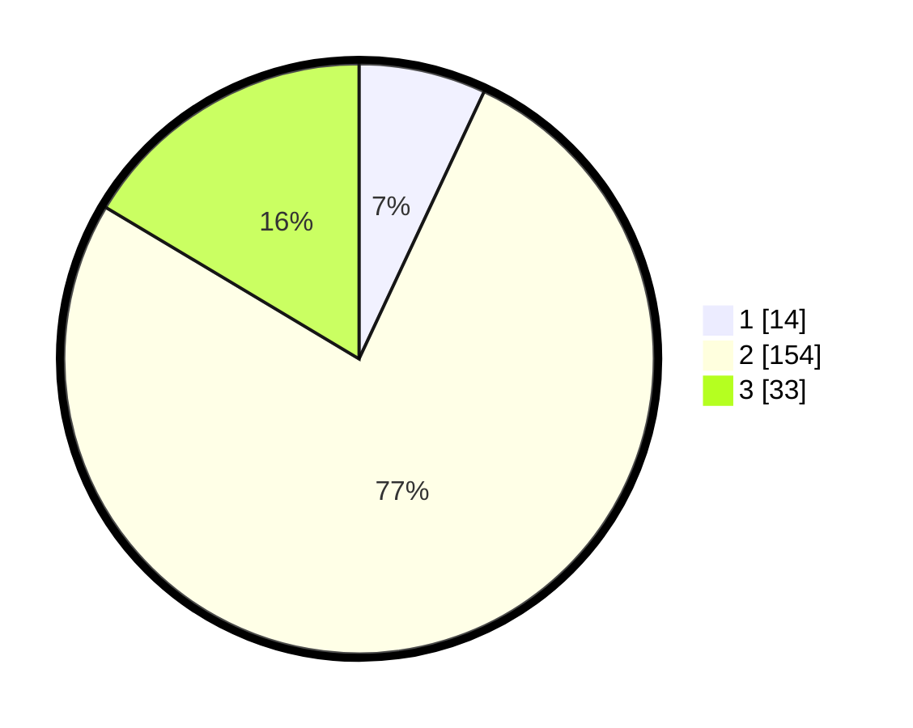

# Hasil

## Grafik

## Tabel

| No. | Nama Paslon    | Suara | Suara (raw) | Persentase |
|:--- |:-------------- | -----:| -----------:| ----------:|
| 1   | ANIES MUHAIMIN | 14    | [14][p-1]   | 6,97       |
| 2   | PRABOWO GIBRAN | 154   | [154][p-2]  | 76,62      |
| 3   | GANJAR MAHFUD  | 33    | [33][p-3]   | 16,42      |

[p-1]: https://github.com/gigit-pemilu/pemilu-2024/blob/main/pilpres/hitung-suara/sub/91-papua/sub/03-jayapura/sub/15-yapsi/sub/2003-ongan-jaya/sub/005-tps/sub/paslon-1.txt
[p-2]: https://github.com/gigit-pemilu/pemilu-2024/blob/main/pilpres/hitung-suara/sub/91-papua/sub/03-jayapura/sub/15-yapsi/sub/2003-ongan-jaya/sub/005-tps/sub/paslon-2.txt
[p-3]: https://github.com/gigit-pemilu/pemilu-2024/blob/main/pilpres/hitung-suara/sub/91-papua/sub/03-jayapura/sub/15-yapsi/sub/2003-ongan-jaya/sub/005-tps/sub/paslon-3.txt

## Foto C Plano

https://sirekap-obj-formc.kpu.go.id/a598/pemilu/ppwp/91/03/15/20/03/9103152003005-20240302-120201--2439cac0-6408-4582-bedf-eefdadf6ce0d.jpg

https://sirekap-obj-formc.kpu.go.id/a598/pemilu/ppwp/91/03/15/20/03/9103152003005-20240302-120329--d62c855e-5d5b-490c-8f17-bd95c1a553da.jpg

https://sirekap-obj-formc.kpu.go.id/a598/pemilu/ppwp/91/03/15/20/03/9103152003005-20240302-120449--ee2565f5-afee-440e-8449-fdb3e9cf1a1f.jpg

## Metadata

| Key        | Value               |
| ---------- | ------------------- |
| Time Stamp | 2024-03-02 13:00:00 |

## DATA PEMILIH TETAP

Jumlah pemilih dalam DPT: **40**.
 * L: **500**.
 * P: **500**.

## DATA PENGGUNA HAK PILIH

Jumlah pengguna hak pilih dalam DPT: **40**.
 * L: **505**.
 * P: **0**.

Jumlah pengguna hak pilih dalam DPTb: **440**.
 * L: **835**.
 * P: **971**.

Jumlah pengguna hak pilih dalam DPK: **0**.
 * L: **6**.
 * P: **8**.

Jumlah pengguna hak pilih: **330**.
 * L: **494**.
 * P: **140**.

## JUMLAH SUARA SAH DAN TIDAK SAH

JUMLAH SELURUH SUARA SAH: **201**.

JUMLAH SUARA TIDAK SAH: **9**.

JUMLAH SELURUH SUARA SAH DAN SUARA TIDAK SAH: **210**.

