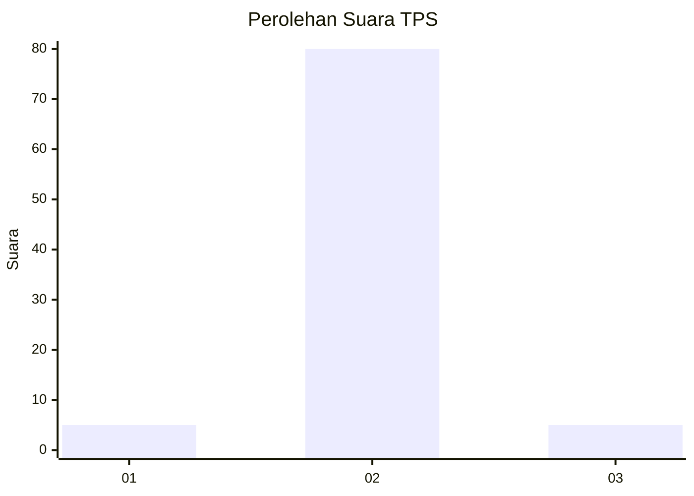
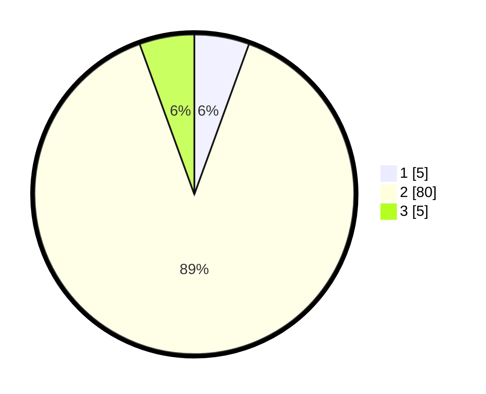

# Hasil

## Grafik

## Tabel

| No. | Nama Paslon    | Suara | Suara (raw) | Persentase |
|:--- |:-------------- | -----:| -----------:| ----------:|
| 1   | ANIES MUHAIMIN | 5     | [5][p-1]    | 5,56       |
| 2   | PRABOWO GIBRAN | 80    | [80][p-2]   | 88,89      |
| 3   | GANJAR MAHFUD  | 5     | [5][p-3]    | 5,56       |

[p-1]: https://github.com/gigit-pemilu/pemilu-2024-91-papua/blob/main/pilpres/hitung-suara/sub/91-papua/sub/03-jayapura/sub/15-yapsi/sub/2005-nawa-mulya/sub/001-tps/sub/paslon-1.txt
[p-2]: https://github.com/gigit-pemilu/pemilu-2024-91-papua/blob/main/pilpres/hitung-suara/sub/91-papua/sub/03-jayapura/sub/15-yapsi/sub/2005-nawa-mulya/sub/001-tps/sub/paslon-2.txt
[p-3]: https://github.com/gigit-pemilu/pemilu-2024-91-papua/blob/main/pilpres/hitung-suara/sub/91-papua/sub/03-jayapura/sub/15-yapsi/sub/2005-nawa-mulya/sub/001-tps/sub/paslon-3.txt

## Foto C Plano

https://sirekap-obj-formc.kpu.go.id/7250/pemilu/ppwp/91/03/15/20/05/9103152005001-20240301-134646--4f9d4319-74c1-4fde-b883-5e7c2ac9b0ca.jpg

https://sirekap-obj-formc.kpu.go.id/7250/pemilu/ppwp/91/03/15/20/05/9103152005001-20240301-134924--2f62c3fc-9be3-4a32-8a1c-cc055866159c.jpg

https://sirekap-obj-formc.kpu.go.id/7250/pemilu/ppwp/91/03/15/20/05/9103152005001-20240301-135533--83fdeee1-652b-4f97-94c6-6cba432e231e.jpg

## Metadata

| Key        | Value               |
| ---------- | ------------------- |
| Time Stamp | 2024-03-01 14:00:00 |

## DATA PEMILIH TETAP

Jumlah pemilih dalam DPT: **127**.
 * L: **70**.
 * P: **57**.

## DATA PENGGUNA HAK PILIH

Jumlah pengguna hak pilih dalam DPT: **101**.
 * L: **51**.
 * P: **50**.

Jumlah pengguna hak pilih dalam DPTb: **0**.
 * L: **0**.
 * P: **0**.

Jumlah pengguna hak pilih dalam DPK: **26**.
 * L: **8**.
 * P: **18**.

Jumlah pengguna hak pilih: **127**.
 * L: **59**.
 * P: **68**.

## JUMLAH SUARA SAH DAN TIDAK SAH

JUMLAH SELURUH SUARA SAH: **119**.

JUMLAH SUARA TIDAK SAH: **8**.

JUMLAH SELURUH SUARA SAH DAN SUARA TIDAK SAH: **127**.

