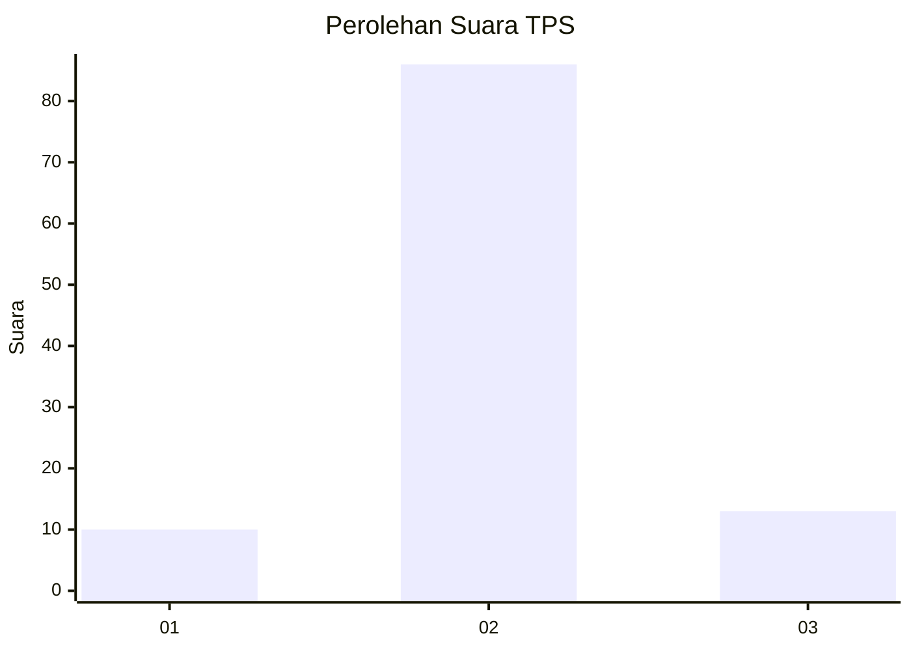
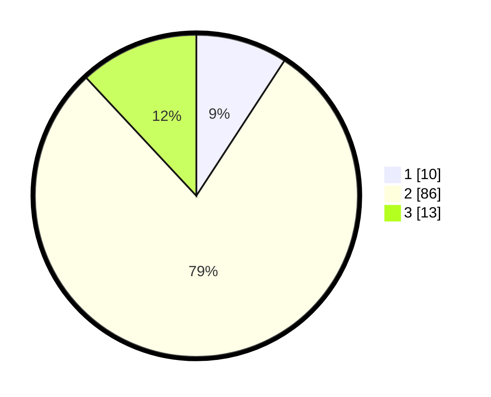

# Hasil

## Grafik

## Tabel

| No. | Nama Paslon    | Suara | Suara (raw) | Persentase |
|:--- |:-------------- | -----:| -----------:| ----------:|
| 1   | ANIES MUHAIMIN | 10    | [10][p-1]   | 9,17       |
| 2   | PRABOWO GIBRAN | 86    | [86][p-2]   | 78,90      |
| 3   | GANJAR MAHFUD  | 13    | [13][p-3]   | 11,93      |

[p-1]: https://github.com/gigit-pemilu/pemilu-2024-91-papua/blob/main/pilpres/hitung-suara/sub/91-papua/sub/03-jayapura/sub/18-gresi-selatan/sub/2001-omon/sub/001-tps/sub/paslon-1.txt
[p-2]: https://github.com/gigit-pemilu/pemilu-2024-91-papua/blob/main/pilpres/hitung-suara/sub/91-papua/sub/03-jayapura/sub/18-gresi-selatan/sub/2001-omon/sub/001-tps/sub/paslon-2.txt
[p-3]: https://github.com/gigit-pemilu/pemilu-2024-91-papua/blob/main/pilpres/hitung-suara/sub/91-papua/sub/03-jayapura/sub/18-gresi-selatan/sub/2001-omon/sub/001-tps/sub/paslon-3.txt

## Foto C Plano

https://sirekap-obj-formc.kpu.go.id/3c2b/pemilu/ppwp/91/03/18/20/01/9103182001001-20240216-160641--14641d78-bda2-49bd-b7e5-16859d2fa1cf.jpg

https://sirekap-obj-formc.kpu.go.id/3c2b/pemilu/ppwp/91/03/18/20/01/9103182001001-20240217-134655--2e4c4044-e150-4d57-bf25-37b0198d0fce.jpg

https://sirekap-obj-formc.kpu.go.id/3c2b/pemilu/ppwp/91/03/18/20/01/9103182001001-20240216-162752--eeb5eeff-ccc0-4a59-97b6-1b993a5d1176.jpg

## Metadata

| Key        | Value               |
| ---------- | ------------------- |
| Time Stamp | 2024-02-21 18:00:00 |

## DATA PEMILIH TETAP

Jumlah pemilih dalam DPT: **111**.
 * L: **54**.
 * P: **57**.

## DATA PENGGUNA HAK PILIH

Jumlah pengguna hak pilih dalam DPT: **111**.
 * L: **54**.
 * P: **57**.

Jumlah pengguna hak pilih dalam DPTb: **0**.
 * L: **0**.
 * P: **0**.

Jumlah pengguna hak pilih dalam DPK: **0**.
 * L: **0**.
 * P: **0**.

Jumlah pengguna hak pilih: **111**.
 * L: **54**.
 * P: **57**.

## JUMLAH SUARA SAH DAN TIDAK SAH

JUMLAH SELURUH SUARA SAH: **109**.

JUMLAH SUARA TIDAK SAH: **2**.

JUMLAH SELURUH SUARA SAH DAN SUARA TIDAK SAH: **111**.

