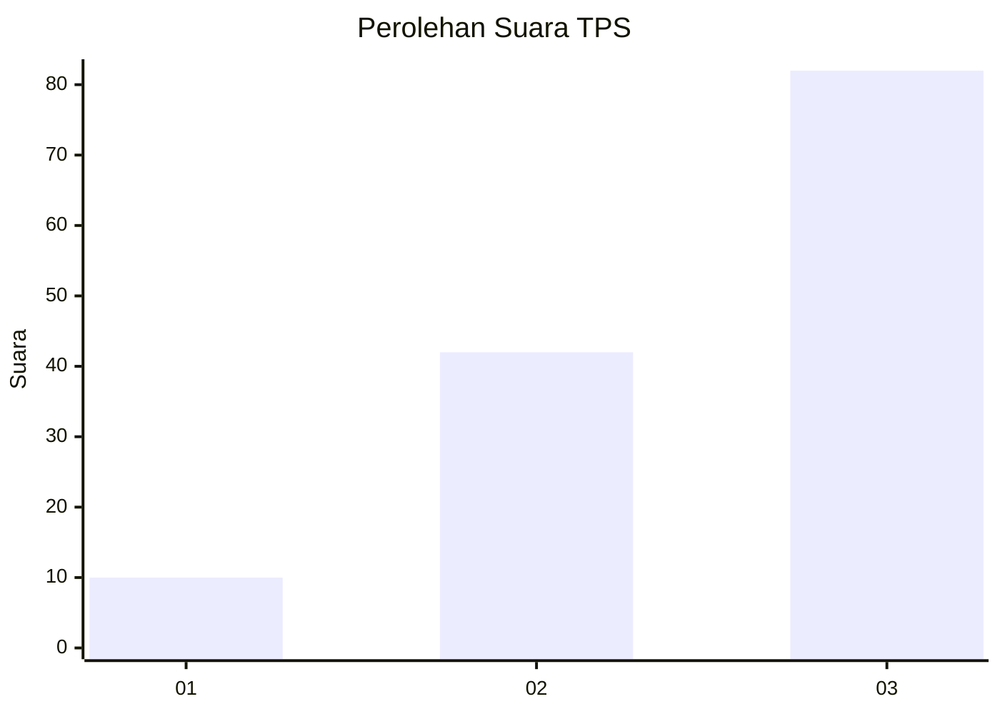
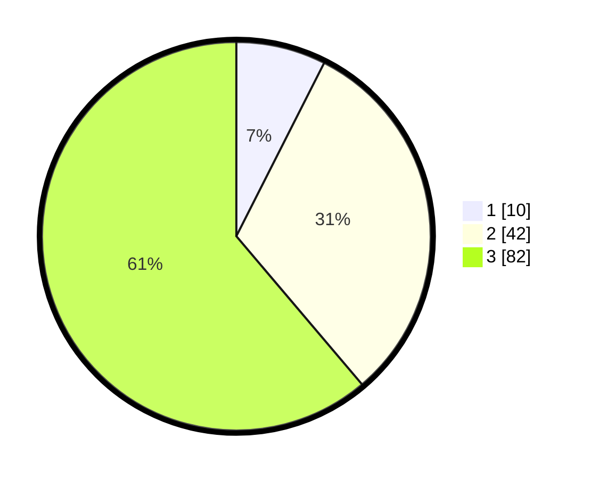

# Hasil

## Grafik

## Tabel

| No. | Nama Paslon    | Suara | Suara (raw) | Persentase |
|:--- |:-------------- | -----:| -----------:| ----------:|
| 1   | ANIES MUHAIMIN | 10    | [10][p-1]   | 7,46       |
| 2   | PRABOWO GIBRAN | 42    | [42][p-2]   | 31,34      |
| 3   | GANJAR MAHFUD  | 82    | [82][p-3]   | 61,19      |

[p-1]: https://github.com/gigit-pemilu/pemilu-2024-91-papua/blob/main/pilpres/hitung-suara/sub/91-papua/sub/03-jayapura/sub/18-gresi-selatan/sub/3002-desa-adat-iwon/sub/001-tps/sub/paslon-1.txt
[p-2]: https://github.com/gigit-pemilu/pemilu-2024-91-papua/blob/main/pilpres/hitung-suara/sub/91-papua/sub/03-jayapura/sub/18-gresi-selatan/sub/3002-desa-adat-iwon/sub/001-tps/sub/paslon-2.txt
[p-3]: https://github.com/gigit-pemilu/pemilu-2024-91-papua/blob/main/pilpres/hitung-suara/sub/91-papua/sub/03-jayapura/sub/18-gresi-selatan/sub/3002-desa-adat-iwon/sub/001-tps/sub/paslon-3.txt

## Foto C Plano

https://sirekap-obj-formc.kpu.go.id/b6ac/pemilu/ppwp/91/03/18/30/02/9103183002001-20240218-010405--55f40deb-4d41-4beb-b573-71937f886954.jpg

https://sirekap-obj-formc.kpu.go.id/b6ac/pemilu/ppwp/91/03/18/30/02/9103183002001-20240218-010407--b44ee60d-a0ca-460a-af45-f9a15c1d63ee.jpg

https://sirekap-obj-formc.kpu.go.id/b6ac/pemilu/ppwp/91/03/18/30/02/9103183002001-20240218-010406--03c6aa29-c48f-411e-b67e-f73156095aa5.jpg

## Metadata

| Key        | Value               |
| ---------- | ------------------- |
| Time Stamp | 2024-02-24 22:31:28 |

## DATA PEMILIH TETAP

Jumlah pemilih dalam DPT: **132**.
 * L: **63**.
 * P: **69**.

## DATA PENGGUNA HAK PILIH

Jumlah pengguna hak pilih dalam DPT: **81**.
 * L: **41**.
 * P: **40**.

Jumlah pengguna hak pilih dalam DPTb: **29**.
 * L: **15**.
 * P: **14**.

Jumlah pengguna hak pilih dalam DPK: **25**.
 * L: **12**.
 * P: **13**.

Jumlah pengguna hak pilih: **135**.
 * L: **68**.
 * P: **67**.

## JUMLAH SUARA SAH DAN TIDAK SAH

JUMLAH SELURUH SUARA SAH: **134**.

JUMLAH SUARA TIDAK SAH: **1**.

JUMLAH SELURUH SUARA SAH DAN SUARA TIDAK SAH: **135**.

