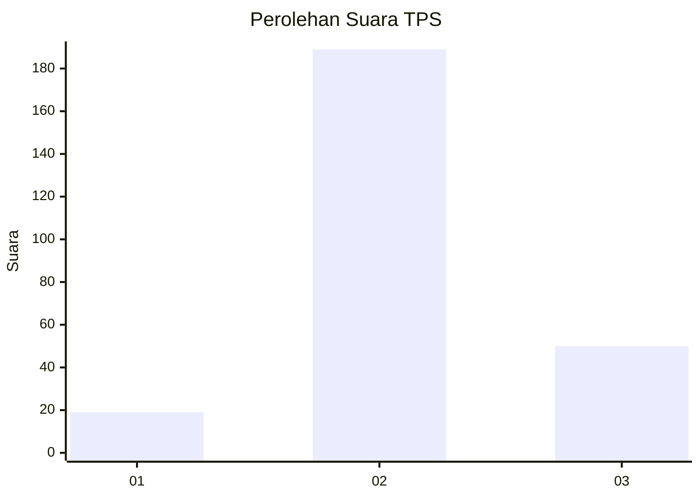
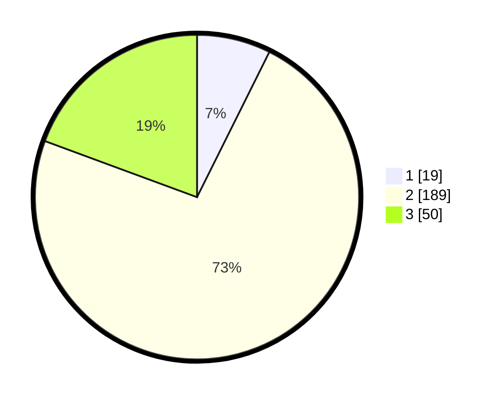

# Hasil

## Grafik

## Tabel

| No. | Nama Paslon    | Suara | Suara (raw) | Persentase |
|:--- |:-------------- | -----:| -----------:| ----------:|
| 1   | ANIES MUHAIMIN | 19    | [19][p-1]   | 7,36       |
| 2   | PRABOWO GIBRAN | 189   | [189][p-2]  | 73,26      |
| 3   | GANJAR MAHFUD  | 50    | [50][p-3]   | 19,38      |

[p-1]: https://github.com/gigit-pemilu/pemilu-2024-91-papua/blob/main/pilpres/hitung-suara/sub/91-papua/sub/05-kepulauan-yapen/sub/01-yapen-selatan/sub/1004-tarau/sub/005-tps/sub/paslon-1.txt
[p-2]: https://github.com/gigit-pemilu/pemilu-2024-91-papua/blob/main/pilpres/hitung-suara/sub/91-papua/sub/05-kepulauan-yapen/sub/01-yapen-selatan/sub/1004-tarau/sub/005-tps/sub/paslon-2.txt
[p-3]: https://github.com/gigit-pemilu/pemilu-2024-91-papua/blob/main/pilpres/hitung-suara/sub/91-papua/sub/05-kepulauan-yapen/sub/01-yapen-selatan/sub/1004-tarau/sub/005-tps/sub/paslon-3.txt

## Foto C Plano

https://sirekap-obj-formc.kpu.go.id/5d8d/pemilu/ppwp/91/05/01/10/04/9105011004005-20240216-022713--42fc687a-4f72-497a-a25a-dc9477731f67.jpg

https://sirekap-obj-formc.kpu.go.id/5d8d/pemilu/ppwp/91/05/01/10/04/9105011004005-20240216-022953--f8f394a5-ba75-4521-a028-51ee1e3c8268.jpg

https://sirekap-obj-formc.kpu.go.id/5d8d/pemilu/ppwp/91/05/01/10/04/9105011004005-20240216-115247--4629fb66-1328-47e2-acb6-ac014c3d79de.jpg

## Metadata

| Key        | Value               |
| ---------- | ------------------- |
| Time Stamp | 2024-02-16 14:00:34 |

## DATA PEMILIH TETAP

Jumlah pemilih dalam DPT: **274**.
 * L: **139**.
 * P: **135**.

## DATA PENGGUNA HAK PILIH

Jumlah pengguna hak pilih dalam DPT: **92**.
 * L: **46**.
 * P: **46**.

Jumlah pengguna hak pilih dalam DPTb: **166**.
 * L: **74**.
 * P: **92**.

Jumlah pengguna hak pilih dalam DPK: **0**.
 * L: **0**.
 * P: **0**.

Jumlah pengguna hak pilih: **258**.
 * L: **120**.
 * P: **138**.

## JUMLAH SUARA SAH DAN TIDAK SAH

JUMLAH SELURUH SUARA SAH: **258**.

JUMLAH SUARA TIDAK SAH: **24**.

JUMLAH SELURUH SUARA SAH DAN SUARA TIDAK SAH: **282**.

