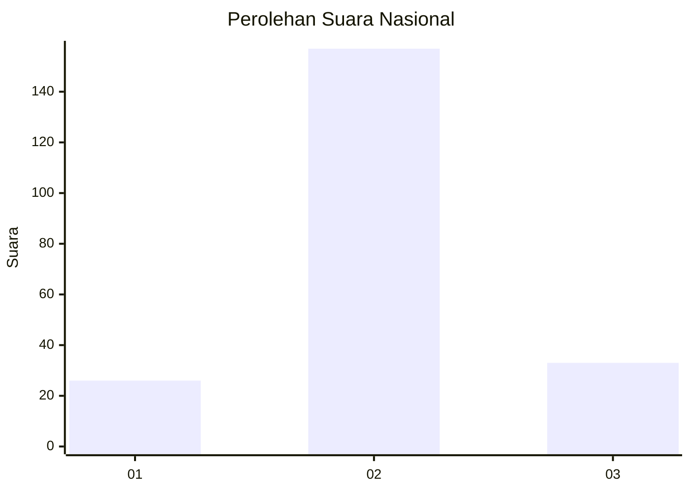
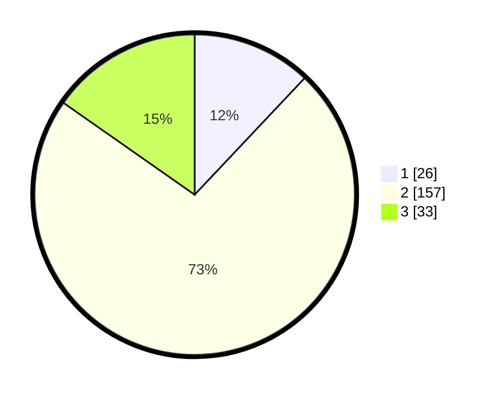

# Hasil

## Grafik

## Tabel

| No. | Nama Paslon    | Suara | Suara (raw) | Persentase |
|:--- |:-------------- | -----:| -----------:| ----------:|
| 1   | ANIES MUHAIMIN | 26    | [26][p-1]   | 12,04      |
| 2   | PRABOWO GIBRAN | 157   | [157][p-2]  | 72,69      |
| 3   | GANJAR MAHFUD  | 33    | [33][p-3]   | 15,28      |

[p-1]: https://github.com/gigit-pemilu/pemilu-2024/blob/main/pilpres/hitung-suara/sub/91-papua/sub/05-kepulauan-yapen/sub/01-yapen-selatan/sub/1004-tarau/sub/014-tps/sub/paslon-1.txt
[p-2]: https://github.com/gigit-pemilu/pemilu-2024/blob/main/pilpres/hitung-suara/sub/91-papua/sub/05-kepulauan-yapen/sub/01-yapen-selatan/sub/1004-tarau/sub/014-tps/sub/paslon-2.txt
[p-3]: https://github.com/gigit-pemilu/pemilu-2024/blob/main/pilpres/hitung-suara/sub/91-papua/sub/05-kepulauan-yapen/sub/01-yapen-selatan/sub/1004-tarau/sub/014-tps/sub/paslon-3.txt

## Foto C Plano

https://sirekap-obj-formc.kpu.go.id/8d2a/pemilu/ppwp/91/05/01/10/04/9105011004014-20240215-213159--4caaf7dc-d312-4595-b24d-3a9db529c632.jpg

https://sirekap-obj-formc.kpu.go.id/8d2a/pemilu/ppwp/91/05/01/10/04/9105011004014-20240215-214228--f7919496-7183-4190-845b-0568f83c1e90.jpg

https://sirekap-obj-formc.kpu.go.id/8d2a/pemilu/ppwp/91/05/01/10/04/9105011004014-20240215-213643--18229efa-9a73-4b74-afb1-3610c18113a2.jpg

## Metadata

| Key        | Value               |
| ---------- | ------------------- |
| Time Stamp | 2024-02-16 04:00:27 |

