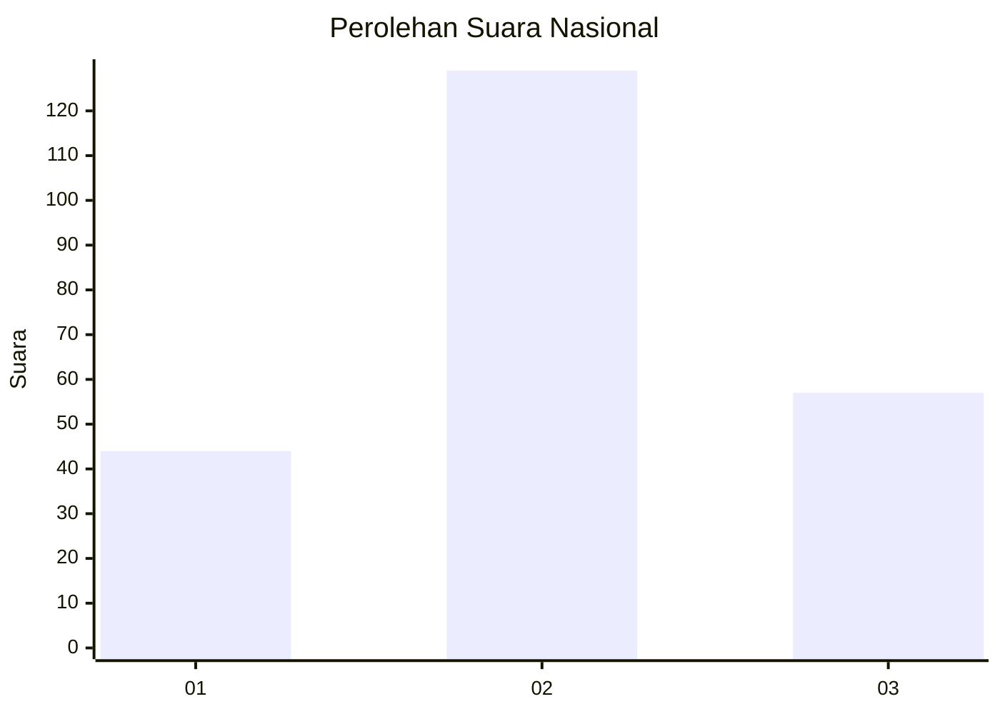
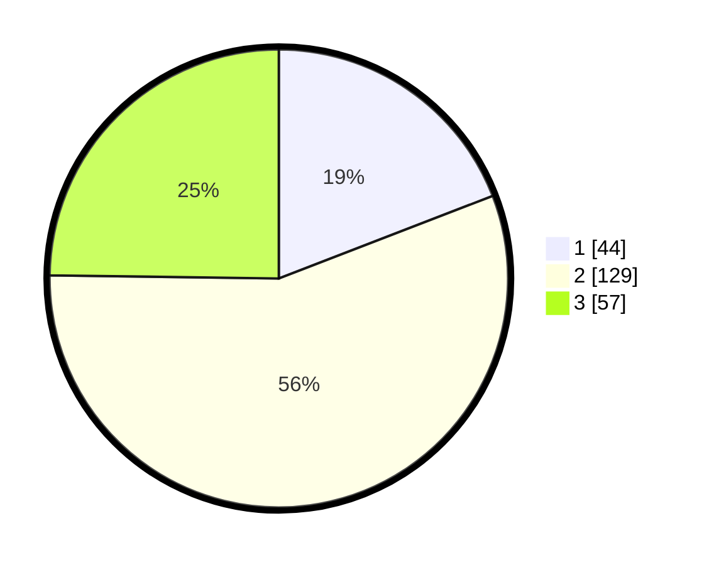

# Hasil

## Grafik

## Tabel

| No. | Nama Paslon    | Suara | Suara (raw) | Persentase |
|:--- |:-------------- | -----:| -----------:| ----------:|
| 1   | ANIES MUHAIMIN | 44    | [44][p-1]   | 19,13      |
| 2   | PRABOWO GIBRAN | 129   | [129][p-2]  | 56,09      |
| 3   | GANJAR MAHFUD  | 57    | [57][p-3]   | 24,78      |

[p-1]: https://github.com/gigit-pemilu/pemilu-2024/blob/main/pilpres/hitung-suara/sub/91-papua/sub/05-kepulauan-yapen/sub/01-yapen-selatan/sub/1004-tarau/sub/015-tps/sub/paslon-1.txt
[p-2]: https://github.com/gigit-pemilu/pemilu-2024/blob/main/pilpres/hitung-suara/sub/91-papua/sub/05-kepulauan-yapen/sub/01-yapen-selatan/sub/1004-tarau/sub/015-tps/sub/paslon-2.txt
[p-3]: https://github.com/gigit-pemilu/pemilu-2024/blob/main/pilpres/hitung-suara/sub/91-papua/sub/05-kepulauan-yapen/sub/01-yapen-selatan/sub/1004-tarau/sub/015-tps/sub/paslon-3.txt

## Foto C Plano

https://sirekap-obj-formc.kpu.go.id/cff1/pemilu/ppwp/91/05/01/10/04/9105011004015-20240215-220405--e4f22de2-c5ba-4943-83eb-68ac328d498c.jpg

https://sirekap-obj-formc.kpu.go.id/cff1/pemilu/ppwp/91/05/01/10/04/9105011004015-20240215-200337--383a74b4-0e4c-4fd1-8744-203104ffa74d.jpg

https://sirekap-obj-formc.kpu.go.id/cff1/pemilu/ppwp/91/05/01/10/04/9105011004015-20240215-200624--d551b60d-2964-46d3-abab-2e26e1bd0a49.jpg

## Metadata

| Key        | Value               |
| ---------- | ------------------- |
| Time Stamp | 2024-02-16 04:00:27 |

