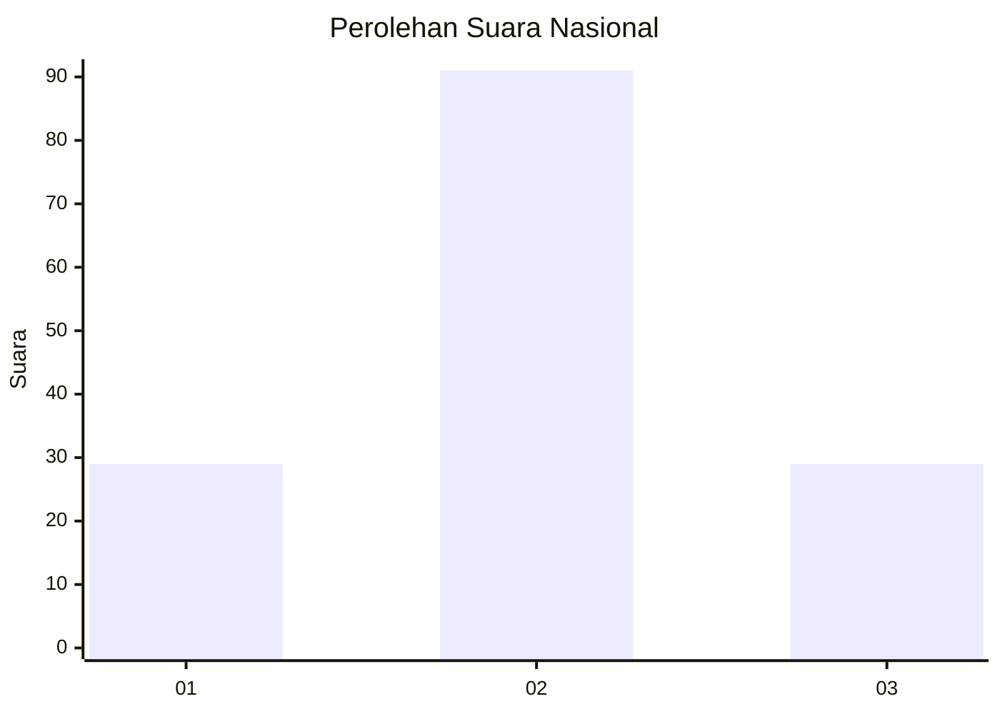
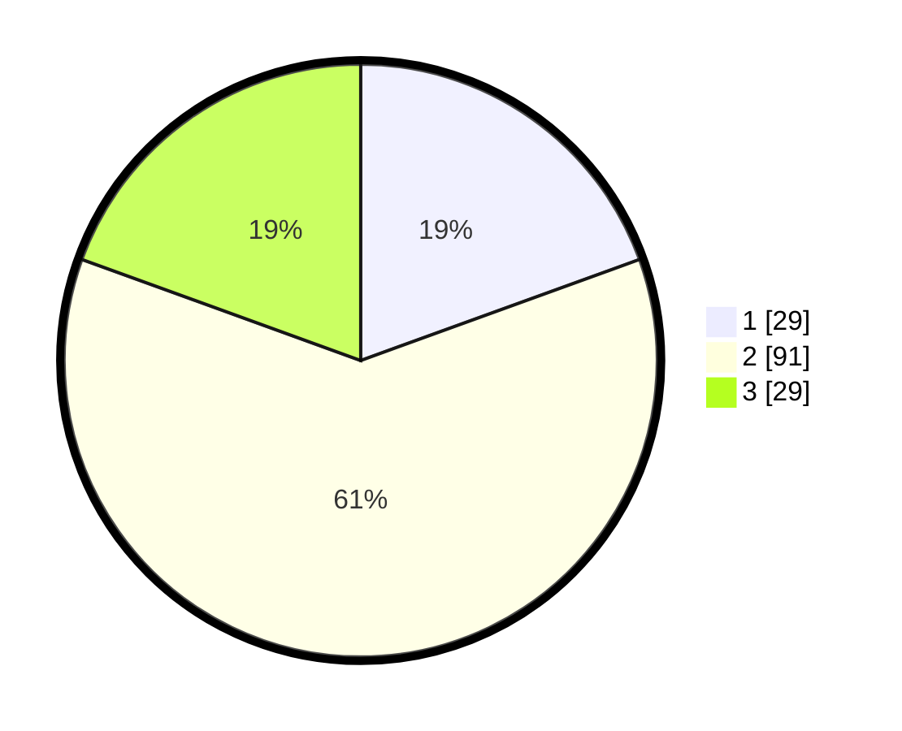

# Hasil

## Grafik

## Tabel

| No. | Nama Paslon    | Suara | Suara (raw) | Persentase |
|:--- |:-------------- | -----:| -----------:| ----------:|
| 1   | ANIES MUHAIMIN | 29    | [29][p-1]   | 19,46      |
| 2   | PRABOWO GIBRAN | 91    | [91][p-2]   | 61,07      |
| 3   | GANJAR MAHFUD  | 29    | [29][p-3]   | 19,46      |

[p-1]: https://github.com/gigit-pemilu/pemilu-2024/blob/main/pilpres/hitung-suara/sub/91-papua/sub/05-kepulauan-yapen/sub/01-yapen-selatan/sub/1004-tarau/sub/017-tps/sub/paslon-1.txt
[p-2]: https://github.com/gigit-pemilu/pemilu-2024/blob/main/pilpres/hitung-suara/sub/91-papua/sub/05-kepulauan-yapen/sub/01-yapen-selatan/sub/1004-tarau/sub/017-tps/sub/paslon-2.txt
[p-3]: https://github.com/gigit-pemilu/pemilu-2024/blob/main/pilpres/hitung-suara/sub/91-papua/sub/05-kepulauan-yapen/sub/01-yapen-selatan/sub/1004-tarau/sub/017-tps/sub/paslon-3.txt

## Foto C Plano

https://sirekap-obj-formc.kpu.go.id/20be/pemilu/ppwp/91/05/01/10/04/9105011004017-20240215-042948--c80ed559-8821-4a80-914d-903bef885869.jpg

https://sirekap-obj-formc.kpu.go.id/20be/pemilu/ppwp/91/05/01/10/04/9105011004017-20240215-023500--c494b20c-742c-4671-b785-6d136f1f3e30.jpg

https://sirekap-obj-formc.kpu.go.id/20be/pemilu/ppwp/91/05/01/10/04/9105011004017-20240215-023854--47b6f3d8-c728-4c3f-a35f-a448eb453958.jpg

## Metadata

| Key        | Value               |
| ---------- | ------------------- |
| Time Stamp | 2024-02-16 13:30:32 |

