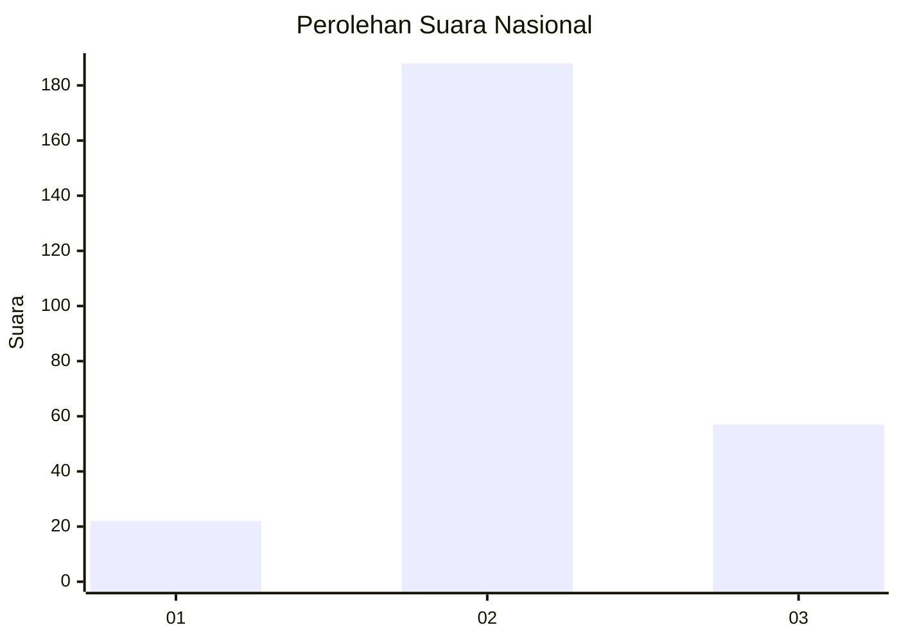
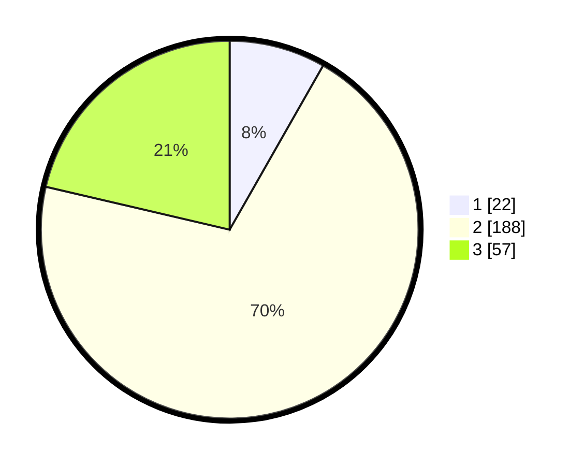

# Hasil

## Grafik

## Tabel

| No. | Nama Paslon    | Suara | Suara (raw) | Persentase |
|:--- |:-------------- | -----:| -----------:| ----------:|
| 1   | ANIES MUHAIMIN | 22    | [22][p-1]   | 8,24       |
| 2   | PRABOWO GIBRAN | 188   | [188][p-2]  | 70,41      |
| 3   | GANJAR MAHFUD  | 57    | [57][p-3]   | 21,35      |

[p-1]: https://github.com/gigit-pemilu/pemilu-2024/blob/main/pilpres/hitung-suara/sub/91-papua/sub/05-kepulauan-yapen/sub/01-yapen-selatan/sub/1005-serui-kota/sub/009-tps/sub/paslon-1.txt
[p-2]: https://github.com/gigit-pemilu/pemilu-2024/blob/main/pilpres/hitung-suara/sub/91-papua/sub/05-kepulauan-yapen/sub/01-yapen-selatan/sub/1005-serui-kota/sub/009-tps/sub/paslon-2.txt
[p-3]: https://github.com/gigit-pemilu/pemilu-2024/blob/main/pilpres/hitung-suara/sub/91-papua/sub/05-kepulauan-yapen/sub/01-yapen-selatan/sub/1005-serui-kota/sub/009-tps/sub/paslon-3.txt

## Foto C Plano

https://sirekap-obj-formc.kpu.go.id/e136/pemilu/ppwp/91/05/01/10/05/9105011005009-20240214-203242--69992c06-ac43-4144-8dc7-f0755db5a8ec.jpg

https://sirekap-obj-formc.kpu.go.id/e136/pemilu/ppwp/91/05/01/10/05/9105011005009-20240214-203132--ccf52206-fced-4edd-9237-5cf79e1394e0.jpg

https://sirekap-obj-formc.kpu.go.id/e136/pemilu/ppwp/91/05/01/10/05/9105011005009-20240214-203408--29d73749-d940-4589-bcdf-e99d913880dc.jpg

## Metadata

| Key        | Value               |
| ---------- | ------------------- |
| Time Stamp | 2024-02-19 06:16:00 |

