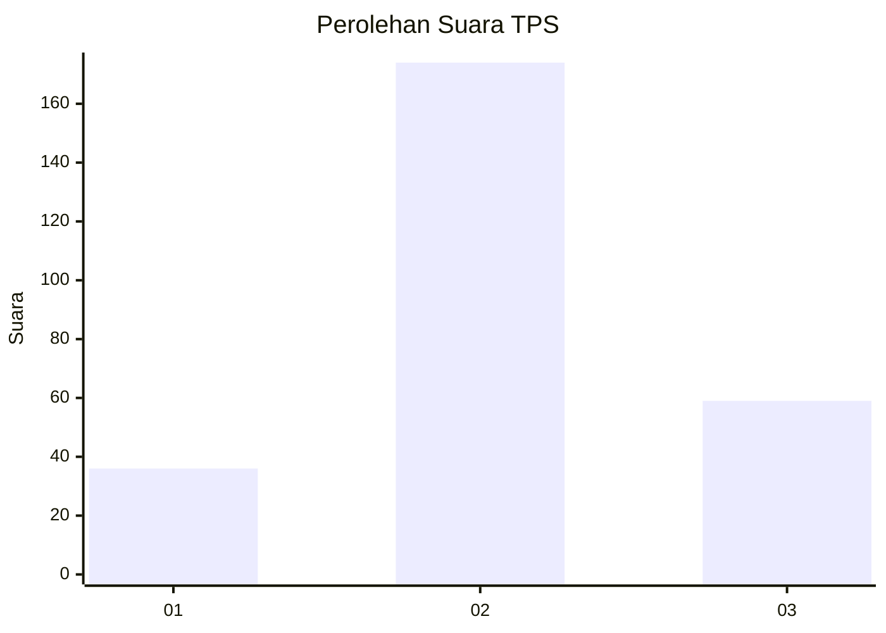
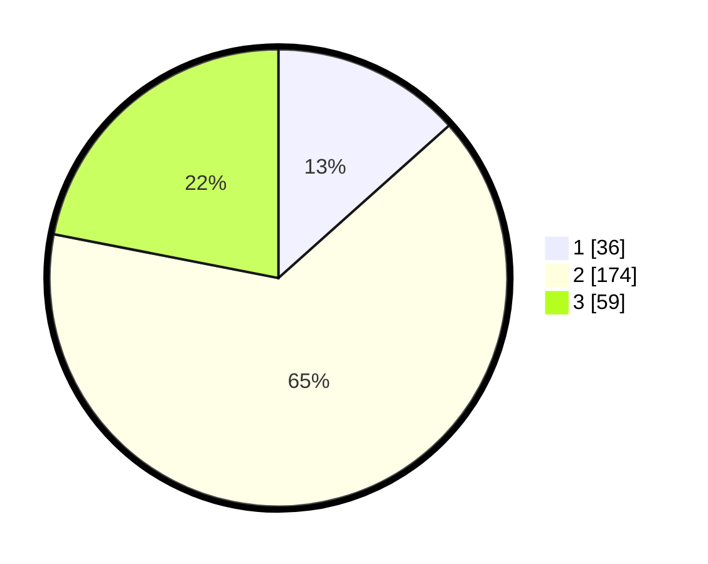

# Hasil

## Grafik

## Tabel

| No. | Nama Paslon    | Suara | Suara (raw) | Persentase |
|:--- |:-------------- | -----:| -----------:| ----------:|
| 1   | ANIES MUHAIMIN | 36    | [36][p-1]   | 13,38      |
| 2   | PRABOWO GIBRAN | 174   | [174][p-2]  | 64,68      |
| 3   | GANJAR MAHFUD  | 59    | [59][p-3]   | 21,93      |

[p-1]: https://github.com/gigit-pemilu/pemilu-2024-91-papua/blob/main/pilpres/hitung-suara/sub/91-papua/sub/05-kepulauan-yapen/sub/01-yapen-selatan/sub/1005-serui-kota/sub/019-tps/sub/paslon-1.txt
[p-2]: https://github.com/gigit-pemilu/pemilu-2024-91-papua/blob/main/pilpres/hitung-suara/sub/91-papua/sub/05-kepulauan-yapen/sub/01-yapen-selatan/sub/1005-serui-kota/sub/019-tps/sub/paslon-2.txt
[p-3]: https://github.com/gigit-pemilu/pemilu-2024-91-papua/blob/main/pilpres/hitung-suara/sub/91-papua/sub/05-kepulauan-yapen/sub/01-yapen-selatan/sub/1005-serui-kota/sub/019-tps/sub/paslon-3.txt

## Foto C Plano

https://sirekap-obj-formc.kpu.go.id/6085/pemilu/ppwp/91/05/01/10/05/9105011005019-20240215-152454--af5cdd1d-c132-4eb4-b813-bc4bf36e6bcd.jpg

https://sirekap-obj-formc.kpu.go.id/6085/pemilu/ppwp/91/05/01/10/05/9105011005019-20240215-152616--58be413c-1691-485e-b10e-c7d67c98eaca.jpg

https://sirekap-obj-formc.kpu.go.id/6085/pemilu/ppwp/91/05/01/10/05/9105011005019-20240215-153227--ffaabd8f-0774-4af8-b3ac-5e9459e9825e.jpg

## Metadata

| Key        | Value               |
| ---------- | ------------------- |
| Time Stamp | 2024-02-25 12:00:00 |

