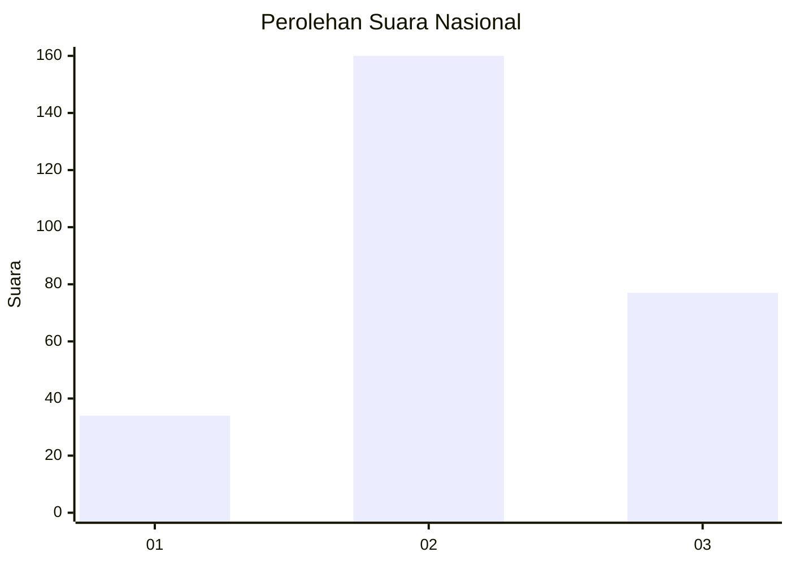
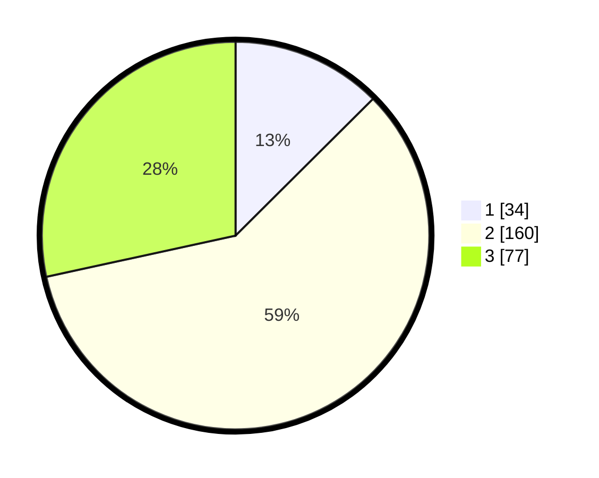

# Hasil

## Grafik

## Tabel

| No. | Nama Paslon    | Suara | Suara (raw) | Persentase |
|:--- |:-------------- | -----:| -----------:| ----------:|
| 1   | ANIES MUHAIMIN | 34    | [34][p-1]   | 12,55      |
| 2   | PRABOWO GIBRAN | 160   | [160][p-2]  | 59,04      |
| 3   | GANJAR MAHFUD  | 77    | [77][p-3]   | 28,41      |

[p-1]: https://github.com/gigit-pemilu/pemilu-2024/blob/main/pilpres/hitung-suara/sub/91-papua/sub/05-kepulauan-yapen/sub/01-yapen-selatan/sub/1006-serui-jaya/sub/003-tps/sub/paslon-1.txt
[p-2]: https://github.com/gigit-pemilu/pemilu-2024/blob/main/pilpres/hitung-suara/sub/91-papua/sub/05-kepulauan-yapen/sub/01-yapen-selatan/sub/1006-serui-jaya/sub/003-tps/sub/paslon-2.txt
[p-3]: https://github.com/gigit-pemilu/pemilu-2024/blob/main/pilpres/hitung-suara/sub/91-papua/sub/05-kepulauan-yapen/sub/01-yapen-selatan/sub/1006-serui-jaya/sub/003-tps/sub/paslon-3.txt

## Foto C Plano

https://sirekap-obj-formc.kpu.go.id/6d82/pemilu/ppwp/91/05/01/10/06/9105011006003-20240216-161011--3ab0747d-8cda-4a5d-99da-cb59f823741b.jpg

https://sirekap-obj-formc.kpu.go.id/6d82/pemilu/ppwp/91/05/01/10/06/9105011006003-20240216-161159--431aecf2-dbe1-4b9e-81ae-96bd5d149ab3.jpg

https://sirekap-obj-formc.kpu.go.id/6d82/pemilu/ppwp/91/05/01/10/06/9105011006003-20240216-161310--c8c19a9b-5da6-429f-8eef-cad327acf197.jpg

## Metadata

| Key        | Value               |
| ---------- | ------------------- |
| Time Stamp | 2024-02-19 06:16:00 |

