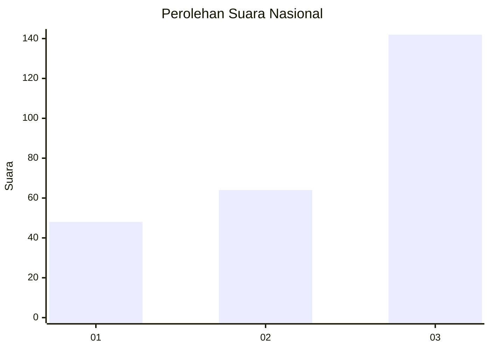
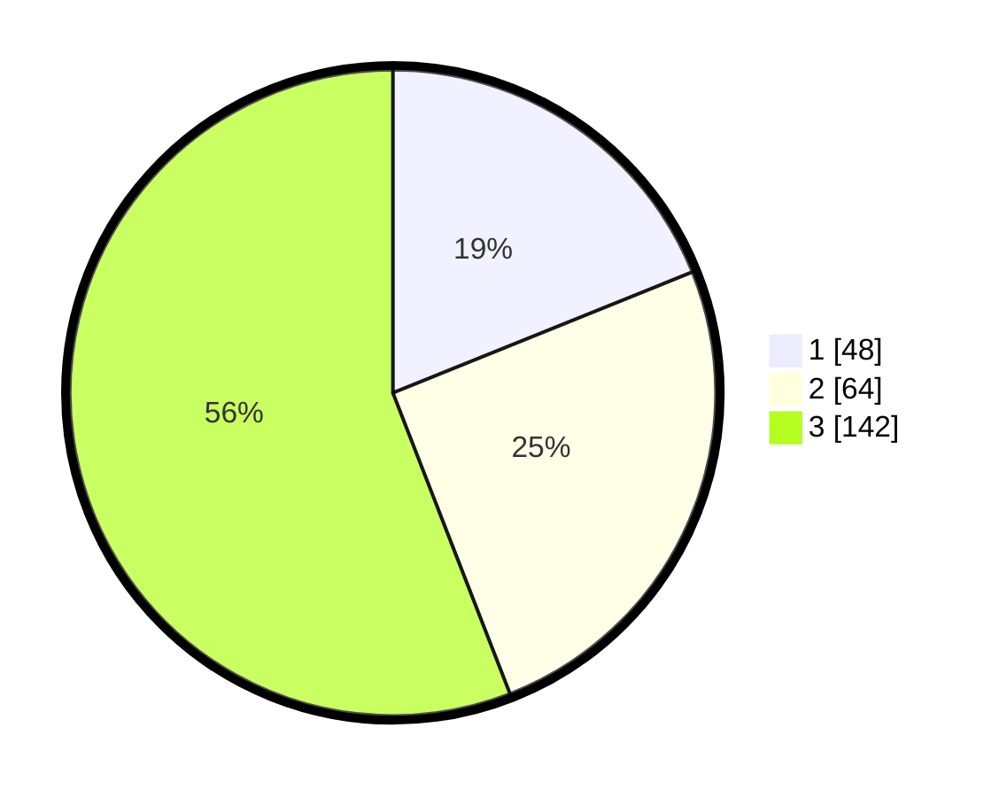

# Hasil

## Grafik

## Tabel

| No. | Nama Paslon    | Suara | Suara (raw) | Persentase |
|:--- |:-------------- | -----:| -----------:| ----------:|
| 1   | ANIES MUHAIMIN | 48    | [48][p-1]   | 18,90      |
| 2   | PRABOWO GIBRAN | 64    | [64][p-2]   | 25,20      |
| 3   | GANJAR MAHFUD  | 142   | [142][p-3]  | 55,91      |

[p-1]: https://github.com/gigit-pemilu/pemilu-2024/blob/main/pilpres/hitung-suara/sub/91-papua/sub/05-kepulauan-yapen/sub/01-yapen-selatan/sub/2014-serui-laut/sub/001-tps/sub/paslon-1.txt
[p-2]: https://github.com/gigit-pemilu/pemilu-2024/blob/main/pilpres/hitung-suara/sub/91-papua/sub/05-kepulauan-yapen/sub/01-yapen-selatan/sub/2014-serui-laut/sub/001-tps/sub/paslon-2.txt
[p-3]: https://github.com/gigit-pemilu/pemilu-2024/blob/main/pilpres/hitung-suara/sub/91-papua/sub/05-kepulauan-yapen/sub/01-yapen-selatan/sub/2014-serui-laut/sub/001-tps/sub/paslon-3.txt

## Foto C Plano

https://sirekap-obj-formc.kpu.go.id/066f/pemilu/ppwp/91/05/01/20/14/9105012014001-20240215-160031--351f124c-6688-4533-82b6-bb290983c8fd.jpg

https://sirekap-obj-formc.kpu.go.id/066f/pemilu/ppwp/91/05/01/20/14/9105012014001-20240215-160320--f33c2dda-9742-4b84-98c2-bd02cf92100a.jpg

https://sirekap-obj-formc.kpu.go.id/066f/pemilu/ppwp/91/05/01/20/14/9105012014001-20240215-160403--dedf6a1a-e8c3-461f-a239-c59f25d1fb90.jpg

## Metadata

| Key        | Value               |
| ---------- | ------------------- |
| Time Stamp | 2024-02-19 06:16:00 |

