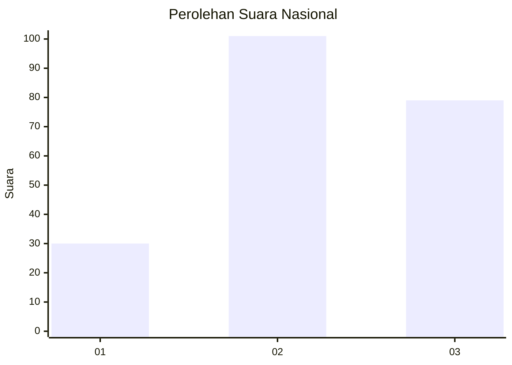
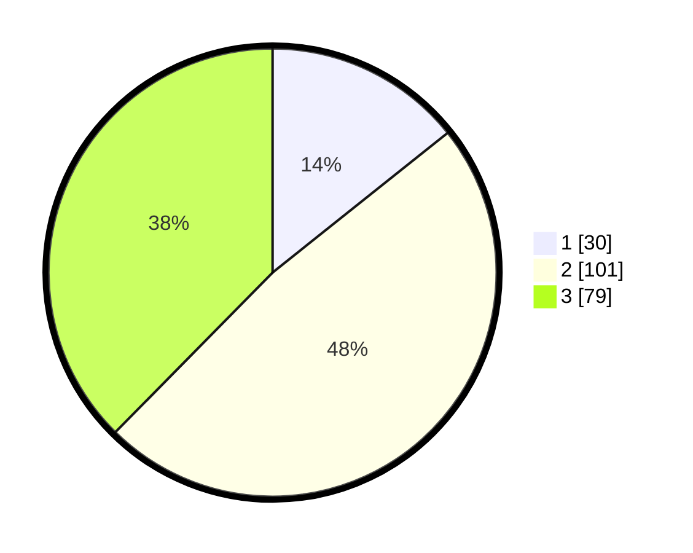

# Hasil

## Grafik

## Tabel

| No. | Nama Paslon    | Suara | Suara (raw) | Persentase |
|:--- |:-------------- | -----:| -----------:| ----------:|
| 1   | ANIES MUHAIMIN | 30    | [30][p-1]   | 14,29      |
| 2   | PRABOWO GIBRAN | 101   | [101][p-2]  | 48,10      |
| 3   | GANJAR MAHFUD  | 79    | [79][p-3]   | 37,62      |

[p-1]: https://github.com/gigit-pemilu/pemilu-2024/blob/main/pilpres/hitung-suara/sub/91-papua/sub/05-kepulauan-yapen/sub/01-yapen-selatan/sub/2015-banawa/sub/002-tps/sub/paslon-1.txt
[p-2]: https://github.com/gigit-pemilu/pemilu-2024/blob/main/pilpres/hitung-suara/sub/91-papua/sub/05-kepulauan-yapen/sub/01-yapen-selatan/sub/2015-banawa/sub/002-tps/sub/paslon-2.txt
[p-3]: https://github.com/gigit-pemilu/pemilu-2024/blob/main/pilpres/hitung-suara/sub/91-papua/sub/05-kepulauan-yapen/sub/01-yapen-selatan/sub/2015-banawa/sub/002-tps/sub/paslon-3.txt

## Foto C Plano

https://sirekap-obj-formc.kpu.go.id/809f/pemilu/ppwp/91/05/01/20/15/9105012015002-20240216-013832--d3a0d9b5-8365-479b-bd82-5a0ff41c7aaf.jpg

https://sirekap-obj-formc.kpu.go.id/809f/pemilu/ppwp/91/05/01/20/15/9105012015002-20240216-014031--edfdf701-99c1-4a1e-a67f-043d1d438c7f.jpg

https://sirekap-obj-formc.kpu.go.id/809f/pemilu/ppwp/91/05/01/20/15/9105012015002-20240216-013936--88650c48-20cd-4688-8bda-1206e0a1db7f.jpg

## Metadata

| Key        | Value               |
| ---------- | ------------------- |
| Time Stamp | 2024-02-19 06:16:00 |

