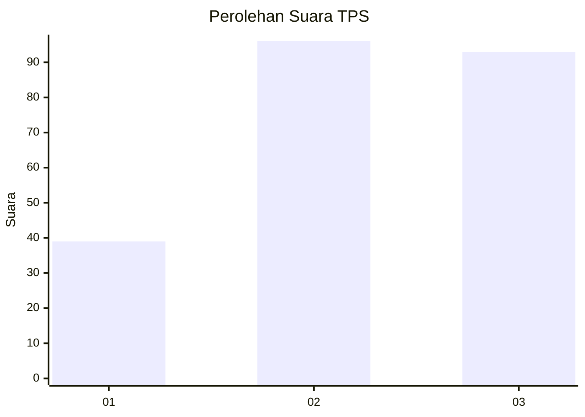
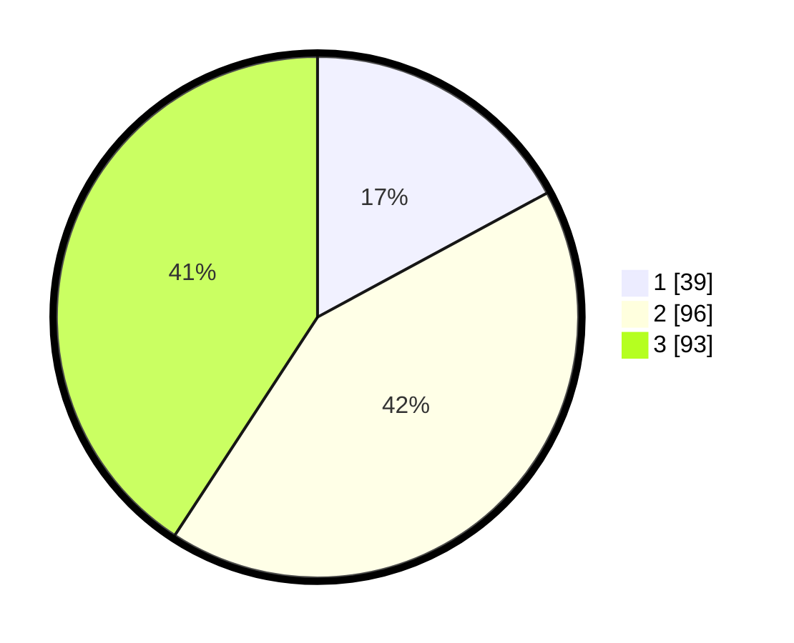

# Hasil

## Grafik

## Tabel

| No. | Nama Paslon    | Suara | Suara (raw) | Persentase |
|:--- |:-------------- | -----:| -----------:| ----------:|
| 1   | ANIES MUHAIMIN | 39    | [39][p-1]   | 17,11      |
| 2   | PRABOWO GIBRAN | 96    | [96][p-2]   | 42,11      |
| 3   | GANJAR MAHFUD  | 93    | [93][p-3]   | 40,79      |

[p-1]: https://github.com/gigit-pemilu/pemilu-2024-91-papua/blob/main/pilpres/hitung-suara/sub/91-papua/sub/05-kepulauan-yapen/sub/01-yapen-selatan/sub/2015-banawa/sub/003-tps/sub/paslon-1.txt
[p-2]: https://github.com/gigit-pemilu/pemilu-2024-91-papua/blob/main/pilpres/hitung-suara/sub/91-papua/sub/05-kepulauan-yapen/sub/01-yapen-selatan/sub/2015-banawa/sub/003-tps/sub/paslon-2.txt
[p-3]: https://github.com/gigit-pemilu/pemilu-2024-91-papua/blob/main/pilpres/hitung-suara/sub/91-papua/sub/05-kepulauan-yapen/sub/01-yapen-selatan/sub/2015-banawa/sub/003-tps/sub/paslon-3.txt

## Foto C Plano

https://sirekap-obj-formc.kpu.go.id/55d3/pemilu/ppwp/91/05/01/20/15/9105012015003-20240215-214434--a7e87cca-d3b6-4a17-93f5-33f6ea616734.jpg

https://sirekap-obj-formc.kpu.go.id/55d3/pemilu/ppwp/91/05/01/20/15/9105012015003-20240215-214615--5b7d36b8-ce7f-4733-9cb2-a39f03d1c447.jpg

https://sirekap-obj-formc.kpu.go.id/55d3/pemilu/ppwp/91/05/01/20/15/9105012015003-20240215-213504--bcc5e8f4-b38b-4b24-ab81-7295f0e5ee58.jpg

## Metadata

| Key        | Value               |
| ---------- | ------------------- |
| Time Stamp | 2024-02-19 06:16:00 |

