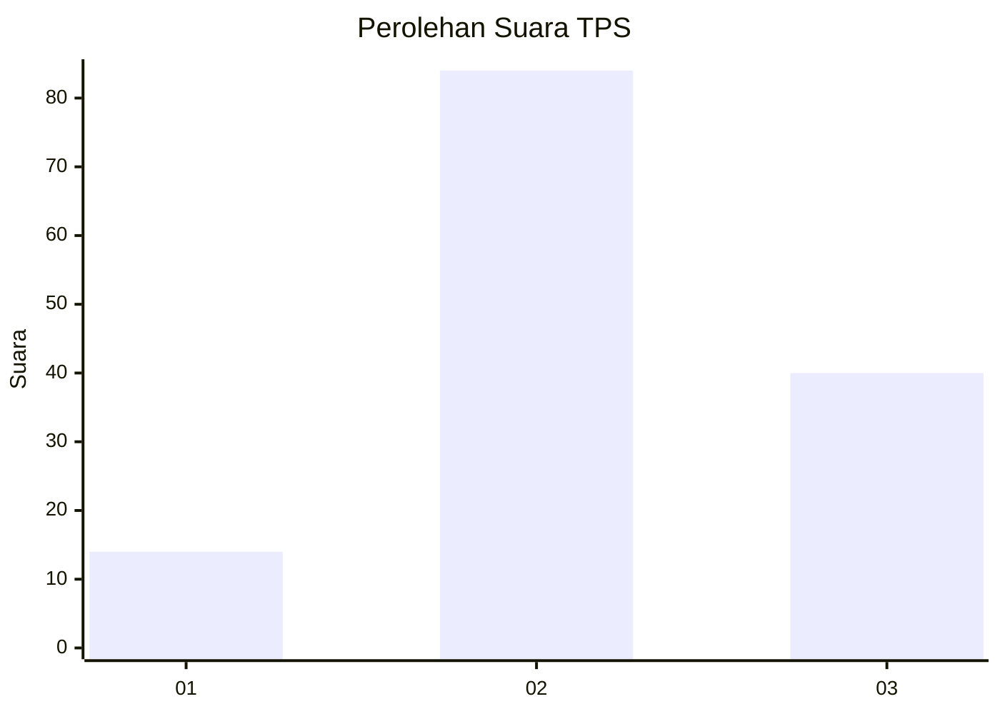
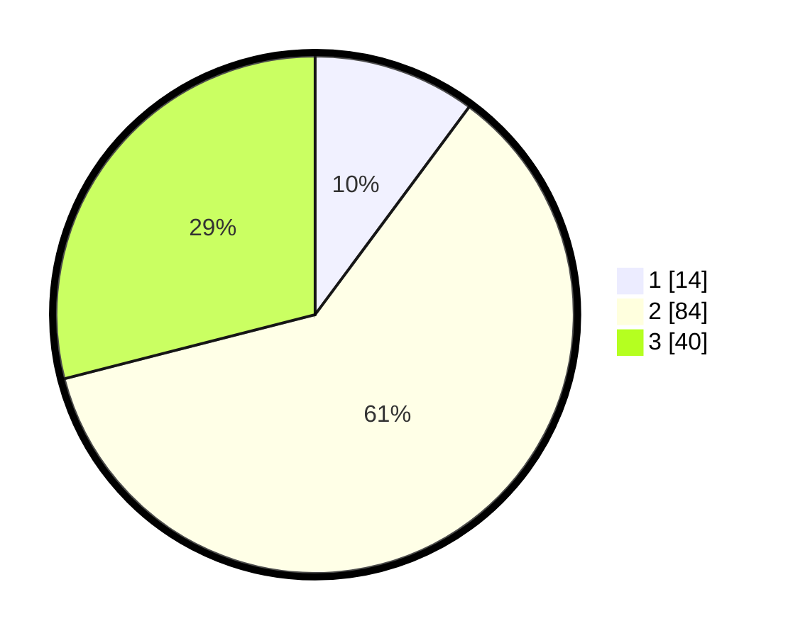

# Hasil

## Grafik

## Tabel

| No. | Nama Paslon    | Suara | Suara (raw) | Persentase |
|:--- |:-------------- | -----:| -----------:| ----------:|
| 1   | ANIES MUHAIMIN | 14    | [14][p-1]   | 10,14      |
| 2   | PRABOWO GIBRAN | 84    | [84][p-2]   | 60,87      |
| 3   | GANJAR MAHFUD  | 40    | [40][p-3]   | 28,99      |

[p-1]: https://github.com/gigit-pemilu/pemilu-2024-91-papua/blob/main/pilpres/hitung-suara/sub/91-papua/sub/05-kepulauan-yapen/sub/03-yapen-timur/sub/2005-dawai/sub/001-tps/sub/paslon-1.txt
[p-2]: https://github.com/gigit-pemilu/pemilu-2024-91-papua/blob/main/pilpres/hitung-suara/sub/91-papua/sub/05-kepulauan-yapen/sub/03-yapen-timur/sub/2005-dawai/sub/001-tps/sub/paslon-2.txt
[p-3]: https://github.com/gigit-pemilu/pemilu-2024-91-papua/blob/main/pilpres/hitung-suara/sub/91-papua/sub/05-kepulauan-yapen/sub/03-yapen-timur/sub/2005-dawai/sub/001-tps/sub/paslon-3.txt

## Foto C Plano

https://sirekap-obj-formc.kpu.go.id/be44/pemilu/ppwp/91/05/03/20/05/9105032005001-20240215-180629--7f981cfb-300e-4283-af45-8990215879e2.jpg

https://sirekap-obj-formc.kpu.go.id/be44/pemilu/ppwp/91/05/03/20/05/9105032005001-20240215-180737--350d9a0c-9b9b-446d-8e18-da7e4e3c3cf1.jpg

https://sirekap-obj-formc.kpu.go.id/be44/pemilu/ppwp/91/05/03/20/05/9105032005001-20240215-180919--63f6c600-64a6-4621-b333-dff7b09cdccf.jpg

## Metadata

| Key        | Value               |
| ---------- | ------------------- |
| Time Stamp | 2024-02-19 06:16:00 |

