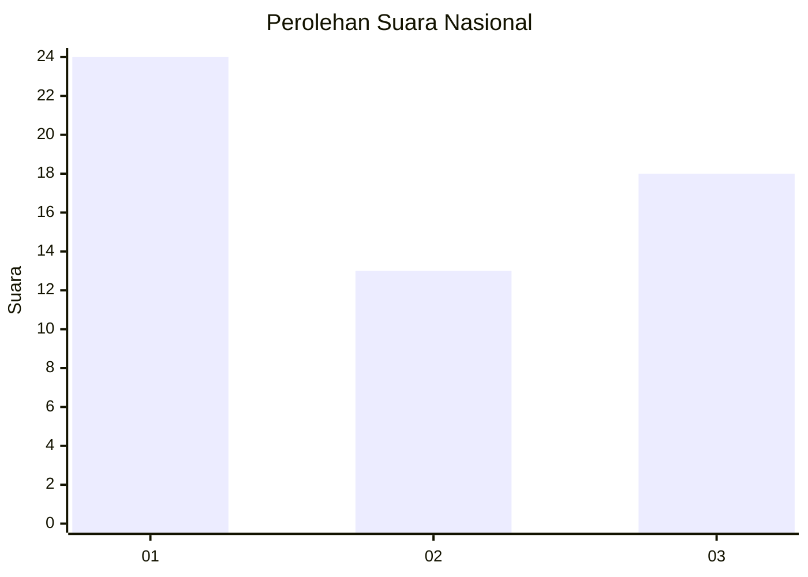
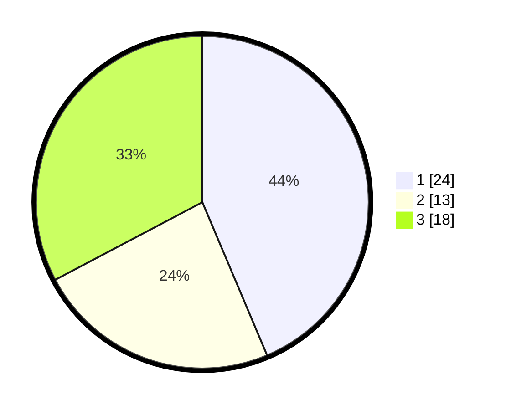

# Hasil

## Grafik

## Tabel

| No. | Nama Paslon    | Suara | Suara (raw) | Persentase |
|:--- |:-------------- | -----:| -----------:| ----------:|
| 1   | ANIES MUHAIMIN | 24    | [24][p-1]   | 43,64      |
| 2   | PRABOWO GIBRAN | 13    | [13][p-2]   | 23,64      |
| 3   | GANJAR MAHFUD  | 18    | [18][p-3]   | 32,73      |

[p-1]: https://github.com/gigit-pemilu/pemilu-2024/blob/main/pilpres/hitung-suara/sub/91-papua/sub/05-kepulauan-yapen/sub/03-yapen-timur/sub/2023-woinsupi/sub/002-tps/sub/paslon-1.txt
[p-2]: https://github.com/gigit-pemilu/pemilu-2024/blob/main/pilpres/hitung-suara/sub/91-papua/sub/05-kepulauan-yapen/sub/03-yapen-timur/sub/2023-woinsupi/sub/002-tps/sub/paslon-2.txt
[p-3]: https://github.com/gigit-pemilu/pemilu-2024/blob/main/pilpres/hitung-suara/sub/91-papua/sub/05-kepulauan-yapen/sub/03-yapen-timur/sub/2023-woinsupi/sub/002-tps/sub/paslon-3.txt

## Foto C Plano

https://sirekap-obj-formc.kpu.go.id/5232/pemilu/ppwp/91/05/03/20/23/9105032023002-20240216-071325--1d30db42-e4c7-4def-b956-66a21f575bf3.jpg

https://sirekap-obj-formc.kpu.go.id/5232/pemilu/ppwp/91/05/03/20/23/9105032023002-20240216-081551--762a3f64-fe16-46d2-ad67-e709d4889f7d.jpg

https://sirekap-obj-formc.kpu.go.id/5232/pemilu/ppwp/91/05/03/20/23/9105032023002-20240216-071757--6e187ca0-52d8-462c-8e41-0f50c1412fca.jpg

## Metadata

| Key        | Value               |
| ---------- | ------------------- |
| Time Stamp | 2024-02-16 12:51:22 |

## DATA PEMILIH TETAP

Jumlah pemilih dalam DPT: **25**.
 * L: **52**.
 * P: **32**.

## DATA PENGGUNA HAK PILIH

Jumlah pengguna hak pilih dalam DPT: **42**.
 * L: **30**.
 * P: **25**.

Jumlah pengguna hak pilih dalam DPTb: **10**.
 * L: **7**.
 * P: **3**.

Jumlah pengguna hak pilih dalam DPK: **3**.
 * L: **0**.
 * P: **3**.

Jumlah pengguna hak pilih: **55**.
 * L: **30**.
 * P: **25**.

## JUMLAH SUARA SAH DAN TIDAK SAH

JUMLAH SELURUH SUARA SAH: **55**.

JUMLAH SUARA TIDAK SAH: **0**.

JUMLAH SELURUH SUARA SAH DAN SUARA TIDAK SAH: **55**.

