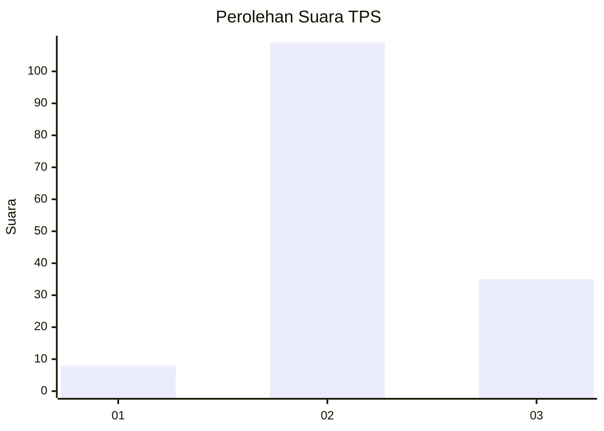
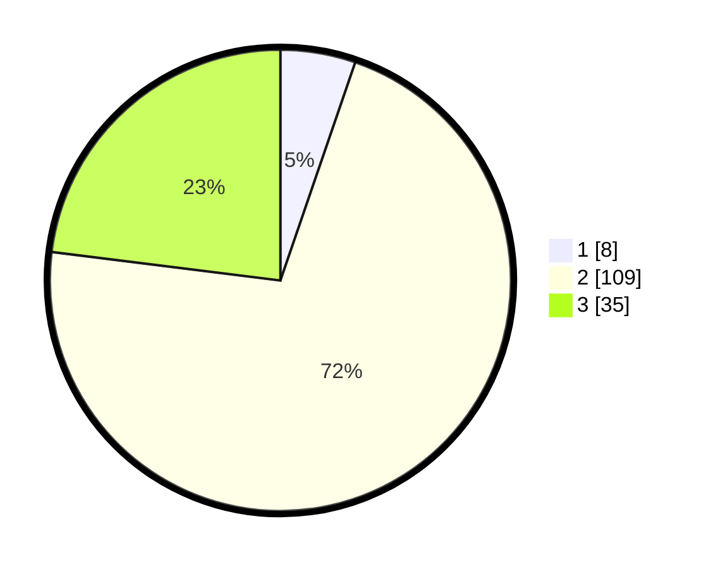

# Hasil

## Grafik

## Tabel

| No. | Nama Paslon    | Suara | Suara (raw) | Persentase |
|:--- |:-------------- | -----:| -----------:| ----------:|
| 1   | ANIES MUHAIMIN | 8     | [8][p-1]    | 5,26       |
| 2   | PRABOWO GIBRAN | 109   | [109][p-2]  | 71,71      |
| 3   | GANJAR MAHFUD  | 35    | [35][p-3]   | 23,03      |

[p-1]: https://github.com/gigit-pemilu/pemilu-2024-91-papua/blob/main/pilpres/hitung-suara/sub/91-papua/sub/05-kepulauan-yapen/sub/03-yapen-timur/sub/2024-awunawai/sub/005-tps/sub/paslon-1.txt
[p-2]: https://github.com/gigit-pemilu/pemilu-2024-91-papua/blob/main/pilpres/hitung-suara/sub/91-papua/sub/05-kepulauan-yapen/sub/03-yapen-timur/sub/2024-awunawai/sub/005-tps/sub/paslon-2.txt
[p-3]: https://github.com/gigit-pemilu/pemilu-2024-91-papua/blob/main/pilpres/hitung-suara/sub/91-papua/sub/05-kepulauan-yapen/sub/03-yapen-timur/sub/2024-awunawai/sub/005-tps/sub/paslon-3.txt

## Foto C Plano

https://sirekap-obj-formc.kpu.go.id/7eb6/pemilu/ppwp/91/05/03/20/24/9105032024005-20240214-130744--f31e041b-5831-4b0f-b5a5-1b27890c7c05.jpg

https://sirekap-obj-formc.kpu.go.id/7eb6/pemilu/ppwp/91/05/03/20/24/9105032024005-20240215-022933--c700322a-e6b3-4d2c-96a0-5bc43c228167.jpg

https://sirekap-obj-formc.kpu.go.id/7eb6/pemilu/ppwp/91/05/03/20/24/9105032024005-20240215-023057--24a20d87-f0c2-454f-86b7-80bf4271fe68.jpg

## Metadata

| Key        | Value               |
| ---------- | ------------------- |
| Time Stamp | 2024-02-25 02:00:00 |

