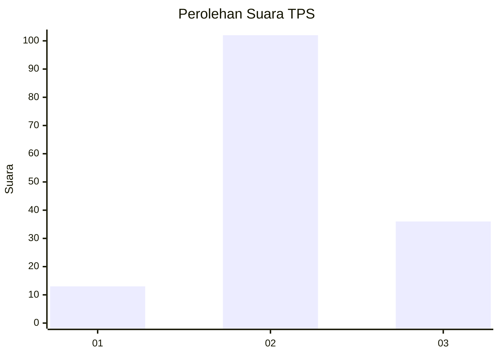
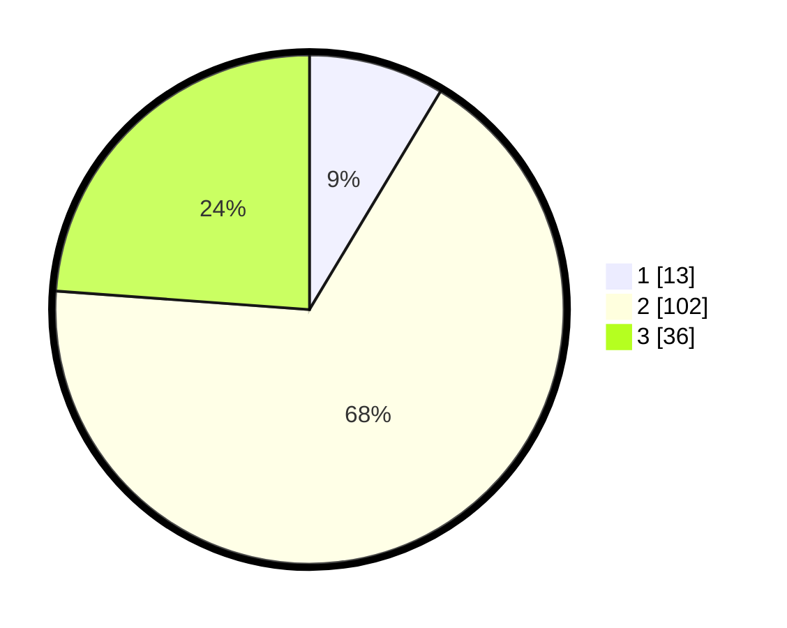

# Hasil

## Grafik

## Tabel

| No. | Nama Paslon    | Suara | Suara (raw) | Persentase |
|:--- |:-------------- | -----:| -----------:| ----------:|
| 1   | ANIES MUHAIMIN | 13    | [13][p-1]   | 8,61       |
| 2   | PRABOWO GIBRAN | 102   | [102][p-2]  | 67,55      |
| 3   | GANJAR MAHFUD  | 36    | [36][p-3]   | 23,84      |

[p-1]: https://github.com/gigit-pemilu/pemilu-2024-91-papua/blob/main/pilpres/hitung-suara/sub/91-papua/sub/05-kepulauan-yapen/sub/03-yapen-timur/sub/2024-awunawai/sub/009-tps/sub/paslon-1.txt
[p-2]: https://github.com/gigit-pemilu/pemilu-2024-91-papua/blob/main/pilpres/hitung-suara/sub/91-papua/sub/05-kepulauan-yapen/sub/03-yapen-timur/sub/2024-awunawai/sub/009-tps/sub/paslon-2.txt
[p-3]: https://github.com/gigit-pemilu/pemilu-2024-91-papua/blob/main/pilpres/hitung-suara/sub/91-papua/sub/05-kepulauan-yapen/sub/03-yapen-timur/sub/2024-awunawai/sub/009-tps/sub/paslon-3.txt

## Foto C Plano

https://sirekap-obj-formc.kpu.go.id/2c9e/pemilu/ppwp/91/05/03/20/24/9105032024009-20240214-220530--bb1a3811-5e6f-46a8-a081-ef810a66da97.jpg

https://sirekap-obj-formc.kpu.go.id/2c9e/pemilu/ppwp/91/05/03/20/24/9105032024009-20240214-220626--f6924441-9470-4c2d-a939-7351ca996684.jpg

https://sirekap-obj-formc.kpu.go.id/2c9e/pemilu/ppwp/91/05/03/20/24/9105032024009-20240214-220645--7c6cf1a8-ba52-4c54-b5b7-52ee51607807.jpg

## Metadata

| Key        | Value               |
| ---------- | ------------------- |
| Time Stamp | 2024-02-19 06:16:00 |

