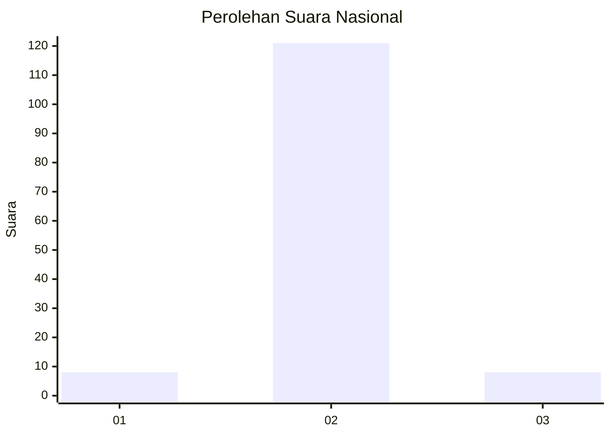
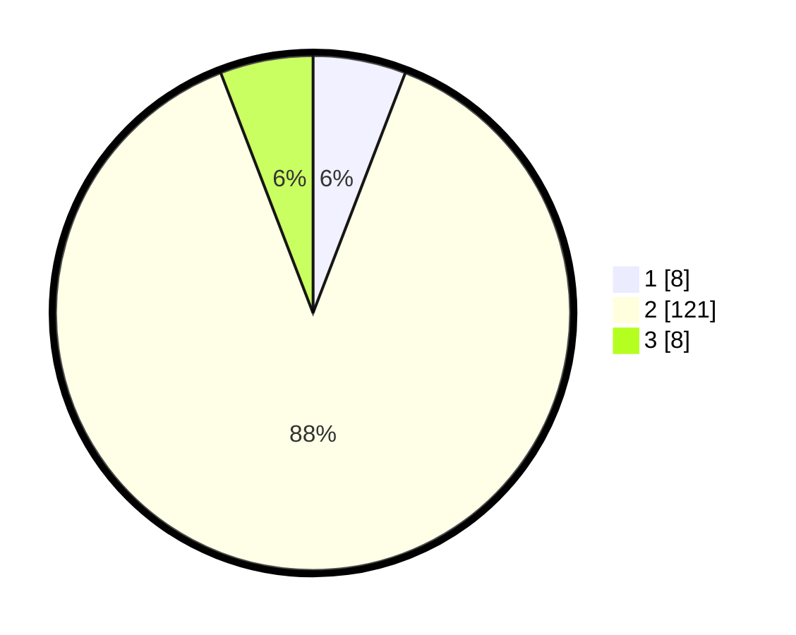

# Hasil

## Grafik

## Tabel

| No. | Nama Paslon    | Suara | Suara (raw) | Persentase |
|:--- |:-------------- | -----:| -----------:| ----------:|
| 1   | ANIES MUHAIMIN | 8     | [8][p-1]    | 5,84       |
| 2   | PRABOWO GIBRAN | 121   | [121][p-2]  | 88,32      |
| 3   | GANJAR MAHFUD  | 8     | [8][p-3]    | 5,84       |

[p-1]: https://github.com/gigit-pemilu/pemilu-2024/blob/main/pilpres/hitung-suara/sub/91-papua/sub/05-kepulauan-yapen/sub/03-yapen-timur/sub/2024-awunawai/sub/902-tps/sub/paslon-1.txt
[p-2]: https://github.com/gigit-pemilu/pemilu-2024/blob/main/pilpres/hitung-suara/sub/91-papua/sub/05-kepulauan-yapen/sub/03-yapen-timur/sub/2024-awunawai/sub/902-tps/sub/paslon-2.txt
[p-3]: https://github.com/gigit-pemilu/pemilu-2024/blob/main/pilpres/hitung-suara/sub/91-papua/sub/05-kepulauan-yapen/sub/03-yapen-timur/sub/2024-awunawai/sub/902-tps/sub/paslon-3.txt

## Foto C Plano

https://sirekap-obj-formc.kpu.go.id/21be/pemilu/ppwp/91/05/03/20/24/9105032024902-20240214-213159--090da7e1-38c0-4d45-9dad-3a3eee586692.jpg

https://sirekap-obj-formc.kpu.go.id/21be/pemilu/ppwp/91/05/03/20/24/9105032024902-20240214-212837--41f9c4dd-5b67-49f9-ba0e-28d0cf90455a.jpg

https://sirekap-obj-formc.kpu.go.id/21be/pemilu/ppwp/91/05/03/20/24/9105032024902-20240214-213126--ae51a756-e3f6-4558-8bed-c436c9204cd7.jpg

## Metadata

| Key        | Value               |
| ---------- | ------------------- |
| Time Stamp | 2024-02-24 22:31:28 |

## DATA PEMILIH TETAP

Jumlah pemilih dalam DPT: **286**.
 * L: **199**.
 * P: **87**.

## DATA PENGGUNA HAK PILIH

Jumlah pengguna hak pilih dalam DPT: **8**.
 * L: **2**.
 * P: **6**.

Jumlah pengguna hak pilih dalam DPTb: **128**.
 * L: **91**.
 * P: **37**.

Jumlah pengguna hak pilih dalam DPK: **1**.
 * L: **1**.
 * P: **0**.

Jumlah pengguna hak pilih: **137**.
 * L: **94**.
 * P: **43**.

## JUMLAH SUARA SAH DAN TIDAK SAH

JUMLAH SELURUH SUARA SAH: **137**.

JUMLAH SUARA TIDAK SAH: **0**.

JUMLAH SELURUH SUARA SAH DAN SUARA TIDAK SAH: **137**.

