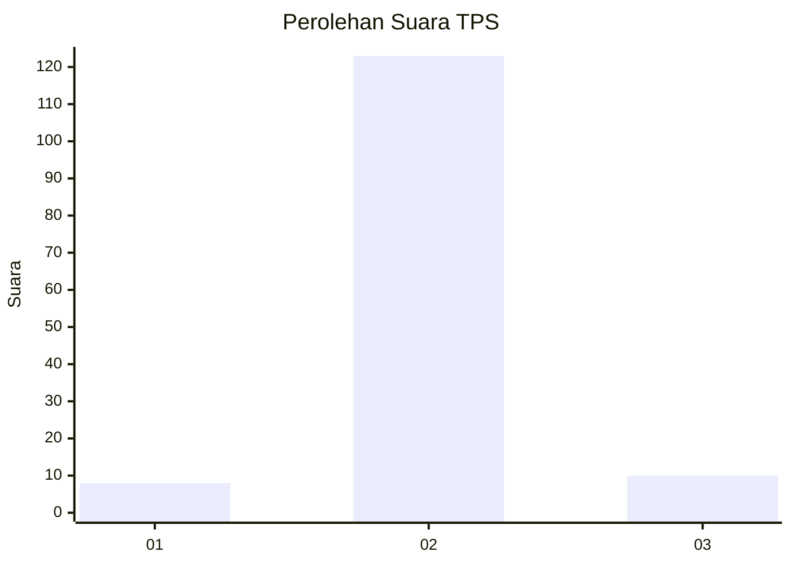
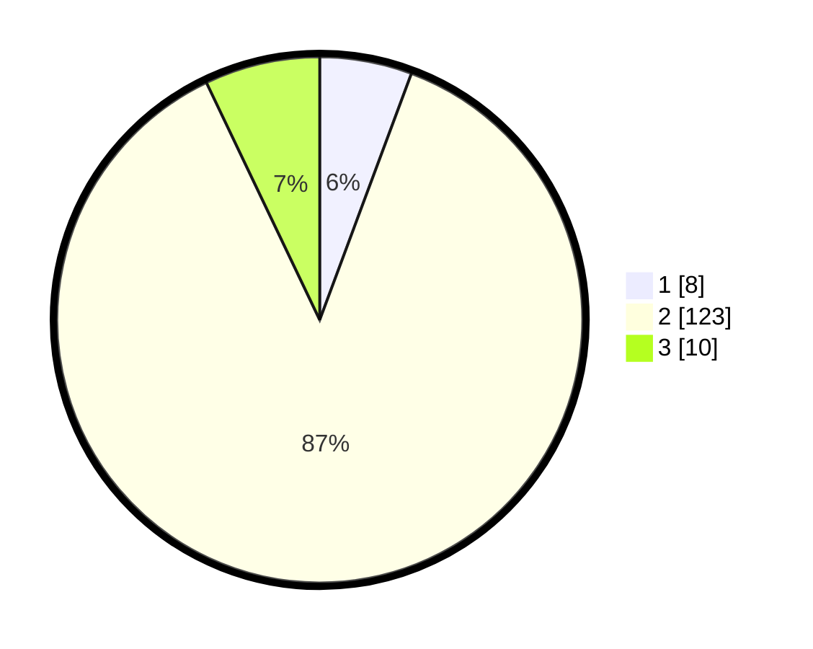

# Hasil

## Grafik

## Tabel

| No. | Nama Paslon    | Suara | Suara (raw) | Persentase |
|:--- |:-------------- | -----:| -----------:| ----------:|
| 1   | ANIES MUHAIMIN | 8     | [8][p-1]    | 5,67       |
| 2   | PRABOWO GIBRAN | 123   | [123][p-2]  | 87,23      |
| 3   | GANJAR MAHFUD  | 10    | [10][p-3]   | 7,09       |

[p-1]: https://github.com/gigit-pemilu/pemilu-2024-91-papua/blob/main/pilpres/hitung-suara/sub/91-papua/sub/05-kepulauan-yapen/sub/03-yapen-timur/sub/2024-awunawai/sub/903-tps/sub/paslon-1.txt
[p-2]: https://github.com/gigit-pemilu/pemilu-2024-91-papua/blob/main/pilpres/hitung-suara/sub/91-papua/sub/05-kepulauan-yapen/sub/03-yapen-timur/sub/2024-awunawai/sub/903-tps/sub/paslon-2.txt
[p-3]: https://github.com/gigit-pemilu/pemilu-2024-91-papua/blob/main/pilpres/hitung-suara/sub/91-papua/sub/05-kepulauan-yapen/sub/03-yapen-timur/sub/2024-awunawai/sub/903-tps/sub/paslon-3.txt

## Foto C Plano

https://sirekap-obj-formc.kpu.go.id/f9d2/pemilu/ppwp/91/05/03/20/24/9105032024903-20240214-203243--81f1f496-d982-4768-9d31-f8eb890a22e6.jpg

https://sirekap-obj-formc.kpu.go.id/f9d2/pemilu/ppwp/91/05/03/20/24/9105032024903-20240214-203331--c30eb9eb-bc63-4b96-8050-54404a198bd9.jpg

https://sirekap-obj-formc.kpu.go.id/f9d2/pemilu/ppwp/91/05/03/20/24/9105032024903-20240214-203608--65d90a1c-0a32-4bfd-9ea3-1bf69f620e4c.jpg

## Metadata

| Key        | Value               |
| ---------- | ------------------- |
| Time Stamp | 2024-02-19 06:16:00 |

