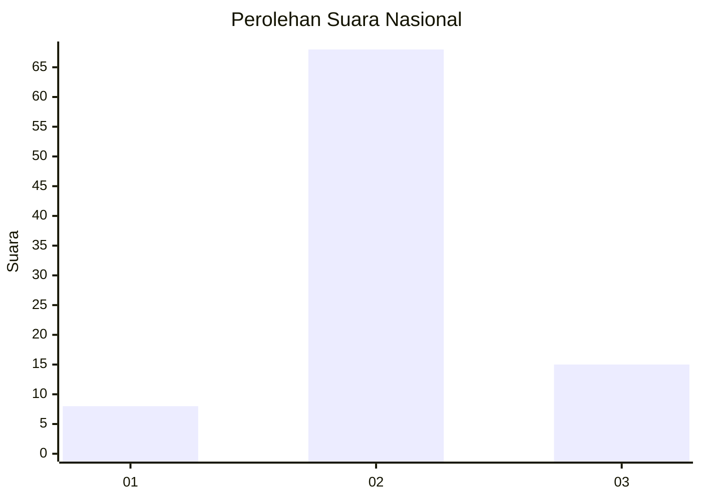
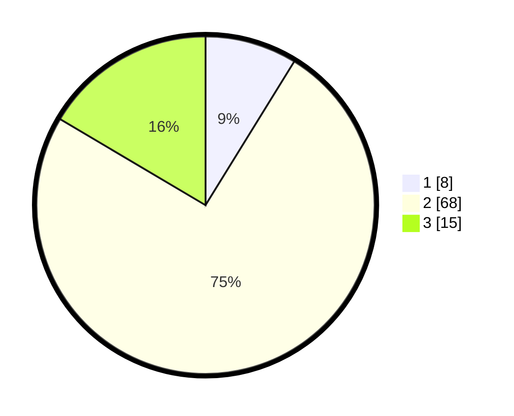

# Hasil

## Grafik

## Tabel

| No. | Nama Paslon    | Suara | Suara (raw) | Persentase |
|:--- |:-------------- | -----:| -----------:| ----------:|
| 1   | ANIES MUHAIMIN | 8     | [8][p-1]    | 8,79       |
| 2   | PRABOWO GIBRAN | 68    | [68][p-2]   | 74,73      |
| 3   | GANJAR MAHFUD  | 15    | [15][p-3]   | 16,48      |

[p-1]: https://github.com/gigit-pemilu/pemilu-2024/blob/main/pilpres/hitung-suara/sub/91-papua/sub/05-kepulauan-yapen/sub/03-yapen-timur/sub/2024-awunawai/sub/906-tps/sub/paslon-1.txt
[p-2]: https://github.com/gigit-pemilu/pemilu-2024/blob/main/pilpres/hitung-suara/sub/91-papua/sub/05-kepulauan-yapen/sub/03-yapen-timur/sub/2024-awunawai/sub/906-tps/sub/paslon-2.txt
[p-3]: https://github.com/gigit-pemilu/pemilu-2024/blob/main/pilpres/hitung-suara/sub/91-papua/sub/05-kepulauan-yapen/sub/03-yapen-timur/sub/2024-awunawai/sub/906-tps/sub/paslon-3.txt

## Foto C Plano

https://sirekap-obj-formc.kpu.go.id/db38/pemilu/ppwp/91/05/03/20/24/9105032024906-20240214-231211--be78339d-949c-4d2b-85f4-e19b9a20d407.jpg

https://sirekap-obj-formc.kpu.go.id/db38/pemilu/ppwp/91/05/03/20/24/9105032024906-20240214-232937--040377dd-a24f-486e-8b21-2c6f6dc8c50b.jpg

https://sirekap-obj-formc.kpu.go.id/db38/pemilu/ppwp/91/05/03/20/24/9105032024906-20240214-190827--9dcdcc03-4517-41fb-a4bd-8d3cb996eab0.jpg

## Metadata

| Key        | Value               |
| ---------- | ------------------- |
| Time Stamp | 2024-02-15 09:00:24 |

## DATA PEMILIH TETAP

Jumlah pemilih dalam DPT: **158**.
 * L: **105**.
 * P: **53**.

## DATA PENGGUNA HAK PILIH

Jumlah pengguna hak pilih dalam DPT: **75**.
 * L: **48**.
 * P: **27**.

Jumlah pengguna hak pilih dalam DPTb: **1**.
 * L: **1**.
 * P: **0**.

Jumlah pengguna hak pilih dalam DPK: **16**.
 * L: **12**.
 * P: **4**.

Jumlah pengguna hak pilih: **92**.
 * L: **61**.
 * P: **31**.

## JUMLAH SUARA SAH DAN TIDAK SAH

JUMLAH SELURUH SUARA SAH: **91**.

JUMLAH SUARA TIDAK SAH: **1**.

JUMLAH SELURUH SUARA SAH DAN SUARA TIDAK SAH: **92**.

